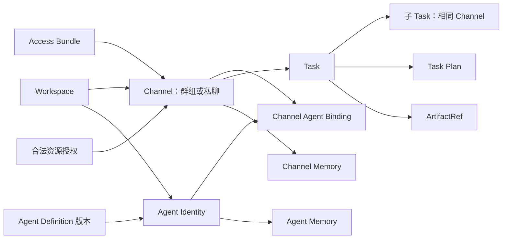
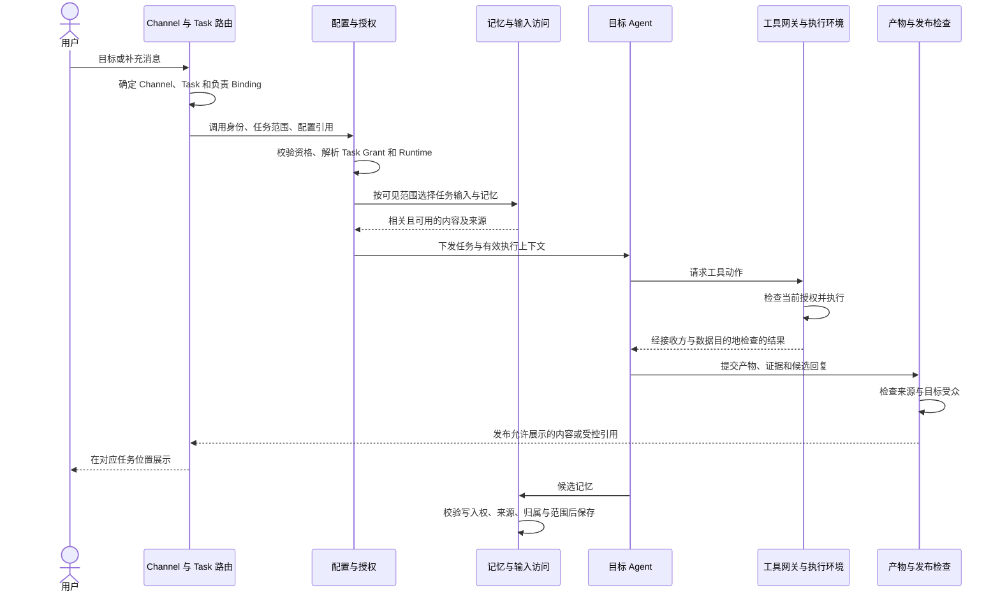
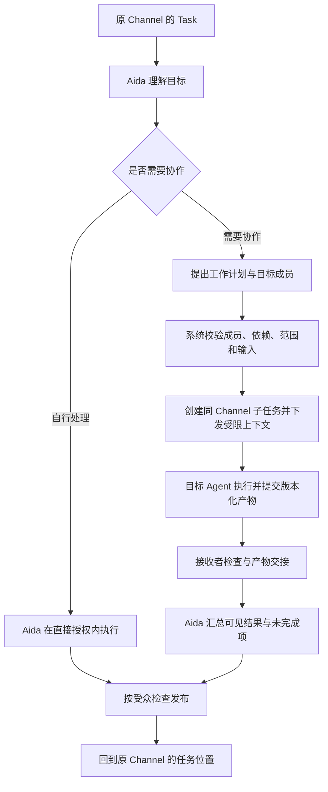

# 多 Agent 系统：概念、架构与数据流

版本：v0.4 · 概念设计 · 2026-10-03

本文在 v0.3 基础上吸收 [Agent Teams 评审建议](/Users/crown1/Documents/Codex/2026-09-29/wo/outputs/multi-agent-review-recommendations.md)，明确产品概念、身份与权限关系、执行前后的数据流和第一版边界。本文描述目标行为，尚不代表已实现或验证。

Run 的实体、状态机、调度、重试、恢复、计费和完整生命周期继续后置。本文中的 Task Grant、执行上下文和产物引用是必要的概念契约，不预设 Run 实现。

## 1. 产品模型与确定的原则

用户在 Channel 中向 Aida 交办目标。Aida 同时是可直接 `@` 的助手和 Agent 小队队长，自行判断亲自完成、委派或协同执行，持续负责沟通和交付。用户也可以直接 `@具体 Agent`，由该 Agent 负责这项工作。

**所有 Task 必须唯一绑定 Channel，私聊也是 Channel。** 群组、私聊、定时、API 或事件触发任务都遵守这条约束；没有明确 Channel 的任务不能开始执行。

| 原则 | 对产品和系统的含义 |
|---|---|
| 一个入口，按需协作 | 用户无需先创建小队、选队长或选择单/多 Agent 模式 |
| 任务不脱离 Channel | 拆解出的子任务继承原 Channel；更换 Agent、主机或模型不改变归属 |
| 定义复用，身份隔离 | 相同 Agent 名称、模板或版本不意味着共享权限、凭证或私有记忆 |
| 协调权与操作权分开 | Aida 可以安排已获授权的专业工作，无需获得成员全部直接操作权限 |
| 归属与可见范围分开 | Task 属于某个 Channel，不表示其输入、日志和产物可向全体成员公开 |
| 授权在系统中执行 | 自然语言、Skill、计划和模型输出不能创建权限；执行点落实约束 |
| 运行位置与数据去向明确 | 个人主机执行文件操作，不自动表示模型推理或所有数据处理都留在本地 |

### 1.1 产品决策记录

以下默认策略已由用户于 2026-10-03 确认，与不可绕过的概念约束分别记录。

| 决策 | 本版选择 | 适用范围 |
|---|---|---|
| D1 · 资源访问身份默认值 | 群组使用组织/频道服务身份，私聊使用个人身份；具体连接可显式覆盖 | 覆盖必须有适用授权，不自动切换账号 |
| D2 · Agent 经验跨 Channel 使用 | 默认保留来源限制，经有权用户明确发布后才能跨 Channel 复用 | 自动提炼不等于自动扩大使用范围 |
| D3 · 第一版受限资料支持 | 群组只处理可向目标频道共享的资料；不兼容时提示使用已有授权的私聊或调整授权 | 第一版不提供群组内仅部分成员可见的任务正文/产物 |

## 2. 核心概念

### 2.1 Workspace 与身份：谁拥有、谁调用、代表谁操作

Workspace 是数据与配置所属的个人或组织范围。个人使用也有个人 Workspace，可以自动建立，不要求用户先设置组织。

一次工作需要区分以下身份；它们可以有关联，但不能用一个名称替代：

| 身份 | 回答的问题 | 示例 |
|---|---|---|
| 调用主体 | 谁发起或继续驱动这个 Task | 用户、已有授权的定时或事件入口 |
| 执行 Agent 身份 | 哪个已安装 Agent 承担工作 | 当前 Workspace 的 Aida、代码助手 |
| 资源访问身份 | 外部服务认为是谁在操作 | 个人 Git 账号、组织服务账号 |
| 授权主体 | 谁有权授予或撤回该项访问 | 资源所有者、被授予管理权限的人 |
| Runtime 所有者 | 谁控制接收任务数据的设备 | 用户本人、组织管理的主机 |

组织管理员、频道管理员、Agent 作者、主机所有者并不天然具有彼此的全部权限。具体资源授权必须有有效来源。

### 2.2 Access Bundle：复用资源访问配置

Access Bundle 将 Git、Domain、Skill、MCP 等资源访问配置组织为可复用集合，供 Channel 引用。Channel 也能在 Bundle 之外增加明确授权的资源。

| 类型 | 配置内容 | 说明 |
|---|---|---|
| Git | 仓库、分支/路径范围、读取或写入动作 | 不把“可访问仓库”等同于任意推送能力 |
| Domain | 允许访问的网络域名与范围 | 本文指网络目标，域名注册或管理服务另按工具授权 |
| Skill | 可加载的技能及版本 | 技能说明不自动提供其依赖的工具、凭证或文件权限 |
| MCP | 服务、工具及参数/资源范围 | 连接服务不自动允许使用所有工具 |

内部区分三个角色：

- **Resource**：目标资源及能力是什么。
- **Access Grant**：谁允许哪些主体，以什么访问身份，在什么范围内做哪些动作。
- **Connection**：如何连接资源及取得受控认证；可关联凭证引用。

Bundle 可以引用已有 Grant 和 Connection，但引用、复制或分享 Bundle 不自动转授凭证使用权。解析时必须确认 Grant 适用于当前 Workspace、Channel、调用主体、目标 Agent 和工作范围。

角色指令放在 Agent 定义与 Binding 中，频道共同规则放在 Channel 中。Bundle 负责复用资源配置，不混入频道对话、私有记忆或 Agent 职责。长期凭证由连接设施保存，不作为普通上下文下发。

### 2.3 Channel：所有 Task 的归属与工作上下文

Channel 具有稳定身份，包含类型、所属 Workspace、成员、Agent Binding、默认 Aida、Bundle 引用、额外授权、共同规则、运行策略及 Channel 记忆。

| 类型 | 用户体验 | 模型关系 |
|---|---|---|
| 群组 Channel | 多人共同交办与跟进工作 | 多个成员、多个 Task、多个 Agent Binding |
| 私聊 Channel | 用户在私聊界面与 Aida 或具体 Agent 工作 | 仍有 Channel、Task、Binding、资源与记忆策略 |

私聊可以省略管理界面和显式 `@`，由收件人解析目标 Binding；这不省略底层 Channel。一个 Channel 可以存在多个并发 Task，其全部历史不会自动成为每个 Task 的输入。

同一用户的私聊与群组分别管理资源和记忆，不能因用户相同而互相借用授权。私聊内可以组织多个 Agent，子任务仍留在该私聊 Channel，无需另建群组。

外部渠道连接、Channel、消息 thread 是三个不同概念：外部连接接收消息，Channel 承担工作归属，thread 组织对话与回复。它们通过明确映射关联，不直接共用名称或标识。

### 2.4 Agent：定义、身份与频道绑定

用户仍将 Agent 理解为一个工作角色。内部区分三层，避免复用与隔离冲突：

| 层次 | 内容 | 归属 |
|---|---|---|
| Agent Definition | 名称、职责、基础指令、Skill/MCP 需求、Subagent 引用、版本 | 可复用与分发的定义 |
| Agent Identity | 使用该定义的稳定 Agent 身份及私有记忆归属 | 一个明确的 Workspace |
| Channel Agent Binding | 该身份在特定 Channel 的成员关系与局部配置 | 一个 Channel 与一个 Agent Identity |

Binding 包含频道内别名、额外指令、启用能力、直接操作限制、可接受/发起的委派范围、Runtime 偏好及记忆策略。本版默认同一 Agent Identity 在同一 Channel 有一个有效 Binding。

定义的作者可以发布新版本，不因此获得使用者的消息、凭证或记忆。不同 Workspace 可以使用相同的 Aida 定义，但身份与数据隔离；同一 Workspace 内的身份可加入多个 Channel，仍受各来源可见范围限制。

Agent 中的 Skill/MCP 表达“需要什么能力、如何使用”；Bundle/Grant 表达“什么资源已获授权”。二者必须匹配。Agent 自带的连接引用也必须经过当前 Channel 的合法授权路径。

**Subagent** 是定义中声明的可委派对象；**Channel 成员 Agent** 是已具备当前频道 Binding 的协作者。第一版只执行指向有效 Binding 的委派，单有 Subagent 名称不授予调用资格。

### 2.5 Aida：统一助手兼小队队长

每个 Channel 默认提供 Aida。其产品身份稳定，同时承担直接执行、选择协作者、计划拆解、依赖衔接、进展沟通和最终交付。

- 任务简单时直接完成；需要互补能力或独立验证时再组织协作。
- 可在同一任务中完成一部分工作，并委派其他部分。
- DAG 是可按需展示的任务计划，不是用户使用前必须配置的内容。
- 通过 Aida 发起的父任务，Aida 继续负责整体交付；各子任务具有明确负责 Binding。
- 用户直接 `@其他 Agent` 时，由该 Agent 负责，Aida 不自动接管或重复接单。

小队是围绕任务组织的协作关系，本版不增加必须由用户先创建的小队实体。Aida 默认在云端运行；协调者角色不自动提供私有资源访问或读取其他 Agent 全部记忆的权利。

### 2.6 Task 与 Task Plan

Task 是围绕明确目标组织的工作，必须具有一个有效 `channel_id`。子任务继承父任务 Channel，普通委派不支持改变归属。所有入口先解析或建立有效 Channel，再创建 Task。

Task 保留发起主体、目标、负责 Binding、父任务引用、触发消息、相关输入和回复位置。补充消息可以关联已有 Task；无法唯一定位时先明确目标，不按最近活跃任务静默猜测。

**Task Plan** 描述工作项、负责 Agent、输入、预期输出与依赖。计划可用 DAG 表达，并允许修订。计划存在不代表节点已执行，模型声明完成不替代实际产物与证据。

一条消息可能创建任务或补充已有任务；一个 thread 也不必永久对应一个 Task。修改目标、取消或扩展范围要检查操作者的任务权限，不能仅凭在同一 Channel 中发言就扩大授权。

### 2.7 Runtime 与数据处理位置

Runtime 提供执行能力，覆盖云端和个人主机。内部同时记录：

| 位置 | 负责什么 |
|---|---|
| Agent 循环位置 | 组织模型调用、工具请求与工作过程 |
| 工具执行位置 | 运行命令、操作文件、访问本地服务 |
| 模型推理位置 | 模型实际处理提示词与工具返回内容的提供方/端点 |

可先支持固定组合，例如云端 Agent 循环调用个人主机工具，再使用获准的云模型。接收数据的设备、主机所有者、模型提供方和网络目标均需符合来源数据及 Channel 策略。

“个人主机执行”只描述相应组件的位置，不承诺所有数据留在本机。主机拥有的登录状态、文件或高权限账号不是 Channel 的授权来源。

### 2.8 Memory 与 Artifact

长期记忆仍只有两类：Channel Memory 保存项目背景、共享事实和决策；Agent Memory 保存某个 Agent Identity 的稳定工作经验和专长。临时推测、工具原始返回、草稿属于任务工作上下文，不自动沉淀为长期记忆。

**Artifact** 是代码变更、报告、图片、数据或测试日志等交付与交接产物。它与记忆都需要记录归属、来源和可见范围；产物额外记录不可变版本或内容标识。

任务对话记录、长期记忆、交付产物分别承担过程追踪、知识复用和结果交接职责。即使底层共用存储，也不能混用其访问与生命周期规则。

## 3. 关系与最小数据契约

以下是逻辑信息，不规定数据库表或微服务数量。

| 对象 | 必需或关键关联 | 约束 |
|---|---|---|
| Workspace | 个人/组织主体、管理关系 | 定义数据与身份所属范围 |
| Channel | Workspace、类型、成员、默认 Aida Binding、规则与授权引用 | ID 稳定；私聊与群组共用模型 |
| Task | Channel、调用主体、负责 Binding、目标、输入/回复引用、可选父任务 | Channel 必填且唯一；普通父子任务同 Channel |
| Agent Definition | 指令、能力需求、版本 | 复用不分享私有运行数据 |
| Agent Identity | Workspace、定义版本、记忆主体 | 私有身份不以展示名称识别 |
| Binding | Channel、Agent Identity、局部配置、委派与直接操作约束 | 调用解析到当前 Channel 的有效 Binding |
| Access Bundle | 版本、资源描述、Grant/Connection 引用 | 可引用不等于可使用 |
| Access Grant | 授权来源、调用主体、访问身份、资源/动作/范围、目标限制、有效性 | 关联条件整体判断，不能拆开拼出更大权限 |
| Task Grant | Task、根授权来源、允许工作与目标范围 | 由平台从已有授权解析，子任务只能收敛 |
| Connection | 外部服务、访问身份、受控认证引用 | 长期凭证不进入普通 Agent 上下文 |
| Task Plan | Task、工作项、依赖、输入输出、版本 | 节点需有有效负责者，依赖无环 |
| Runtime | 设备/环境身份、所有者、可用能力、三类位置、数据目的地 | 匹配授权、信任与能力后才选用 |
| ArtifactRef | Task/Channel、产生者、版本/内容标识、取回方式、来源及受众 | 持有引用不自动有权读取 |
| Memory Entry | Channel 或 Agent Identity 归属、来源集合、可见范围、确认/失效状态 | 跨来源派生不自动扩大范围 |



关系图表达归属与引用，不表示自动可见或自动授予权限。

## 4. 配置解析、授权与委派

### 4.1 配置解析规则

执行上下文由平台解析得到，不能把所有配置简单拼接后要求 Agent 自行决定优先级。

| 类别 | 合并规则 |
|---|---|
| 角色与任务指令 | Agent 基础职责 + Channel 共同规则 + Binding 局部要求 + 当前任务 |
| 允许覆盖的普通设置 | Binding 显式值优先，其次 Channel 默认、Agent 默认、系统默认 |
| 可机器执行的强制约束 | 由授权与执行逻辑处理；拒绝和范围限制不能被普通设置覆盖 |
| Skill / MCP 能力 | 只启用已授权、任务需要且 Runtime 支持的能力 |
| 资源授权 | 验证合法来源，再应用调用主体、访问身份、Channel、目标、资源和动作约束 |
| Runtime | 在许可范围内匹配三类位置、设备信任、工具能力和数据目的地 |
| 记忆与对话 | 先过滤可见范围，再按当前 Task 选择相关内容 |

自由文本表达工作偏好与业务要求；强制授权使用结构化规则。系统不承诺自动识别所有自然语言矛盾；遇到影响交付且不能兼容的要求时明确冲突来源。

### 4.2 资源身份与 Task Grant

群组 Channel 默认使用组织/频道服务身份，私聊 Channel 默认使用个人身份。具体连接可以显式覆盖；覆盖需验证调用主体、资源所有者、目标 Channel 和使用范围的授权，不只是修改配置字段。

默认值帮助选择已经合法配置的连接，不负责创建账号或授予权限。未配置匹配身份、外部工具不支持该身份，或授权不足时说明缺失条件，不静默借用发起人的个人账号或主机登录态。实际身份随上下文保留，不因切换 Agent、私聊或 Runtime 改变。

平台根据已有合法授权、调用主体资格、频道规则和明确的任务范围生成根 Task Grant。它是本任务允许工作的上限，可包含只允许指定专业 Agent 执行的动作；不是 Aida 当前工具权限的简单复制。

缺失授权时返回明确原因，不能由模型、任务描述或下游 Agent 的宽权限身份补造。配置中新增权限也不自动扩大既有 Task Grant；确需扩展时走明确的授权与范围变更路径。

### 4.3 直接操作与委派分开判断

```text
本 Agent 直接操作范围
  ⊆ 当前 Task Grant
    ∩ 本 Agent / Binding 的直接操作限制
    ∩ 当前仍有效的资源、频道、主体与数据目的地策略

允许提出委派
  = 当前操作者有权驱动此 Task
    且委派方有权请求目标 Binding 承担该类工作

子任务 Task Grant
  ⊆ 父 Task Grant
    ∩ 委派许可范围（目标、资源、动作与继续委派条件）
    ∩ 接收 Binding 可承担的工作范围
    ∩ 当前仍有效的授权策略
```

目标 Agent 亲自操作时，继续应用自身直接操作约束。多层委派始终受根任务与每一级父任务范围约束；第一版先采用已有有效 Binding 的一层委派，扩展递归前再定义深度、总工作量和并发限制。

例如，Aida 没有 Git 推送权限，但有权安排代码 Agent 在已授权仓库的指定分支提交修改。平台为代码 Agent 提供受限访问；Aida 自己仍不能推送，代码 Agent 也不能改用自己的其他账号访问任务外仓库。

以上集合仅用于解释；实现时保留主体、资源、动作、身份、目标等关联条件，不能将各维度分别取并集。已有授权可覆盖常规调用，不要求每次委派新增确认步骤。

### 4.4 授权在哪里落实

| 检查点 | 责任 |
|---|---|
| Task 创建与驱动 | Channel 访问、Agent 调用资格、消息与任务关联、当前操作者权限 |
| 委派 | 目标 Binding、同 Channel、父子范围、输入可见性与工作量约束 |
| 工具动作 | 当前 Grant、具体资源/动作/参数、访问身份与网络目标 |
| 本地主机 | 文件目录、进程、工具与连接凭证的实际隔离 |
| 内容进入模型或另一 Agent | 接收身份、模型提供方、来源与数据目的地策略 |
| 产物读取、发布、记忆读写 | 目标受众、来源约束、当前授权及失效状态 |

隐藏一个工具名称或在指令中写“只读”，不能替代执行点限制。通用 shell 若能继承更宽的账号或访问工作范围外文件，就不能宣称满足相应的硬限制；不向能力不匹配的 Runtime 分派该任务。

### 4.5 配置版本与授权变化

记录执行上下文引用的 Agent、Bundle 和策略版本及其来源，默认通过显式版本变更更新定义。版本固定用于解释行为，不允许继续使用已撤销权限。

新的受保护操作、产物读取和发布需验证当前授权。授权失效时拒绝相关新动作；已经完成的外部操作和已合法展示的数据不能据此自动撤回。外部连接的撤销传播与短期访问有效期需要在连接实现中明确，不能只依赖旧上下文里的配置。

## 5. 数据流一：直接调用 Agent

群组和私聊共用此流程。`@Aida` 后自行完成和直接 `@具体 Agent` 仅目标 Binding 不同。



1. **确定归属**：先识别稳定的 Channel，再决定创建新 Task 或补充现有 Task。无 Channel 不执行；不明确的任务关联先澄清。
2. **解析上下文**：取得有效配置、Task Grant、目标 Runtime 与可见输入，保留来源。
3. **执行**：Agent 提出动作，由执行点校验；必要时可以直接完成回复而不调用外部工具。
4. **交付**：产物与结果关联原 Task/Channel，发布前检查目标受众。第一版群组仅使用可向频道共享的输入并交付兼容结果；不兼容时停止该数据路径并说明条件，不用私密产物绕过 D3。
5. **沉淀**：候选记忆进入受控写入流程，不要求每次回复都生成记忆。

## 6. 数据流二：Aida 组织小队

Aida 先判断协作是否有实际价值：需要互补能力、可独立并行的工作或独立验证时再拆解。用户始终通过同一个助手继续沟通。



计划执行前，检查目标 Binding 有效、父子 Channel 相同、依赖无环、所需能力与权限匹配、输入可交付、预期输出明确及工作量有界。无法满足时说明受影响环节，不把计划节点视为完成事实。

每份委派包含：

| 内容 | 用途 |
|---|---|
| Task、父 Task、Channel 与根授权引用 | 保留归属及授权链 |
| 目标、边界、负责 Binding、验收条件 | 明确交付责任 |
| 相关输入、对话与记忆引用 | 提供必要背景，避免复制全部历史 |
| 前置产物及不可变版本 | 保证依赖的数据就是预期数据 |
| 收敛后的授权与 Runtime 描述 | 指明允许做什么、在哪里做、数据可以到哪里 |
| 输出格式、返回位置与受众 | 支持合法交接与可检查的汇总 |

目标 Agent 可以返回结果、证据、不确定项和失败原因。Aida 仅接收其有权访问的部分；目标能读取的内容不自动向 Aida 开放。Aida 持续负责父任务，但不因此拥有所有原始日志。第一版委派前校验完成预期交接所需的可见性；不满足时说明阻塞，不以只返回“完成”替代需要证据的交付。

用户补充要求时，先检查其驱动权限与 Task 关联，再由 Aida 判断计划影响，将必要信息交给相关成员。重新规划保留已完成事实及计划版本；如何暂停、重试和恢复执行留待 Run 设计。

多个 Agent 修改同一代码或文件时，使用隔离工作目录、可合并产物或明确的单一写入责任，避免把并发编辑同一路径作为默认协作方式。

## 7. 数据流三：Runtime 与跨环境交接

```text
Task 与有效 Grant
  → 匹配 Agent 循环、工具执行、模型推理位置
  → 检查设备身份、资源范围、主机信任与数据目的地
  → 下发必要上下文及受控访问引用
  → 执行点按当前授权调用工具
  → 保存带来源、版本、受众的 ArtifactRef
  → 接收方通过检查后取回准确版本
  → 将结果关联原 Task 和 Channel
```

个人主机通过经配对的连接器与控制服务通信。只开放明确的工作目录、工具、网络与访问身份；不继承无关的浏览器会话、环境变量或主机凭证作为任务能力。隔离手段应与主机平台的实际保证匹配。

主机所有者或管理员可能接触执行环境，不能假定沙箱能向宿主机管理员保密。把任务交给某台设备前，需要满足数据向该设备与信任主体披露的条件。

主机离线或断连时报告不可用或结果未知。没有已允许的替代路径，不自动迁云或换设备；即使允许切换，也重新检查授权与数据目的地。结果未知不等于动作未发生，不能因此重复外部写入。

ArtifactRef 使用稳定标识关联内容摘要、Git 提交、补丁版本或其他不可变内容。浮动分支名和本地绝对路径不足以证明跨环境交接正确；消费方要确认取到的就是被指定的版本。

实际下载或读取仍检查当前权限，引用可按需解析为短期访问方式。无权读取、内容缺失或版本不符时，不宣称验证完成。

## 8. 数据流四：信息可见范围与记忆

### 8.1 归属、来源与受众分别记录

| 维度 | 回答的问题 |
|---|---|
| 归属 | 这是哪个 Channel 的产物，或哪个 Agent Identity 的记忆 |
| 来源 | 内容依据哪些消息、资源、产物或已有记忆形成 |
| 受众 | 哪些用户、Agent 和处理环境可以接收内容 |
| 适用范围 | 内容可用于哪些任务/Channel，是否已失效或待确认 |

信息经过摘要、翻译、汇总、委派或改为 Agent 记忆，都不自动解除来源限制。多来源内容默认同时满足各来源约束，不将来源受众取并集。

### 8.2 群组结果发布

第一版群组只处理已获准向该频道共享的资料。使用个人身份显式覆盖连接，也不改变这项约束：该账号可读的内容仍须可向目标频道共享。内容进入目标 Agent、模型服务、其他主机和最终受众时分别检查许可。

发现不兼容时，不把受限正文导入群组任务的 Agent 上下文、日志、记忆或产物，并说明可选路径：在已有相应授权的私聊 Channel 新建任务，或由有权主体调整授权。原 Task 不静默迁移；跨频道引用或复制材料也需要合法授权。

第一版不实现“群组内公开状态 + 仅部分成员可见正文”的交付体验，数据模型仍保留来源与受众，供后续扩展。固定状态、标题、错误信息与链接也要避免披露受限内容；不能仅凭模型声称“已脱敏”就扩大受众。上游接口若不能在导入前确定来源范围，应限制为已配置为频道共享的资源范围；无法判定时拒绝相关导入。

成员变化也会改变频道受众。向新增成员开放历史前，应确认现有共享资料的授权覆盖新受众；无法确认时，不自动开放这条访问路径，需要有权主体先调整授权或成员安排。产物读取同时检查当前权限，不能承诺撤回此前已合法展示或被复制的信息。

### 8.3 记忆归属示例

| 内容 | 保存位置 |
|---|---|
| 项目架构、共享业务事实、已确认根因 | Channel Memory |
| 某 Agent 可复用的工作方法与角色经验 | Agent Memory，并保留来源与使用范围 |
| 频道交付语言、禁止动作、默认 Runtime | 配置；记忆可引用但不替代配置 |
| 当前排查位置、未验证推测、原始日志 | 临时上下文或 Artifact，不自动作为长期事实 |

Agent Memory 属于 Workspace 内的 Agent Identity；检索不能只用全局模板 ID 或“Aida”名称。来自某个 Channel 的经验默认保留来源限制，即使已提炼成通用表述，也不能自动在另一个 Channel 使用。

有权用户可以明确发布选定经验，并指定新的适用 Channel 或 Workspace 范围。发布要验证其对相关来源的分享权限，记录所发布内容、来源、发布者、目标范围和授权依据；这是对选定经验的明确范围变更，不授予其他 Channel 访问原始材料或个人连接的权利。

经过有效发布的条目按批准的范围参与检索，同时保留来源与发布记录。自动记忆提取只生成候选或来源受限的条目，不自动批准跨频道发布。来源失效或发布授权撤回时重新判断条目是否仍可使用。

### 8.4 读取与写入

```text
读取：Task/Channel + 当前身份 + 来源与可见策略
  → 在允许范围内检索
  → 排除失效或撤回内容，处理冲突与确认状态
  → 选择任务相关内容
  → 检查接收 Agent 与模型目的地后注入上下文

写入：对话、工具结果、Artifact
  → 提取候选记忆
  → 判断长期价值与事实状态
  → 记录来源集合及派生关系
  → 选择 Channel 或 Agent 归属
  → 验证写入权、受众与适用范围
  → 去重、修订或保留待确认状态
```

模型推测、工具结果和用户确认的决策保持不同状态。记忆更新保留可追溯来源；来源撤权或失效后，相关派生条目、索引与缓存不能继续绕过当前访问检查。

数据删除的传播范围、时间要求和备份处理需要在存储实现中确定。删除系统中的记忆不等于抹除已合法交付到用户设备的副本。

## 9. 推荐逻辑架构与部署边界

| 逻辑职责 | 承担的工作 | 对外保证 |
|---|---|---|
| 入口与路由 | 连接事件、Channel 映射、任务/消息关联、负责 Binding | 不产生无归属 Task，不将回复串到其他工作 |
| 配置与授权 | 定义版本、Grant 解析、委派许可、连接身份、策略来源 | 模型请求不直接成为授权决定 |
| 上下文与知识访问 | 任务输入、记忆检索、来源和受众过滤 | 只把可用内容传给获准接收方 |
| Agent 协作 | Aida 决策、计划、委派与汇总 | 对成员交付与未完成项有明确责任 |
| 执行适配与动作检查 | 云端 worker、主机连接器、工具网关、本地限制 | 约束在实际动作处生效 |
| 产物与发布 | 内容版本、受控取回、回传、记忆写入 | 归属不扩大可见范围 |

第一版可以采用一个模块化控制服务、一个数据库、受控产物存储，以及云端 worker/个人主机连接器。逻辑职责不必分别部署；资源隔离和设备边界仍需真实存在。

首期不要求独立 Team 实体、自动跨 Channel 委派或无界递归。云端和个人主机均保留在目标模型中，具体先试点哪类 Runtime 由首个实际场景决定，不改变本文概念。

## 10. 端到端示例

### 10.1 群组：修复并验证

研发 Channel 有 Aida、代码 Agent、测试 Agent 三个有效 Binding。频道已获得指定仓库和测试目录访问，数据允许交给这些 Agent、指定个人主机及已配置模型处理。

用户发送：`@Aida 修复登录超时问题，并完成验证。`

1. 路由确认 Channel、发起者与目标，创建 Task，解析已有授权形成 Task Grant。
2. Aida 读取可见背景与记忆，决定采用“定位与修改 → 独立验证 → 汇总”的计划。
3. Aida 有权安排代码 Agent 修改指定分支，自身可以仅有读取与协调能力。系统校验委派后创建相同 Channel 的子任务。
4. 代码 Agent 返回不可变的补丁或提交 ArtifactRef，注明结果与未完成项。
5. 测试 Agent 通过接收方与 Runtime 检查，在指定个人主机取得同一版本并验证，证据绑定被测内容。
6. Aida 接收其有权查看的验证结果；发布检查通过后，将交付放回原 Channel 的任务位置。
7. 项目根因可进入 Channel 记忆，工作方法可成为带来源限制的 Agent 经验；只有经有权用户明确发布后，其他 Channel 才能在批准范围内使用。

用户无需先建队或逐个追问成员。若使用 `@代码 Agent` 发起分析，则代码 Agent 直接负责对应 Task，不自动由 Aida 接管。

### 10.2 私聊：使用自己的资料

用户在私聊中向 Aida 交办工作。系统使用该私聊 Channel 的配置，默认选择已获授权的个人资源身份，并按私聊记忆范围创建 Task，不继承用户所在群组的连接。用户显式选择合法的其他连接时，记录实际访问身份。

若私聊已具备其他有效 Agent Binding，Aida 可以委派，子任务仍属于原私聊。需要把资料交给云模型或其他设备时检查数据目的地；“任务在私聊”本身不代表资料可以发给任何运行环境。

### 10.3 同频道的权限差异

用户在群组中请 Aida 分析一份仅自己可读的报告。即使用户已经连接个人账号，第一版也不把报告导入群组任务。系统说明资料不能向当前频道共享，并提示使用已有授权的私聊，或请有权主体调整分享范围。

若用户选择私聊，需在该私聊 Channel 新建 Task，并使用其已有授权取得报告；群组 Task 保留自身归属和不含受限信息的阻塞说明。Aida 不通过复制摘要、换 Agent 或更改记忆归属绕过限制。

## 11. 验收场景与评审落实

| 场景 | 应满足的行为 |
|---|---|
| 群组、私聊、定时/API/事件入口 | Task 全部绑定有效 Channel，无归属不能执行 |
| Aida 委派或切换 Runtime | 子任务保留父 Channel，授权和数据目的地重新检查 |
| Aida 无直接写权但具有受限委派权 | 专业 Agent 可以完成合法动作，Aida 自行越权被拒绝 |
| Bundle 被其他频道引用 | 原连接使用权不自动转移，必须存在适用授权 |
| 同名 Aida 出现在多个 Workspace | 私有身份、连接和记忆不因定义相同而互通 |
| 同一 Channel 并发多个 Task | 输入、补充消息、产物和回复关联正确，不能静默猜测 |
| 仅部分成员可见的来源 | 第一版不导入群组任务，提示已有授权的私聊或调整授权；摘要和日志不泄漏正文 |
| 群组增加成员 | 开放历史前验证新受众兼容性，加入成员不自动授予来源资源权限 |
| 权限撤回或 Bundle 升级 | 新动作应用当前授权，记录定义版本；新增能力不自动扩任务范围 |
| 个人主机断连 | 不伪造完成、不静默迁移、不因结果未知重复写入 |
| 本地工具调用云模型 | 数据去向符合策略，产品表述不暗示全部本地处理 |
| 云端修改交给本地验证 | 测试证据指向准确不可变版本，无法取回时说明未完成 |
| 来源撤权后的派生记忆 | 索引、缓存和跨频道检索均不绕过当前限制 |
| Agent 经验跨 Channel | 未明确发布时保持来源限制；有权发布后仅按批准范围使用 |
| 简单任务与复杂协作 | 能比较单 Agent 与协作的结果质量、耗时、成本和人工返工 |

| 评审发现 | 本版落实位置 |
|---|---|
| F1 委派语义 | §4.2–§4.3 Task Grant、直接使用与委派 |
| F2 结果受众 | §5–§8 输入、交接、发布与记忆检查 |
| F3 Agent 身份 | §2.1、§2.4、§8.3 |
| F4 授权执行点 | §2.2、§4.4 |
| F5 Runtime 位置 | §2.7、§7 |
| F6 消息与任务关联 | §2.3、§2.6、§5 |
| F7 版本与撤权 | §4.5、§8.4 |
| F8 有界计划与质量 | §4.3、§6、§11 |
| F9 产物版本 | §3、§7、§10.1 |

## 12. 后续设计范围

- **Run**：执行标识、状态、父子关系、调度、重试、取消、恢复和成本记录。
- **产品交互细节**：私聊 Channel 的建立/复用规则、无 `@` 时的路由、多任务歧义选择，以及多人协作时的驱动权限模板。
- **高级委派**：临时成员、更深递归、成员互相通信和跨 Channel 关联工作。扩展不能绕过现有归属与授权不变量。
- **更细的群组可见性**：仅部分成员可见的任务资料、受限回复和产物属于后续能力，不纳入第一版。
- **连接与存储细节**：外部授权撤销传播、主机平台隔离能力、产物保留和删除传播的具体实现。

原始评审以 [v0.3 归档](/Users/crown1/Documents/Codex/2026-09-29/wo/outputs/archive/multi-agent-concepts-and-data-flow-v0.3.md) 为基线；竞品与参考资料保留在独立评审文档，不将参考产品的内部实现当作本系统已确定设计。
