# 智能体编排与调度

本文描述**一次唤醒从产生到被投递、再到一个回合执行完毕**的完整链路：谁决定该唤醒哪些智能体、经过哪些门控、在云端 Pod 与 BYOA 自有机器两条路径上分别如何落地、回合内部的多跳循环与回合内插话（steer）如何组织。

与相邻文档的分工：

- 系统角色、协议边界与整体数据流见 [架构文档](ARCHITECTURE.zh-CN.md)。
- 「智能体之间如何不互相踩踏」的防御层次与反模式见 [协作文档](COORDINATION.zh-CN.md)。
- 组件的接口、数据库表与协议清单见 [组件、协议与数据库](COMPONENTS_PROTOCOLS_DATABASE.zh-CN.md)。
- 本地引擎（Claude Code / Codex 等）的接入与沙箱边界见 [BYOA 文档](BYOA.zh-CN.md)。

本文以**当前工作树代码**为准，所有结论标注 `文件:行号`。仓库内的 `.ua/knowledge-graph.json` 知识图谱基于更早的提交（`92ef7fa`），`server/src/agents/` 下已有 30 余个文件在其后变更，因此本文不依赖该图谱。

---

## 1. 总览

编排分成两条**共享同一套唤醒协议、但执行边界不同**的路径。服务端的调度器（`scheduler.ts`）是共同的咽喉；分叉点在于「目标智能体由谁承载」——云端托管的 Pod，还是配对到用户机器的 BYOA 守护进程。

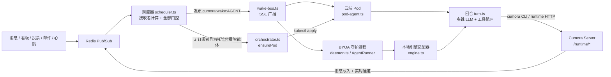

| | 云端托管 Pod | BYOA（自带智能体） |
|---|---|---|
| 承载位置 | 服务端 Kubernetes Pod | 用户机器上的常驻守护进程 |
| 入口 | `server/src/agents/runtime/pod-agent.ts` | `server/src/agents/computer/daemon.ts` |
| 大脑 | 服务端模型（`responses.create`） | 本地 CLI 引擎（Claude Code / Codex / …） |
| 唤醒接收 | `/runtime/wake-stream` SSE | `/runtime/wake-stream` SSE + 20 秒收件箱兜底轮询 |
| 数据访问 | 经服务器 HTTP，不直连数据库 | 纯 HTTP，同样不直连数据库 |
| Pod/进程回收 | 空闲或无工作即退出 | 常驻；服务安装后由监督者拉起 |

关键认知：`server/src/agents/runtime/select.ts` 选择的是**进程内客户端 vs HTTP 客户端**（`CUMORA_RUNTIME_CLIENT=http`），而**不是**云 vs BYOA。云/BYOA 的分野在调度器：`resolveAgentHost()` 得到 host 后由 `isByoaKind(host.kind)` 判定（`scheduler.ts:352,497`）。

---

## 2. 唤醒的来源与分类

唤醒的 `reason` 只有**五种**（`scheduler.ts:64`）：

```ts
type WakeReason = 'message.new' | 'idle' | 'manual' | 'background_scan' | 'poll.updated'
```

`steer` **不是**一种 reason，而是 wake-bus 上的**第二种事件类型**（`kind: 'steer'`，`wake-bus.ts:116`）。代码中不存在 `bootstrap` / `recovery` / `warmup` / `interactive` 这类唤醒类别——冷启动由「SSE 接入时无条件排空一次收件箱」处理（`pod-agent.ts:117`），断线补齐由收件箱游标处理。

| reason | 触发源 | 是否受低优先级预算约束 | 语义 |
|---|---|---|---|
| `message.new` | 消息写入后发布 `cumora:msg.new` | 否 | 有人类或智能体发言 |
| `manual` | 看板动作、显式唤醒（可带简报） | 否 | 被点名/改派，携带背景简报 |
| `idle` | `idle.ts` 空闲心跳 | **是**（20/min 进程内） | 主动看看有没有活 |
| `background_scan` | `scanner.ts` 后台扫描 / 议程 | **是** | 群里最近有动静，值得看一眼 |
| `poll.updated` | `handlePollUpdated`（投票） | **是** | 投票有更新 |

收件箱分诊与合成唤醒门控把「便宜的判断」和「昂贵的大模型回合」分开，这是整套编排的省 token 主线。

---

## 3. 云端调度主干

### 3.1 事件订阅与跨副本去重

`startScheduler()`（`scheduler.ts:1034`）在每个 server 副本上订阅 `cumora:msg.new` 与 `cumora:polls`。因为生产默认 2 副本，**同一条消息会被两个副本各收到一次**，所以进入处理器前先做跨副本认领：

```
claimAndWake: SET cumora:wake-claim:MESSAGE_ID NX EX 60
```

只有抢到键的副本继续（`scheduler.ts:575`），其余直接返回。这是「同一消息不重复唤醒」的第一道保证；它不是投递语义保证，最终兜底是已落库的收件箱记录。

### 3.2 接收者计算（`wake`，`scheduler.ts:678`）

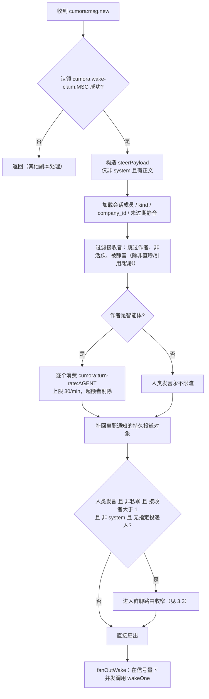

要点：

- **人类发言不受 turn-rate 限制**；只有作者本身是智能体时才按 30 次/分钟节流接收者（`scheduler.ts:759`）。这是防止智能体互相刷屏的关键。
- 静音智能体只在 `direct` 私聊、精确 `@id`、引用回复三种情况下仍被投递（`shouldDeliverToMutedAgent`，`scheduler.ts:898`）。
- `mentionedAgentIds()`（`scheduler.ts:925`）虽然名字像投递过滤器，实际只作为**提示信号**，不单独决定投递集合。
- 扇出并发受 `WAKE_FANOUT_CONCURRENCY`（默认 6）的信号量约束（`scheduler.ts:993`）。

### 3.3 群聊路由收窄（`routing.ts`）

只对「人类发言的群消息」生效。**任何不确定都 fail open 到全员扇出**——收窄是优化，不是正确性依赖。

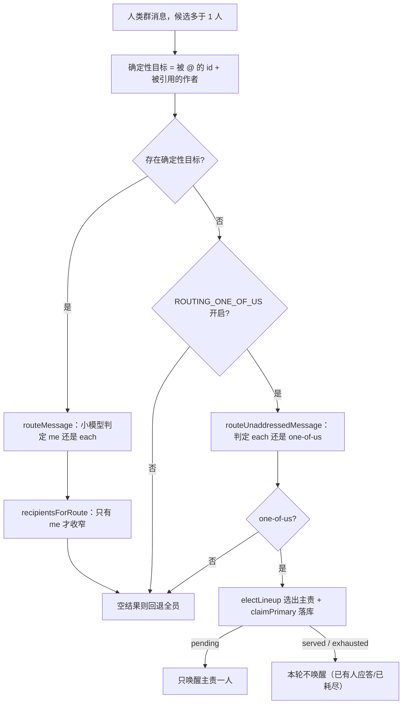

- 确定性短路（`@all`、私聊、零目标、全员目标）不会调用模型（`buildRouteRequest`，`routing.ts:40`）。
- 小模型用 `MESSAGE_ROUTING_MODEL`，`max_output_tokens: 200`，**任何异常均回退 `each`**（`routeMessage`，`routing.ts:107`）。
- `ROUTING_ONE_OF_US` 默认 **off**（`env.ts:117`）。

### 3.4 one-of-us 选举与失效兜底

「一位代言人」机制让无人 @ 的群消息只唤起一名最合适的智能体，其余人保持安静。

选举本身是**纯函数、零 I/O**（`routing-election.ts`），因此多个副本能对同一输入得出同一结论：

- `isBusyCandidate()`（`:37`）：状态属于 `thinking/working/waiting` 且未超过 90 秒租约即视为忙。
- `orderCandidates()`（`:44`）：空闲者优先，同类按 id 字典序排序（确定性）。
- `electLineup()`（`:81`）：模型提出的 `primary` 若空闲则入选，否则取第一个空闲者，再否则取忙碌的 `primary`，最后取排序首位。

选举结果落库为**可续租的行**（`routing-claims.ts`，表 `agent_routing_claims`，迁移 `0014`），保证重复投递时沿用既有结论（`claimPrimary` 用 `ON CONFLICT DO NOTHING`，`:73`）。

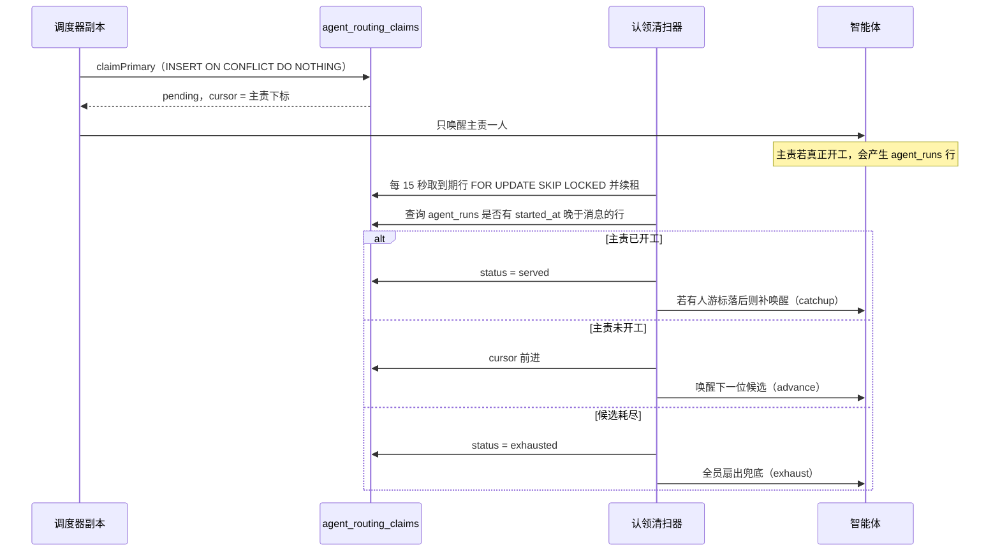

清扫参数：`ELECTION_LEASE_MS = 90_000`、`SWEEP_INTERVAL_MS = 15_000`、`SWEEP_BATCH = 20`、终态行保留 `TERMINAL_ROW_TTL_MS = 24h`。**任何认领写入失败都回退全员扇出**（`scheduler.ts:860`）。

### 3.5 每接收者门控（`wakeOne`，`scheduler.ts:333`）

这是整套编排最密的一段，按顺序经过以下门控：

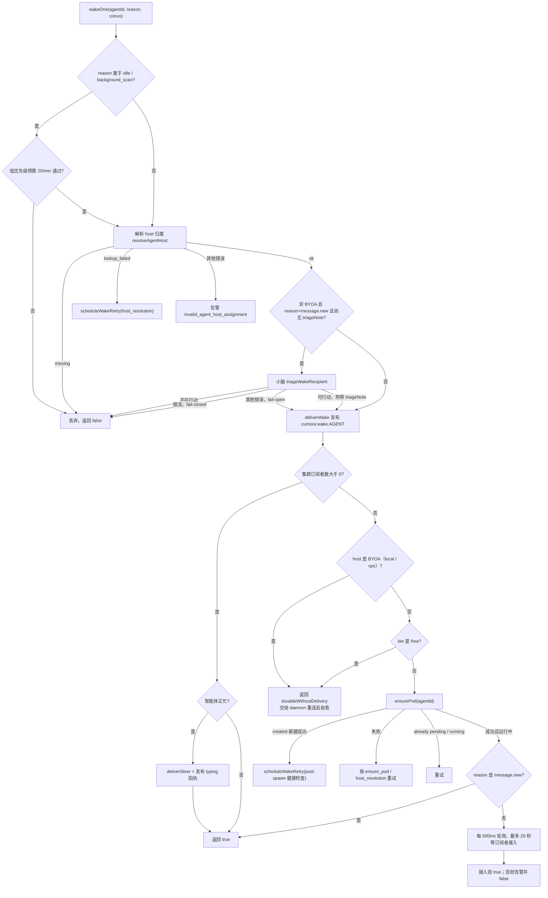

三条容易踩错的设计（均有注释说明来由）：

1. **triage 的失败方向是分层的**：限流（429/503）→ **fail-closed 丢弃**；其余错误 → **fail-open 放行**。理由是限流时大模型很可能也限流，硬唤醒只是烧钱。
2. **`message.new` 永不进入重试队列**。它已经持久化在收件箱里，Pod 排空时会自愈；再排一次队列会导致「先唤醒 3 次再唤醒 1 次」的重复投递 Bug（`scheduler.ts:95` 的注释）。**只有 `manual` 会被真正入队**。
3. **BYOA 与 free 档永不调用 `ensurePod`**（`:497,:511`），只返回「已持久化但未投递」；免费档是 BYOA 专属。

### 3.6 投递（`wake-bus.ts`）

- 频道为 `cumora:wake:AGENT_ID`；`deliver()` 的返回值是**集群订阅者数**，`0` 表示该智能体在所有副本上都没有活跃的 SSE 连接（`wake-bus.ts:227`）。
- 每个 agent 频道只在**首个**本地订阅者出现时订阅 Redis（`:322`），最后一个离开时退订。
- 背压：写出缓冲超过 1 MB 或待投递数达到 64 即断开该订阅者（`:153,:157`）。
- 心跳 ping 每 25 秒；每条事件带 `kind-uuid` 形式的 `id`，便于 Pod 重连后去重（`:264`）。

### 3.7 Pod 生命周期（`orchestrator.ts`）

`ensurePod()`（`:1155`）是幂等的，用 `inFlight` 去重 + `ENSURE_POD_WATCHDOG_MS = 180_000` 看门狗。其实现 `ensurePodImpl`（`:1192`）依次：

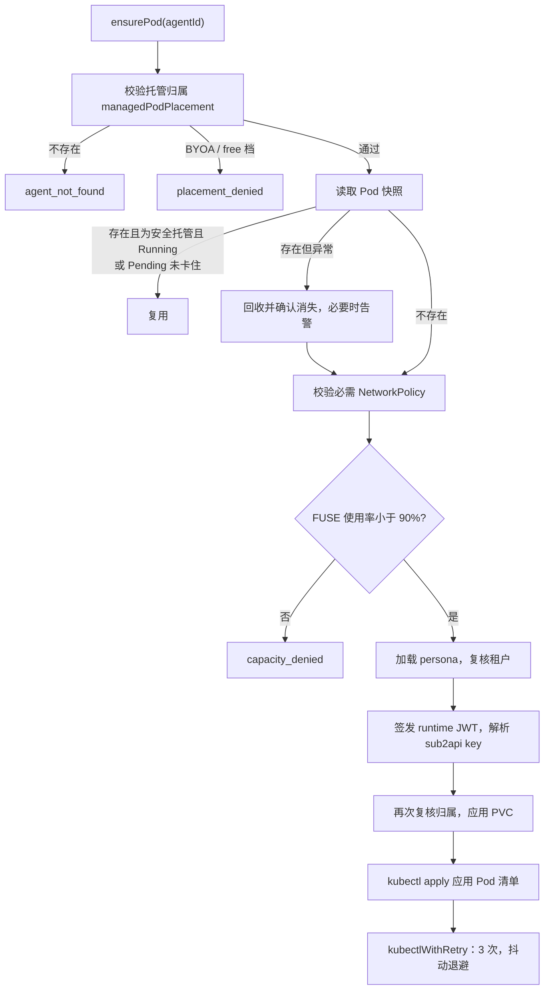

合理之处：归属判定在整个流程中被**复核三次**（初始、复用、apply 前），避免在长时间的编排过程中归属发生变化；FUSE 准入是集群级的熔断，防止 Pod 数量把 `/dev/fuse` 打满。

### 3.8 重试队列

`scheduler.ts` 用 Redis zset + hash 维护唤醒重试：

- 退避 `min(60s, 5s · 2^min(attempt,4))`（`_wakeRetryDelayMs`，`:89`）。
- `pollWakeRetriesOnce` 每 5 秒取一批到期任务（`ZRANGEBYSCORE … LIMIT 0 25`，`ZREM` 抢占），上限 `WAKE_RETRY_MAX_ATTEMPTS = 60`，耗尽后告警 `scheduler.wake_retry_exhausted`。
- 重试准入规则：`host_resolution` 失败**总是**重试；其余沿用 `_shouldRetryEnsurePodFailure`，即**只有 `manual` 才排队**。

### 3.9 合成唤醒：心跳、扫描与议程

这三种唤醒都不该让大模型空转，因此各有一道「先判断值不值得」的关卡。

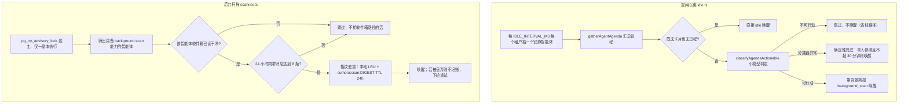

| 机制 | 关键常量 / 键 | 位置 |
|---|---|---|
| 空闲安静阈值 | `IDLE_MIN_QUIET_MIN = 25` | `idle.ts:57` |
| 议程分类模型 | `AGENDA_CLASSIFIER_MODEL`，`max_output_tokens: 2000` | `agenda.ts:437` |
| 停滞窗口 | `CUMORA_STALL_MIN_MS = 5min` / `CUMORA_STALL_MAX_MS = 6h` | `agenda.ts:238` |
| 停滞轻推冷却 | `CUMORA_NUDGE_COOLDOWN_MS = 45min` / 兜底路径 `5min` | `agenda.ts:137` |
| 轻推去重 | `SET cumora:nudge:CONVO EX 冷却 NX`，连续 3 次被拒后放弃 | `agenda.ts:137,182` |
| 扫描选主锁 | `pg_try_advisory_lock(7_643_178_926_318)` | `scanner.ts:351` |
| 扫描窗口 / 阈值 | `SCANNER_WINDOW_HOURS = 24`，`SCANNER_MIN_MESSAGES = 8` | `scanner.ts:296` |
| 扫描指纹 | `SET cumora:scan:DIGEST EX 24h` | `scanner.ts:329` |
| 低优先级预算 | `LOW_PRIORITY_WAKE_BUDGET_PER_MIN = 20`，进程内 | `scheduler.ts:240` |

注意 `agenda.ts` 的分类器异常走的是**确定性兜底**而非放弃：当「无卡片、无日程、恰有一个停滞且最后发言者不是自己且静默不超过 30 分钟」时仍会唤醒（`:539`）。这保证分类器挂掉时不会把该做的活全丢掉。

---

## 4. 回合执行

`runAgentTurn()`（`turn.ts:1574`）是唯一的运行时入口，对云端 Pod 与 BYOA 引擎同样适用。

### 4.1 回合生命周期

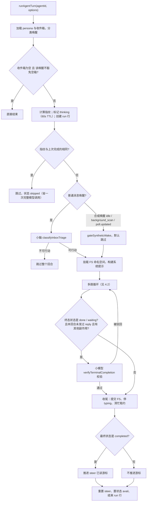

指纹去重（`lastCompletedInbox`，`turn.ts:841`）是一个廉价而有效的省钱措施：同一批未读消息重复唤醒时直接跳过。

### 4.2 多跳循环与终止

循环体为 `for (hop = 0; hop < MAX_HOPS; hop++)`，`MAX_HOPS = 200`（`turn.ts:850,2460`）。每一跳：

1. 检查自动压缩（`turn.ts:2477`）。
2. 一次流式模型调用：`tool_choice: 'auto'`、`reasoning.effort: 'low'`、`max_output_tokens: 4000`（`:2665`）。
3. 并发执行工具（`Promise.all` 包 `executePodTool`，`:2961`）。
4. 追加历史（`:3065`）。
5. **工具之后**排空 steer（`:3108`）——顺序很关键，见第 5 节。

退出只有四种原因（`loopExitReason`，`turn.ts:1677`）：

| 退出原因 | 条件 | 结果 |
|---|---|---|
| `turn_status` | 模型显式声明终态 | 正常结束 |
| `budget` | 压缩后历史仍超硬上限 | 结束 |
| `protocol_violation` | 反复不声明回合状态 | 结束 |
| `max_hops` | 循环耗尽仍在请求工具 | 状态记为 `failed` |

无工具调用分支（`:2810`）的处理顺序值得注意：先尝试排空 steer（若有则 `continue` 继续循环），再最多两次催促模型声明状态，然后若此前已发过回复则推断为 `done`，最后合成唤醒的无操作按 `skipped` 结束。

### 4.3 回合状态协议

模型通过 `set_turn_status` 工具声明状态。合法取值 `['done','continue','needs_clarification','blocked','waiting']`（`tools-shared.ts:47`），其中**终态只有 `done` 与 `waiting`**（`isTerminalTurnStatus`，`turn.ts:1121`）。

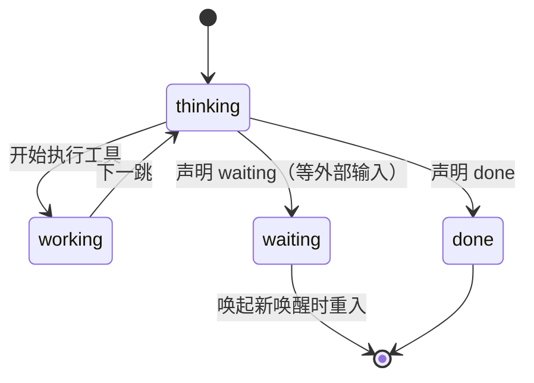

有一条硬性设计：**绝不从「模型沉默」推断语义完成**（`turn.ts:1669`）。沉默只会触发催促或协议违规计数，不会把回合当作成功。

### 4.4 上下文压缩（`turn-compaction.ts`）

- 软阈值 75% 触发压缩，硬上限 95% 强制结束（`compactThresholdFor` / `hardLimitFor`，`turn.ts:933,942`）。
- 上下文窗口按模型判定：`gpt-5*` 200K，`gpt-5.4-mini` 128K，`gpt-5.4-nano` 64K，`gpt-4o` 128K（`contextWindowFor`，`:918`）。
- 单跳工具输出上限 `MODEL_TOOL_OUTPUT_BYTES = 8_000`（`:856`）。
- 压缩的四条不变量（`turn-compaction.ts:26`）：同一 `call_id` 组整体增删、起始非工具种子项不删、最近 `KEEP_RECENT_PAIRS = 2` 对不删、**存活项保持原有相对顺序（只删除、绝不重排）**——最后一条是修复重复回复 Bug 的产物。
- token 估算对中日韩字符做了区分：ASCII 约 3.5 字符/token，非 ASCII 约 1 字符/token（`estimateTokens`，`:105`）。

### 4.5 完成验证

当回合即将以终态结束、但本回合**没有** `cumora reply` 副作用、却有其他副作用时，触发小模型校验 `verifyTerminalCompletion`（`turn.ts:1184`，超时 `VERIFIER_TIMEOUT_MS = 10_000`）。被驳回则把「继续」提示压回历史（`:3166`）。这防止智能体「声称做完了但其实什么都没交付」。

---

## 5. 回合内插话：steer

云端 Pod 与 BYOA 的引擎进程都是**单线程、一次一个回合**。在漫长的多跳序列里，用户新发的消息原本要等整个回合结束才会被调度器再次唤醒。

`steer.ts` 把这些消息排进队列，`turn.ts` 在**跳边界**处注入，因此新消息不必等回合结束即可影响模型决策。

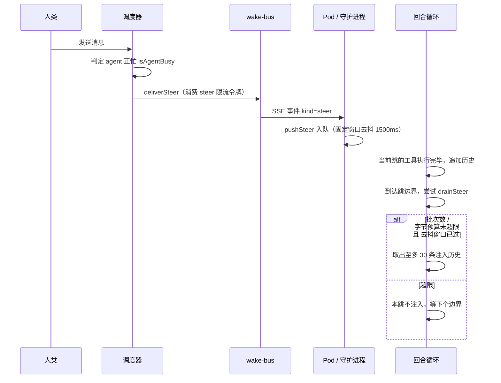

设计上明确是「**跳间注入，绝不取消进行中的流**」（`steer.ts:11`）。注入点在工具输出追加**之后**，因此 `function_call` 与 `function_call_output` 的配对永远不会被打断——这是协议层的硬约束。

| 常量 | 值 | 作用 |
|---|---|---|
| `DEBOUNCE_MS` | 1500 | 固定窗口去抖：首条设定截止时间，后续条目不延长窗口 |
| `SUMMARIZE_THRESHOLD` | 3 | 超过则用小模型摘要，摘要失败回退截断原文 |
| `MAX_BATCHES_PER_TURN` | 8 | 每回合最多注入批次数 |
| `MAX_BODY_BYTES` | 4096 | 单条正文截断上限 |
| `MAX_QUEUE_ITEMS` | 100 | 队列上限，FIFO 淘汰最旧 |
| `MAX_ITEMS_PER_DRAIN` | 30 | 单次排空条数 |
| `MAX_BYTES_PER_TURN` | 64 KiB | 整回合累计注入字节上限 |
| `STEER_INTERRUPT_AFTER_MS` | 20 000 | 工具批次超过此时长即中断（仅 bash 可中断） |
| `STEER_RATE_PER_MINUTE` | 30 | 发布端限流，按 agent 滚动 60 秒 |

另外两点：

- **队列刻意不持久化**（`steer.ts:224`）。Pod 崩溃丢队列是可接受的，因为每条被 steer 的消息本来就已在 `messages` 表里，收件箱会兜底。
- `STEER_ENABLED` 关闭时 `pushSteer` 退化为空操作（`:267`）。该开关的默认解释是「未设置即为开」（`env.ts:109`）。

---

## 6. BYOA 守护进程

守护进程是运行在用户机器上的**自包含迷你调度器**：纯 HTTP，无数据库、无 Redis。

### 6.1 主循环与定时器

`doRun()`（`daemon.ts:3287`）启动时依次安装带时间戳的日志、`unhandledRejection`/`uncaughtException` 保活处理、加载配置、`requireLocalEngine()` 要求必须有可用引擎、写入 `running.json`，然后拉起下列定时任务：

| 任务 | 间隔 | 常量 / 环境变量 |
|---|---|---|
| 智能体集合同步 | 60 s | `AGENT_POLL_MS` |
| 心跳 | 30 s | `HEARTBEAT_MS` |
| 引擎 PATH 重扫 | 5 min | `ENGINE_RESCAN_MS` |
| 日志轮转 | 5 min | `LOG_ROTATE_MS`（单文件上限 20 MB） |
| 自更新检查 | 6 h，首次 60 s | `UPDATE_CHECK_MS` |
| 空闲退出以便更新 | 30 s | 字面量 |
| 回合内 run 心跳 | 60 s | `RUN_HEARTBEAT_MS` |
| 收件箱兜底轮询 | 20 s | `INBOX_POLL_MS`（按 agent，忙时跳过） |
| 唤醒去抖窗口 | 2.5 s | `WAKE_DEBOUNCE_MS` |
| 议程静默 / 检查节流 | 90 s / 60 s | `AGENDA_QUIET_MS` / `AGENDA_CHECK_MS` |
| CLI IPC 兜底轮询 | 1 s | `CLI_IPC_FALLBACK_POLL_MS` |

同步与扫描都做了单飞与合并：`sync()` 是单飞（`:3406`），引擎重扫经 `createEngineRescanQueue` 合并（`:61`），引擎清单经 `EngineInventoryStabilizer` 稳定后才上报（`:942`）。优雅停机给 `CUMORA_SHUTDOWN_GRACE_MS`（默认 15 秒）等待忙碌的 runner 收尾。

### 6.2 单个智能体的运行回合

每个被分配的智能体对应一个 `AgentRunner`（`daemon.ts:1634`），持有自己的专属 home、runtime JWT、SSE 唤醒流与引擎会话。

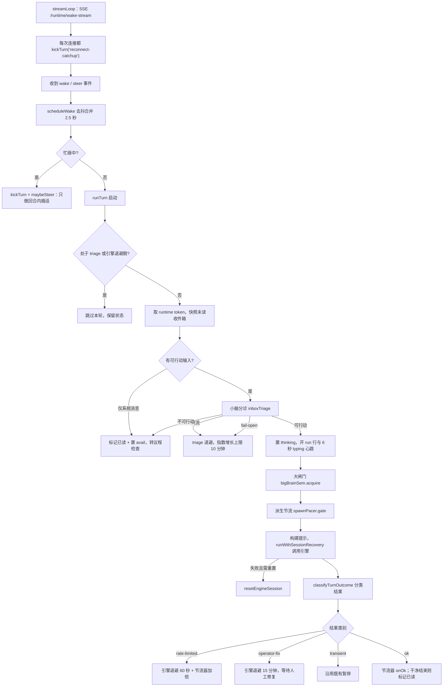

### 6.3 并发闸门与节流

三道独立的限流器，避免在用户机器上把本地引擎与配额打爆：

| 机制 | 默认 | 环境变量 | 语义 |
|---|---|---|---|
| 大脑并发 | 6 | `CUMORA_BYOA_MAX_CONCURRENT_BIG_BRAIN` | `BigBrainSemaphore`，FIFO 等待队列 |
| 小脑并发 | 8 | `CUMORA_BYOA_MAX_CONCURRENT_TRIAGE` | 比大脑高，因为分诊便宜 |
| 派生最小间隔 | 500 ms | `CUMORA_BYOA_MIN_SPAWN_INTERVAL_MS` | `AdaptivePacer` 基准；限流时翻倍至上限 8 s，连续 5 次成功后减半 |

失败分类决定退避长短（`backoffUntilFor`，`daemon.ts:287`）：`ok` 不退避，`rate-limited` 退避 60 秒，`operator-fix`（未登录 / 额度不足 / 密钥无效）退避 15 分钟，`transient` 保持原状。把「需要人工介入」与「等一等就好」区分开，是避免把配额浪费在必然失败的调用上的关键。

### 6.4 引擎会话的持久、恢复与重置

- **持久化**：会话 id 存在 agent home 之外（`session-store.ts`，路径形如 `sessions/AGENT/ENGINE[.指纹].session`），因此守护进程重启后可以用 `--resume` 续上同一个引擎会话。写入是 0600 临时文件 + 原子重命名（`:90`）。
- **会话身份是三维的**：agent、engine、以及**provider profile 指纹**（`daemon.ts:1743`）。因此切换自定义服务商配置会开启全新会话，而不是错误地续用旧会话。
- **恢复只做一次，且只认明确证据**（`session-recovery.ts:13`）：仅当引擎明确报出 `resume-not-found` 时才清空会话重跑一次；**模糊失败绝不重放**，避免重复产生副作用。
- **重置的触发条件**（`mustResetSession`，`daemon.ts:1827`）：上下文溢出、转录被污染、或带 resume 时命中陈旧恢复错误。
- 持久会话不可用时（例如某个引擎的一次性模式）会退回 `adapter.run` 单次执行（`:1884`）。

### 6.5 引擎适配层

`engine.ts` 定义统一契约（`EngineAdapter`，`:781`），守护进程只依赖接口，`adapter = getAdapter(engine)`（`daemon.ts:1747`），从不出现引擎专属代码——这正是「编排对引擎无感」的实现方式。

```ts
interface EngineAdapter {
  readonly id: EngineId
  readonly bin: string
  seedHome(home, persona): Promise<void>
  run(args): Promise<EngineRunResult>
  startSession?(args): EngineSession | null   // 可选：缺失即只支持一次性执行
  classify(args): Promise<EngineClassifyResult>  // 分诊
  probe(args): Promise<EngineClassifyResult>     // doctor 探测
  probeWake(args): Promise<EngineWakeProbeResult>
}
```

| 适配器 | 持久会话 | 原生 steer | 说明 |
|---|---|---|---|
| `ClaudeAdapter` | 是 | **是** | stream-json 输入 |
| `CodexAdapter` | 是 | **是** | app-server JSON-RPC |
| `PiAdapter` | 是 | **是** | RPC 行协议 |
| `GrokAdapter` | 是 | 否 | ACP |
| `ZcodeAdapter` | 是 | 否 | 经 `zcode-acp-server` 的 ACP |
| `AntigravityAdapter` | 是 | 否 | 沙箱化 stream-json |
| `CursorAdapter` | 否 | — | 每次唤醒一次性执行 |
| `OpenCodeAdapter` | 否 | — | 同上 |
| `GeminiAdapter` | 否 | — | 同上 |
| `QwenAdapter` | 否 | — | 复用 Claude 形状信封 |

引擎归因字符串由 `byoa-source.ts` 统一收敛为 `byoa-<engine>` 白名单（`:3`），守护进程侧用 `byoaSourceOf(id)` 镜像同一规则（`daemon.ts:1509`），未知值默认回落到 `byoa-claude`。

**注意**：路径上叫 `computer/registry.ts` 的文件**不是**适配器注册表，而是服务器侧的 Computer 数据访问与鉴权模块（用 Postgres 与 Redis）。适配器注册表在 `engine.ts:5748`（`ADAPTERS` / `getAdapter`）。

---

## 7. 横向：预算、限流与成本

编排的每个昂贵动作都有对应的节流或记账：

| 机制 | 参数 | 位置 |
|---|---|---|
| 人类发言 | 永不限流 | — |
| 智能体发言的接收者 | `cumora:turn-rate:AGENT`，30 次/分钟 | `scheduler.ts:259` |
| steer 发布 | `cumora:steer-rate:AGENT`，30 次/分钟 | `scheduler.ts:655` |
| 合成唤醒 | 20 次/分钟，进程内 | `scheduler.ts:272` |
| 扇出并发 | `WAKE_FANOUT_CONCURRENCY`（默认 6） | `scheduler.ts:47` |
| 唤醒重试 | 上限 60 次，批量 25 | `scheduler.ts:89,163` |
| 跨副本认领 | `cumora:wake-claim:MSG`，60 秒 | `scheduler.ts:575` |
| 小模型调用 | 0 重试，8 秒超时，`reasoning.effort: low` | `inbox-triage.ts:34` |
| 成本台账 | `llm_calls` 表，按 purpose 分类 | `llm-ledger.ts` |
| 成本聚合 | 每小时桶物化，单写者 advisory lock | `llm-rollup.ts` |
| 观察指标 | triage 与 wake 分开记账，可算节省额 | `observability.ts` |

小模型的分诊链是省钱的核心：在唤醒大模型之前，先用**确定性规则**（空收件箱、日历到期、仅系统消息、有未读人类消息、智能体间私聊每 8 次、循环上限 `HARD_LOOP_CAP = 20`）裁定，只有落不进任何规则的场合才真的调用模型（`triage-core.ts:317`）。

---

## 8. 关键不变量与易错点

1. **`message.new` 不入重试队列**。它靠收件箱持久化自愈；入队会造成重复唤醒。
2. **只有 `manual` 会在 `ensurePod` 失败后真正排队重试**；`host_resolution` 失败例外，它总是重试。
3. **triage 失败方向分层**：限流 fail-closed，其他错误 fail-open。合成唤醒（无人在等）则任何错误都 fail-closed。
4. **BYOA 与 free 档永不 `ensurePod`**；它们返回「已持久化但未投递」。
5. **steer 只在跳边界注入**，且必须在工具输出追加之后，否则破坏 `function_call` 配对。
6. **绝不由沉默推断完成**；完成还需通过小模型校验（当没有 reply 副作用时）。
7. **压缩只删除、不重排**；重排会导致重复回复。
8. **选举是纯函数 + 可续租行**；任何认领失败都回退全员扇出，不静默丢消息。
9. **`ROUTING_ONE_OF_US` 默认关闭**，`STEER_ENABLED` 默认开启——两者的默认值语义不同，改配置时需注意。
10. **`computer/registry.ts` 是服务端模块**，不是本地适配器表；后者在 `engine.ts`。

已知的实现与注释不一致：`pod-agent.ts` 文件头注释称空闲默认 10 分钟，但代码默认是 **3 分钟**（`CUMORA_AGENT_IDLE_MS` 默认 `180_000`，无工作退出 `CUMORA_AGENT_NO_WORK_MS` 默认 `90_000`，`pod-agent.ts:260`）。以代码为准。

---

## 9. 代码索引

| 关注点 | 入口文件 |
|---|---|
| 调度中心、全部门控与预算 | `server/src/agents/scheduler.ts` |
| 群聊路由收窄 | `server/src/agents/routing.ts` |
| 选举纯函数 | `server/src/agents/routing-election.ts` |
| 选举落库与失效清扫 | `server/src/agents/routing-claims.ts` |
| 收件箱分诊执行 | `server/src/agents/inbox-triage.ts` |
| 分诊纯核心（云端与 BYOA 共用） | `server/src/agents/triage-core.ts` |
| 心跳议程预检 | `server/src/agents/agenda.ts` |
| 空闲调度 | `server/src/agents/idle.ts` |
| 后台扫描 | `server/src/agents/scanner.ts` |
| 唤醒投递 | `server/src/agents/runtime/wake-bus.ts` |
| Pod 生命周期 | `server/src/agents/runtime/orchestrator.ts` |
| 唤醒事件语义 | `server/src/agents/runtime/wake-options.ts` |
| 回合执行 | `server/src/agents/turn.ts` |
| 唤醒分类（纯） | `server/src/agents/turn-wake.ts` |
| 上下文压缩（纯） | `server/src/agents/turn-compaction.ts` |
| 回合内插话 | `server/src/agents/steer.ts` |
| Pod 入口与回收 | `server/src/agents/runtime/pod-agent.ts`、`pod-agent-exit.ts` |
| BYOA 守护进程 | `server/src/agents/computer/daemon.ts` |
| 引擎适配层 | `server/src/agents/computer/engine.ts` |
| 引擎会话持久化 | `server/src/agents/computer/session-store.ts` |
| 引擎会话恢复 | `server/src/agents/computer/session-recovery.ts` |
| 协调信号（已读/锚点/挂起） | `server/src/agents/seen-boundary.ts` |
| Computer 数据与鉴权（服务端） | `server/src/agents/computer/registry.ts` |
