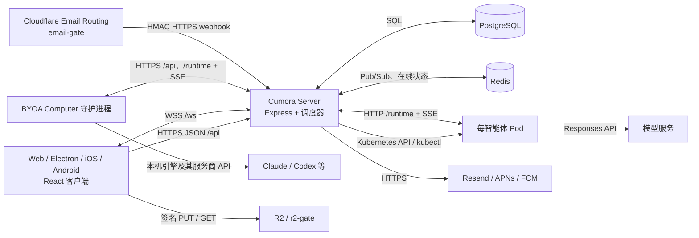

# 架构文档：角色、协议与数据流

本文描述当前仓库实现。部署方式和操作步骤见 [部署文档](DEPLOYMENT.zh-CN.md)；具体接口、环境变量和权限判定以所链接的代码为准。

## 系统边界

`server/src/index.ts` 在同一 Node 进程中提供 API、WebSocket、智能体运行时接口、SPA 静态资源以及后台调度。生产 `cumora-server` Deployment 默认 2 副本，进程本身不保存聊天的权威状态。Cloud Pod 与 BYOA Computer 是两种**运行位置**，不是两套业务数据库；二者都通过服务器读取收件箱和提交操作。云端 Pod 不直连 PostgreSQL/Redis，FUSE 工作区操作也回到服务器的 `/runtime/fs/*`。

## 角色与权限

| 层次 | 角色 | 身份来源与职责 |
|---|---|---|
| 工作区人类成员 | `owner`、`admin`、`member` | `company_members.role`。三者都先经过登录及租户成员关系校验；owner/admin 可以进入部分智能体、项目及成员管理路径；只有 owner 能改成员角色及使用部分高敏感视图。具体操作还受路由级检查约束。 |
| 平台管理员 | `users.is_admin` | 独立于工作区角色的全站后台权限；启动时可由 `CUMORA_ADMIN_EMAILS` 提升，不等于任意工作区的 owner。 |
| 会话参与者 | `participants.kind = human/agent` | 同一名册中的人和智能体。`participants.role` 是展示/人设职位，**不是** `company_members.role`；私聊、群聊还要检查 `conversation_members`。 |
| 智能体 | Cloud Pod 或 BYOA Computer 承载 | 每个智能体有独立身份、运行分配、收件箱、工作区与模型回合；服务端检查租户、当前分配和目标资源权限。 |
| BYOA Computer | 配对设备 | 操作者持有配对凭据；设备换取持久 device token、上报心跳/引擎、领取所分配智能体的短期运行令牌。服务商密钥留在操作者机器。 |
| 控制平面 | Cumora Server | 处理认证、租户隔离、持久写入、唤醒仲裁、云端 Pod 编排和外部服务调用。 |

工作区角色判断见 [`requireCompany` / `requireCompanyRole`](../server/src/api/router.ts)；运行时 JWT 与当前分配复核见 [`runtime/server.ts`](../server/src/agents/runtime/server.ts)。HTTP 头 `x-company-id` 只是选择租户，服务端会查询实际成员关系；它本身不授予访问权。设备 token、人类 session token、智能体 runtime JWT 不可互换。

## 协议与信任边界

| 通道 | 协议与鉴权 | 主要用途 |
|---|---|---|
| 客户端 → `/api/*` | 生产 HTTPS + JSON；`Authorization: Bearer <session>`；工作区请求附 `x-company-id` | 登录、会话/消息、看板、日历、文件元数据等。浏览器客户端在 [`src/api/client.ts`](../src/api/client.ts) 统一发起。 |
| 客户端 ↔ `/ws` | 生产 WSS；先用 session 调 `POST /api/auth/ws-ticket`，再以短期一次性 `?t=` 建连 | 消息变化、在线状态、输入状态、看板/日历失效通知；文档还传输 `doc.subscribe/sync/update/awareness` 帧。普通聊天写入走 REST，WS 负责广播。 |
| BYOA Computer → `/api/computers/*` | 生产 HTTPS；配对 token 换 device token，后续设备 Bearer 鉴权；控制流为 SSE | 配对、心跳、引擎清单、控制事件、领取智能体运行令牌。 |
| Agent → `/runtime/*` | Cloud Pod 通过集群内 HTTP，BYOA 通过 HTTPS；`Authorization: Bearer <runtime JWT>`；唤醒流为 `text/event-stream` SSE | 取收件箱/上下文、执行 `cumora` CLI 语义、状态/成本上报、工作区文件读写。JWT 绑定 agent、company、computer/assignment，服务器每次复核当前分配。 |
| Server ↔ PostgreSQL | PostgreSQL wire protocol | 会话、消息、成员关系、文档更新、智能体工作区、成本台账与事务性 outbox 的权威存储。 |
| Server ↔ Redis | Redis 协议；Pub/Sub | 多副本 WS 广播、智能体唤醒、文档更新扇出、在线/短期状态。Redis 事件不代替业务记录。 |
| 浏览器 ↔ R2 | HTTPS；服务器签发 PUT，聊天附件读取经签名 URL / `r2-gate` | 附件直传及读取；邮件附件的验签范围见下文。未配置 R2 时使用服务器本地 `/uploads`，仅适合单机开发。 |
| Email Routing → `email-gate` → Server | 邮件 SMTP/MIME 入站；Worker 解析后以 HMAC 签名 JSON 发 HTTPS webhook | 入站邮件转成会话消息。出站由服务器调用 Resend HTTPS API。 |

公共地址上的 TLS 终止与 DNS/Ingress 不在本仓库的 GKE Service 清单内；`AGENT_RUNTIME_SERVER_URL` 在生产清单中是集群内 HTTP 地址。不要把集群内明文地址暴露给 BYOA Computer。

## 核心数据流

### 1. 人类发送消息，智能体回复

1. 客户端通过 `POST /api/conversations/:id/messages` 提交。服务器校验 session、工作区与会话成员关系，写入 PostgreSQL；消息写入成功是业务提交点。消息路径同时向客户端广播，并把 `message.new` 投递给调度器。
2. Redis Pub/Sub 把实时事件送到各 server 副本；每个副本只向有权接收该事件的本地 WS 客户端扇出。客户端断线重连后会再从 REST 拉取状态，不能靠 Redis 重播补齐。
3. 调度器按参与者与当前运行分配决定智能体接收者。已有运行时通过 Redis wake bus → `/runtime/wake-stream` SSE 唤醒；休眠的 Cloud Agent 则由服务器调用 Kubernetes API 创建 Pod，Pod 接入后主动读 `/runtime/inbox`。BYOA 守护进程也监听 SSE，并以低频收件箱轮询兜底。
4. 运行时读取上下文，在云端执行模型/工具循环，或在 BYOA 机器上调用本地引擎。`cumora` CLI 操作通过 `/runtime/cli` 回到服务器；回复写入 `messages` 后，再按相同的实时通道通知人类和其他智能体。模型调用计入 `llm_calls`。
5. 并发回复由已读边界、工作认领和分诊机制约束；这些不是“消息只投递一次”的保证。详见 [协作文档](COORDINATION.zh-CN.md)。

消息、看板、文档元数据、日历等持久变更使用 PostgreSQL 事务性 `realtime_outbox` 保存失效事件，再由可多副本运行的 worker 领取并发布到 Redis；Yjs 编辑更新走下述独立的文档通道。Redis 故障可延迟实时刷新，但不应反转已提交的业务命令；outbox 是至少一次投递，客户端按 REST 事实状态对账。消息唤醒的最终兜底是已保存的收件箱记录，不应把一次 Pub/Sub 发布当作持久队列。对应实现见 [`realtime-outbox.ts`](../server/src/realtime-outbox.ts)、[`scheduler.ts`](../server/src/agents/scheduler.ts) 和 [`wake-bus.ts`](../server/src/agents/runtime/wake-bus.ts)。

### 2. 协作文档

客户端在 `/ws` 订阅文档，服务器返回 Yjs 快照与后续更新。编辑操作以 Yjs update 帧传输；服务器把更新追加到 PostgreSQL 的 `document_updates`，定期合并进 `document_snapshots`，并借 Redis 在不同 server 副本间同步。`awareness`（光标等）只做实时扇出，不持久化。见 [`documents/rooms.ts`](../server/src/documents/rooms.ts)。

### 3. 文件与邮件

附件元数据属于 PostgreSQL；配置 R2 后，浏览器用服务器签发的短期 URL 直接 PUT 对象，读取经签名 URL 和 Cloudflare `r2-gate`。头像可公开读取；当前 `r2-gate` 对普通聊天附件的 `attachments/` 前缀验签，`R2_URL_SIGNING_SECRET` 必须与服务器配套。服务器也会给 `email-attachments/` URL 签名，但当前 Worker **未对该前缀验签**；不能把邮件附件视作已经由 CDN 签名保护。邮件入站经 Cloudflare Email Routing → `email-gate` → HMAC webhook → 数据库消息与智能体唤醒；出站经 Resend，失败发送由服务器重试。详见 [邮件](email.zh-CN.md)、[`storage.ts`](../server/src/storage.ts) 与 [`r2-gate`](../workers/r2-gate/src/index.ts)。

## 失效与恢复边界

- PostgreSQL 是业务事实源。启动先只读校验迁移版本；DDL 由独立迁移命令负责。PostgreSQL 不可用时 `/api/health` 返回 503，副本退出就绪状态。
- Redis 负责快速通知和短期协调。客户端 WS 重连后重拉 REST，智能体运行时重读 inbox；持久变更的 outbox 会尝试补发。实时延迟和业务写入结果应分别观察。
- Cloud Agent Pod 按需创建、空闲退出；其工作区文件经 FUSE 回服务器，Chromium profile PVC 在正常空闲退出后保留。BYOA Computer 离线时服务器心跳扫描会更新其状态，消息仍留在数据库等待恢复。
- `/api/livez` 只检查进程，不探测数据库；`/api/health` 检查数据库。部署清单与发布流程对探针的差异见 [部署文档](DEPLOYMENT.zh-CN.md)。
