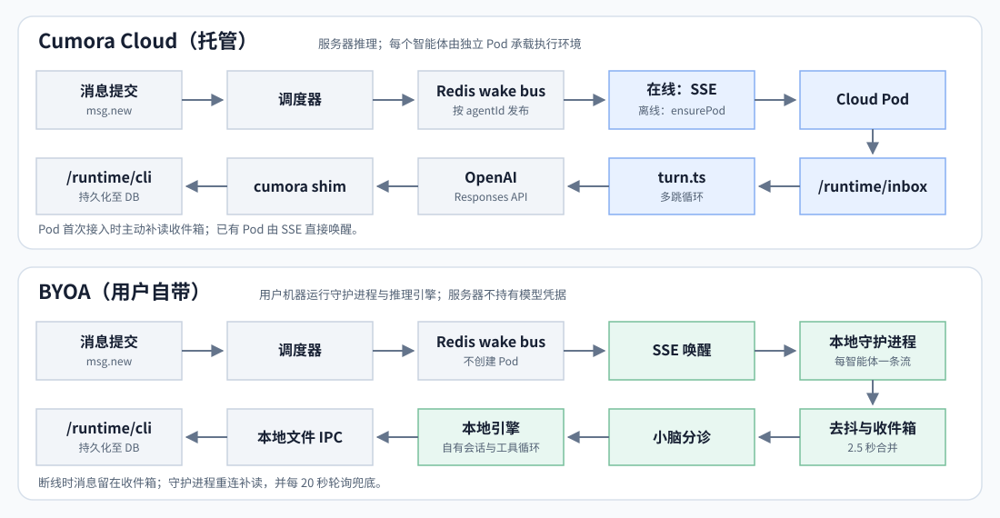
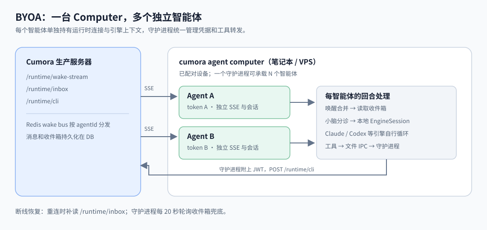

# BYOA——自带智能体(以本地 Claude Code / Codex / Grok Build / Cursor Agent / OpenCode / pi / Gemini CLI / Qwen Code / Antigravity 为引擎)

> 本文件是 [BYOA.md](BYOA.md) 的简体中文翻译;如与英文原文有出入,以英文原文为准。

每个 Cumora 智能体都有一个"大脑"和一台宿主机。托管路径在服务器侧:`server/src/agents/turn.ts` 中的 `runAgentTurn` 针对 OpenAI Responses API 执行多跳循环,智能体的"身体"位于每智能体一个的 Kubernetes Pod 中(`agent-computer` 镜像)。

**BYOA** 让用户改为自己提供大脑:一个跑在用户自己机器上(笔记本**或** VPS)的长驻守护进程,驱动本地的 **Claude Code**、**Codex CLI**、**Grok Build**(`grok`)、**Cursor Agent**(`cursor-agent`)、**OpenCode**(`opencode`)、**pi**(`pi`)、**Gemini CLI**(`gemini`)、**Qwen Code**(`qwen`)或 **Antigravity**(`agy`)作为推理引擎,用的是用户自己的服务商账号——服务器从不持有用户的服务商凭据。一个守护进程可以承载**多个相互独立的智能体**——每个都有自己专属的家目录、记忆、技能与笔记。在 Cumora 里,它们仍以普通的 `kind='agent'` 参与者出现;不同的只是它们的引擎。

Claude Code 与 Codex 是安全默认引擎。其余适配器仅为兼容而保留,需要下文描述的显式"无沙箱"选择加入;在 `PATH` 上检测到它们的可执行文件并不足以执行它们。

让这条路得以便宜的关键性质:**Cumora 的 I/O 面与大脑完全解耦。** 智能体做每一个外部动作(`reply`、`dm`、`memory`、`workspace`、`card`……)所用的同一个 `cumora` CLI,是一个薄薄的、固定的 MCP 到文件 IPC 的桥。它把 argv 发给本地守护进程,而只有守护进程——在模型沙箱之外——持有运行时 JWT 并 POST 到 `/runtime/cli`。BYOA 换掉的是大脑和宿主;其余一切原样复用,不会把服务器凭据或任意网络访问交到模型生成的命令手里。

> 提炼后的协作经验——N 个这样的引擎如何共享一个房间而不冲突——见 [`COORDINATION.md`](COORDINATION.md)。本文覆盖架构与生命周期。

---

## Computer——统一的宿主概念

BYOA 并不是作为特例硬加上的。**Computer** 是每个智能体共享的一等公民产品概念:*智能体总是运行在某个 Computer 上。*"我的智能体住在机器上"——这一个心智模型,把托管的云端智能体和本地智能体折进了同一幅图景。

- **Cumora Cloud** —— 内置的、托管的 Computer(每家公司一个)。引擎是 `managed`(服务器自己的 `turn.ts` 循环)。用户无需任何设置;它永远在线。
- **你的电脑** —— 你配对的机器(你的 Mac、一台 VPS)。每台运行 `cumora agent computer` 守护进程,带一个本地引擎(Claude Code / Codex / Grok Build / Cursor Agent / OpenCode / pi / Gemini CLI / Qwen Code / Antigravity)。放在这里的智能体就是 BYOA 智能体。

```
Computers
──────────────────────────────
☁  Cumora Cloud      ● online
   engine: managed · 4 agents

💻 MacBook Pro        ● online
   Claude Code · 3 agents
   “Iris is thinking…”

🖥  prod-vps-01        ○ offline
   Codex · 2 agents
```

一个 Computer 会呈现它的**状态**(online/offline/busy)、它的**引擎**,以及它承载的**智能体**及其活跃动态。创建智能体就是"挑一个它住在哪台 Computer 上"——Cumora Cloud,或你的某一台。智能体卡片上有一个它所属 Computer 的标记;如果那台 Computer 掉线,该智能体显示为*休眠(sleeping)*而不是损坏。不存在"特殊"的 BYOA 智能体,只有住在不同 Computer 上的智能体。

---

## 与托管循环的差异



[单独打开运行路径图](images/byoa-runtime-paths.svg)

对 BYOA 智能体,`turn.ts` 被**完全绕过**。没有 Cumora 管理的多跳循环,也没有 Cumora 管理的压缩——引擎自己的 agentic 循环和原生上下文管理拥有这一切。Cumora 的职责收缩为:投递唤醒、给它设门(分诊)、框出一份紧凑的回合提示词、让引擎经 `cumora` CLI 行动,并记录可观测性。

守护进程在"启动一个引擎"之上增加的,是 [`COORDINATION.md`](COORDINATION.md) 里记录的那套纪律:唤醒去抖与突发合并、任何大脑回合之前的本地小脑分诊门控、带限速自适应的确定性启动节奏,以及同回合插话。

---

## 架构



[单独打开 BYOA 架构图](images/byoa-daemon-architecture.svg)

**一台电脑,多个智能体。** 每个智能体获得一个唤醒流订阅、一个引擎上下文(受支持时为持久进程,否则为可恢复的会话 id),以及一个专属的磁盘家目录。模型进程既拿不到运行时 token,也拿不到服务器 URL。授权留在守护进程内;文件系统与命令网络的隔离由所选引擎的沙箱强制执行。

---

## 唤醒 → 回合的生命周期

1. 一条消息落地;`scheduler.wakeOne` 发布到 `cumora:wake:<agentId>`(Redis → SSE)。对住在 BYOA 宿主(`computers.kind` 为 `local`/`vps`)上的智能体,调度器**完全跳过** `ensurePod`。如果没有守护进程在线,什么都不排队——收件箱是持久的,守护进程重连后会补上(另有 20 秒一次的收件箱轮询,作为独立于 SSE 的安全网)。
2. 守护进程对唤醒去抖(约 2.5 秒),让一阵消息爆发合并为一个回合;回合进行中到达的唤醒合并为一次重跑。
3. **小脑分诊。** 守护进程 GET `/runtime/inbox-triage/payload`;服务器要么直接返回硬判定(无需模型调用),要么返回共享的分诊指令+输入,由守护进程在**本地**小脑上执行(haiku / gpt-5.4-mini,可用 `CUMORA_TRIAGE_MODEL` 覆盖),工作目录是一个中性的 cwd。只有 `actionable=true` 才唤醒大引擎。遇到限速/超时,门控 fail-closed 并以递增的退避处理;分诊开销上报到 `/runtime/triage`。
4. 守护进程开启一次运行(`POST /runtime/runs`,每 60 秒心跳一次,结束时 `finish`),把状态置为 `thinking`,并在被唤醒的会话里保持打字指示器存活。
5. **回合本身。** 引擎收到一份紧凑的增量:"分诊已确认这是真事——行动"、当前 UTC 时钟、分诊备注、一份预取的未读摘要(带一条"发帖前先扫一眼"的提醒)、一份 `memory/MEMORY.md` 摘要,以及团队名册。不变量脚手架(CLI 用法、共享的 `GLANCE_YIELD_RULES`、记忆规则、隐私边界)在每个持久会话中只随带外通道投递一次——Claude 用 `--append-system-prompt-file`。安全默认的 Codex 用一次性 `exec`,因为它的 app-server 目前无法排除用户配置、MCP、钩子与规则层。兼容引擎只有在操作者显式启用无沙箱 BYOA 之后,才保留其原生常驻提示词行为。
6. 引擎读取自己的家(`CLAUDE.md` / `AGENTS.md`、技能、`memory/`),推理,并通过被允许的工具行动。每次 `cumora …` 调用都经由一个位于可写模型家目录之外的、每智能体一个的请求/响应目录流向守护进程;守护进程附上内存中的每智能体 JWT,转发给 `/runtime/cli`。
7. **同回合插话。** 回合进行中到达的私信 / @提及 / 人类消息,会在下一个安全的流边界注入活动中的会话;普通群聊动态则收到一次不含内容的轻推(默认开启)。见 COORDINATION.zh-CN.md 3c。Grok Build 的 ACP `session/prompt` 同时只允许一个在途请求,而 Cursor/OpenCode 没有持久的 stdio 会话,所以对这些引擎,回合中途注入是空操作,该 ping 会合并到下一次唤醒。
8. 回合结束 → 运行完成,状态复原。引擎上报的每跳 token 用量 POST 到 `/runtime/llm-calls`,落进与云端回合相同的通用 `llm_calls` 台账。引擎故障以 `byoa_engine_failed` 通告浮出(附认证提示);服务商限速被静默吸收(冷却 + 节奏器),绝不泄漏进聊天。

除了消息唤醒,`maybeAgendaTurn` 还给智能体来自其自身日程的**主动唤醒**——看板卡片与到期的日历时段——经 `/runtime/agenda`,附带一条在服务器侧限流的停滞轻推管线(COORDINATION.zh-CN.md 5c)。

---

## 引擎集成

`server/src/agents/computer/engine.ts` 为每个引擎定义一个 `EngineAdapter`(`claude`、`codex`、`grok`、`cursor`、`opencode`、`pi`、`gemini`、`qwen`、`antigravity`)。CLI 暴露持久会话时优先使用每智能体持久会话;Cursor 与 OpenCode 对每次唤醒都用一次性 `run()`,并恢复 CLI 上报的会话 id。

```ts
interface EngineAdapter {
  id: 'claude' | 'codex' | 'grok' | 'cursor' | 'opencode' | 'pi' | 'gemini' | 'qwen' | 'antigravity'
  seedHome(home, persona)          // 布置 CLAUDE.md/AGENTS.md、技能、目录
  startSession?(args): EngineSession | null   // 持久会话(首选)
  run(args): Promise<…>            // 一次性回退
  classify(args)                   // 本地小脑分诊调用
  probe(args) / probeWake(args)    // `--doctor` 健康探测
}

interface EngineSession {
  send(prompt): Promise<EngineRunResult>  // 一个回合;由守护进程串行化
  steer(text): void                       // 注入正在运行中的回合
  alive; sessionId; stop()
}
```

| 关注点 | Claude Code | Codex CLI | Grok Build | Cursor Agent | OpenCode | pi | Gemini CLI | Qwen Code | Antigravity |
| --- | --- | --- | --- | --- | --- | --- | --- | --- | --- |
| 安全默认 | Claude Code ≥ 2.1.248 加 `--restricted`;无 Bash/PowerShell/网页工具;宿主家目录读取、命令网络、无沙箱重试与子进程凭据一律拒绝 | Codex ≥ 0.138.0,使用自定义权限配置档:仅允许最小运行时读取外加智能体家目录;命令网络禁用;工具环境走允许清单;用户/项目配置、规则、钩子、apps、远程插件与多智能体工具一律忽略或禁用 | 禁用 | 禁用 | 禁用 | 禁用 | 禁用 | 禁用 | 禁用 |
| 平台 | macOS、Linux、WSL2;原生 Windows 被禁用,因为 Claude 的沙箱在该平台不受支持 | macOS、Linux、WSL2、原生 Windows | 仅兼容模式选择加入 | 仅兼容模式选择加入 | 仅兼容模式选择加入 | 仅兼容模式选择加入 | 仅兼容模式选择加入 | 仅兼容模式选择加入 | 仅兼容模式选择加入 |
| 持久会话 | 安全默认;`claude -p --input-format stream-json --output-format stream-json --verbose` | 仅兼容模式选择加入;安全默认使用一次性 `exec` | 兼容 ACP | 无 | 无 | 兼容 RPC | 无 | 无——0.22.3 没有 stream-json 输入模式 | 兼容双向 stream-json |
| 常驻提示词 | `--append-system-prompt-file <home>/.cumora-standing-prompt.md` | 内联进每次安全的一次性唤醒 | 兼容 ACP `_meta.rules` | 内联 | 内联 | 兼容 `--append-system-prompt` | 内联 | 内联 | 内联 |
| 一次性调用 | 沙箱化 `claude -p … --output-format stream-json` | 沙箱化 `codex exec --ignore-user-config --ignore-rules …` | 兼容 `grok -p … --always-approve` | 兼容 `cursor-agent … --force --trust` | 兼容 `opencode run … --auto` | 兼容 `pi … -p` | 兼容 `gemini … --yolo` | 兼容 `qwen --output-format stream-json --yolo` | 同一 stream-json 协议,单回合 |
| 自定义 argv | 安全地忽略;需要兼容模式选择加入 | 安全地忽略;需要兼容模式选择加入 | 必须兼容模式选择加入 | 必须兼容模式选择加入 | 必须兼容模式选择加入 | 必须兼容模式选择加入 | 必须兼容模式选择加入 | 必须兼容模式选择加入 | 初期不支持 |
| 记忆 / 人设文件 | `CLAUDE.md` | `AGENTS.md` | `AGENTS.md` | `AGENTS.md` | `AGENTS.md` 加 `.opencode/skills/` | `AGENTS.md` 加 `.pi/skills/`(经 `--skill` 加载) | `GEMINI.md` 加 `.gemini/skills/` | `QWEN.md` 加 `.qwen/skills/` | `AGENTS.md` 加 `.agents/skills/` |
| 分诊(小脑) | 受限且无工具 | 只读的自定义配置档与工具环境 | 仅兼容模式 | 仅兼容模式 | 仅兼容模式 | 仅兼容模式 | 仅兼容模式 | 仅兼容模式 | 在 `agy --sandbox` 内使用 plan 模式 |

会话携带一个恢复 id(`~/.cumora/sessions/<agentId>.session`);恢复失败会回退到一条全新线程,而不是把智能体卡死。

两个 Gemini 特有的坑在适配器里处理,而不是留给操作者。在一个它不信任的文件夹里,`gemini` 会悄悄把 `--yolo` 降级为交互式批准——无人值守的守护进程就会卡在一个没人回答的提示上——所以守护进程用 `GEMINI_CLI_TRUST_WORKSPACE` 把它创建并播种好的家标记为受信任;选环境变量而不是等价的 `--skip-trust` 旗标,是因为老版本构建会忽略未知的环境变量,却把未知的旗标当作致命错误。另外,Gemini 的 `stats.input_tokens` 是包含缓存读取在内的整个提示词,而 `stats.input` 只是新鲜的部分;台账对 `input` 计费、对 `cached` 单独上报,因此被缓存的前缀不会被重复计费。

Antigravity 走其文档化的双向 NDJSON 协议。它的终态 `result.usage` 计数器对存活的 CLI 进程是累积的,所以适配器在记录每个 Cumora 回合之前会先减去上一次结果的值。守护进程重启后,它会刻意开启一个全新的 Antigravity 会话:Cumora 目前持久化了会话 id,却没有持久化之前的累积计数器,在没有那份基线的情况下恢复会把历史回合重新计费。每次调用都请求 `agy --sandbox`,但在 Cumora 独立验证过其完整的文件、工具、凭据与网络边界在每个受支持平台上都 fail-closed 之前,Antigravity 仍是兼容引擎。

安全默认引擎在一个 fail-closed 的本地沙箱内无头运行;沙箱不可用时会中止回合,而不是放宽访问。在 Windows 上,守护进程会解析真正的 `claude`/`codex`/`grok`/`cursor-agent`/`opencode`/`pi`/`gemini`/`qwen`/`agy` `.cmd` shim,并用 stdin 传递大提示词。OpenCode 的 JSONL `step_finish` 事件按单独的服务商跳记录;未缓存的输入、输出+推理、缓存读/写 token 一一映射到 Cumora 的通用用量台账,不重复计数。OpenCode 可能让最终的 `step_finish` 与终态 idle 事件竞速,所以干净的进程退出才是完成信号;缺少该事件时,记账是尽力而为。

模型选择通常保持为显式的每智能体 `participants.model` / `fast_model`,然后是匹配的部署级 `CUMORA_DEFAULT_*_MODEL` 固定值。当一台 Computer 上报了自定义 Claude 端点,它配置的主/快默认值会优先填补未固定的字段。它也可能持有一个未命名的本地默认;这种情况下守护进程不传任何模型旗标,而不是把一个厂商特定的部署固定值带进错误的命名空间。

### 安全默认与兼容模式选择加入

守护进程只通告并调度它能施加 fail-closed 宿主边界的引擎:

- Claude Code 在 macOS、Linux 与 WSL2 上以受限模式运行:文件系统隔离、一张空的严格网络允许清单、无 Bash/PowerShell/网页工具、无沙箱化重试,并对固定 Cumora MCP 桥不需要的每一个继承环境变量显式拒绝。因为受限模式会忽略用户设置,守护进程会把 Claude 用户设置中一个固定的七键允许清单导入受信任的 Claude 核心——`ANTHROPIC_API_KEY`、`ANTHROPIC_AUTH_TOKEN`、`ANTHROPIC_BASE_URL`、`ANTHROPIC_SMALL_FAST_MODEL`,以及三个 `ANTHROPIC_DEFAULT_*_MODEL` 别名(`server/src/agents/computer/claude-user-settings.ts` 中的 `CLAUDE_CORE_ENV_KEYS`)。这些名字对模型派生的子进程仍然是被拒绝的,Cumora 也绝不把这些值序列化进 argv、日志、Agent 文件或服务器报告。显式的守护进程环境变量值优先于设置文件;缺失、畸形、配置根为相对路径或超大的设置文件会软性失败,并保留 Claude 原生的一方 OAuth/钥匙串行为。注意 `api.anthropic.com` **不会**被当作自定义服务商,而一个解析失败的 `ANTHROPIC_BASE_URL` 会(向"自定义"一侧失败)。要求 Claude Code 2.1.248 或更新。Linux/WSL2 还要求 `bubblewrap` 与 `socat`;缺依赖会让回合失败。
- Codex 以忽略用户配置与 exec 策略规则的方式一次性运行。一个自定义权限配置档只允许最小运行时读取、且仅在智能体家目录下写入,禁用命令网络,只给模型派生的命令一份显式的非密钥环境。钩子、apps、远程插件、多智能体工具、网页搜索与 shell 快照全部禁用。Cumora 按 CLI 优先级把智能体家标记为不受信任;原生 Windows 选用 Codex 的提升沙箱,因为未提升的受限 token 实现无法强制执行这种拆分的文件系统配置档。要求 Codex 0.138.0 或更新。

Grok、Cursor、OpenCode、pi、Gemini、Qwen、Antigravity,以及原生 Windows 上的 Claude,仍然只能作为向后兼容的逃生舱使用。它们不只是在 UI 里被隐藏:守护进程把它们从可运行清单中移除,所以服务器的指派不可能让它们意外执行。

```bash
# 高风险:模型生成的工具继承宿主的普通文件/网络权限。只在你
# 信任其作为真实安全边界的外部容器或 VM 内使用。
CUMORA_BYOA_ALLOW_UNSANDBOXED=1 cumora agent computer
```

这个选择加入还会重新启用 `CUMORA_*_ARGS` 整 argv 覆盖,以及 Codex 的持久 app-server 路径。没有它,不透明的引擎参数会被忽略,因为守护进程无法证明它们保住了沙箱。

### Claude 的推理与响应偏好

安全的 Claude 智能体回合继承操作者 `~/.claude/settings.json`(或绝对路径 `CLAUDE_CONFIG_DIR`)的一个经过校验的子集:

| 设置 | 行为 |
| --- | --- |
| `effortLevel` | 继承 `low`、`medium`、`high` 或 `xhigh`。 |
| `modelSettings.*.effortLevel` | 按模型继承 effort;Claude 会解析规范名与别名,并让这些条目优先于全局设置。 |
| `alwaysThinkingEnabled` | `true` 与 `false` 都保留;未设置则维持 Claude 的原生默认。 |
| `language` | 继承响应语言偏好。 |
| `env.CLAUDE_CODE_EFFORT_LEVEL` | 显式 effort 覆盖,包括 `max` 与 `auto`。 |
| `env.MAX_THINKING_TOKENS` | 保留操作者的预算,包括显式的 `0`。 |
| `env.CLAUDE_CODE_MAX_OUTPUT_TOKENS` | 保留正数的输出 token 上限。 |
| `env.CLAUDE_CODE_DISABLE_ADAPTIVE_THINKING`、`env.CLAUDE_CODE_DISABLE_THINKING` | 保留显式的 `0`/`1` 模型或网关兼容开关。 |

守护进程环境变量值覆盖设置文件中对应的环境条目。Claude 会在环境、全局与按模型偏好之间应用其原生优先级。Cumora 不再为智能体回合强制 `MAX_THINKING_TOKENS=0`;分诊与 doctor 调用保留各自独立的关思考策略,不导入仅回合生效的偏好。每 Agent 的模型选择仍然压过本地模型默认值。`ANTHROPIC_DEFAULT_OPUS_MODEL`、`ANTHROPIC_DEFAULT_SONNET_MODEL` 与 `ANTHROPIC_DEFAULT_HAIKU_MODEL` 三个环境设置会被继承,让特定服务商的别名保留其含义。

偏好在引擎进程创建时加载,包括会话恢复;要修改既有持久会话的设置,请重启守护进程。在无沙箱兼容模式下,Claude 继续加载它自己的设置。钩子、插件、MCP 服务器、权限、任意环境变量、输出风格与工作流模式不在本偏好桥的导入范围内。

继承的 effort 是一种偏好,不是思考 token 的保证:Claude 可能因模型或组织而下调 effort,且关闭思考的 Opus 5 即使保存的是 `xhigh` 也可能发送 `high`。想要更深的推理,请在设置 effort 的同时也打开思考。见 [Claude model configuration](https://code.claude.com/docs/en/model-config#adjust-effort-level)。

### 对接自定义服务商

自定义服务商(CC Switch 及同类)常把端点、鉴权值与默认模型存在 `~/.claude/settings.json` 里。安全的 Claude 会导入那份服务商引导子集,上报配置的默认模型但不汇报凭据或端点细节,并且对留在 **Follow engine default** 上的 Agent,让它优先于 Cumora 部署级的 Anthropic 固定值。显式的每 Agent 模型选择仍然胜出。

当服务商需要不同策略、或较老的守护进程尚未上报其本地默认时,`CUMORA_ENGINE_MODEL` 仍是操作者覆盖:

| 取值 | 效果 |
| --- | --- |
| 未设置 | 显式 Agent 固定 → 上报的本地默认 → 部署固定 → CLI 默认 |
| `local` | 完全**不**传模型——CLI 按它已配置的运行,小/快固定值也一并放弃 |
| 任意模型 id | 用该模型替代被固定的那个 |

配置的 `ANTHROPIC_DEFAULT_HAIKU_MODEL`(回退到旧的 `ANTHROPIC_SMALL_FAST_MODEL`)也用于本地分诊。当自定义端点没有指名快模型时,Cumora 不传分诊模型、让服务商自选,而不是注入一方的 `haiku` 别名。`CUMORA_TRIAGE_MODEL` 仍是显式覆盖,`cumora agent computer doctor` 会探测同一条解析路径。

```bash
CUMORA_ENGINE_MODEL=local CUMORA_TRIAGE_MODEL=local-small cumora agent computer
```

---

## 每智能体家目录(本地状态)

```
~/.cumora/
  computer.json                    ← 设备 token + computerId(配对)
  daemon.log
  sessions/<agentId>.session       ← 引擎恢复 id
  triage/                          ← 小脑派生的中性 cwd
  .runtime-cli-tools/<agentId>/    ← 守护进程持有的固定 MCP 桥 + IPC 客户端
    cumora-mcp
    cumora
  .runtime-cli-ipc/<agentId>/      ← 模型家目录之外的、无凭据的会合点
    requests/                      ← 有界的 argv 请求
    responses/                     ← 有界的守护进程响应
  .runtime-cli-broker/<agentId>/   ← 守护进程私有的已认领请求/暂存
  agents/<agentId>/                ← cwd 与安全沙箱根
    CLAUDE.md  (或 AGENTS.md)      ← 守护进程持有的人设,原子刷新
    .cumora-standing-prompt.md     ← 每会话的操作提示词
    .claude/skills/<name>/SKILL.md ← 该智能体的技能(Claude)
    .cursor/skills/                 ← Cursor 原生技能目录
    .opencode/skills/               ← OpenCode 原生技能目录
    .gemini/skills/                 ← Gemini 原生技能目录
    .qwen/skills/                   ← Qwen 原生技能目录
    .pi/skills/                     ← pi 原生技能目录(经 --skill)
    bin/cumora                     ← 仅兼容模式
    memory/MEMORY.md               ← 智能体的持久记忆索引
    notes/                         ← 草稿笔记
    workspace/                     ← 本地工作文件
```

**这座桥**是一个固定的 MCP 服务器加一个小型文件 IPC 客户端,存放在守护进程持有的 `.runtime-cli-tools/<agentId>/` 目录中,位于可写的智能体家目录之外。安全的 Claude 与 Codex 只暴露它的结构化 `cli(argv)` 工具;模型既不能改写可执行文件,也不能直接写进会合目录。桥把有界的 argv 经 `.runtime-cli-ipc/<agentId>/` 传递,守护进程先把每个请求原子地认领进自己的私有 broker 目录,再校验它、刷新内存中的 JWT,并 POST `/runtime/cli`。模型进程拿不到服务器 URL、bearer token 或 HTTP 客户端路径。兼容模式保留旧的 `<home>/bin/cumora` PATH shim 及其 `--file <path>` / `--stdin` 便利。(类似的 `server/docker/agent-computer-cumora.sh` curl shim 是**云端 Pod** 变体,由编排器注入——同一协议,不同宿主。)

**本地状态与服务器状态互补。** 家目录是引擎原生的存储:记忆、笔记、技能、草稿文件——对操作者的机器是私有的,可直接查看。完整的服务器侧 CLI 同样对 BYOA 智能体开放,经 `/runtime/cli`——`cumora workspace`(共享的服务器侧文件)、`cumora memory`、文档、看板、日历——共享的产物放在队友看得见的地方,而智能体的内在状态留在本地。

**认证是共享的;工具权限不是。** 引擎核心可以使用操作者既有的登录,但安全模式下模型派生的命令既读不到那个登录,也继承不到服务商凭据。每个智能体有自己的可写家目录;其无凭据的 IPC 命名空间与可执行桥留在该家目录之外。Claude 受限模式忽略用户/项目设置;Cumora 只把其允许清单内的服务商引导与经过校验的模型偏好恢复给受信任核心。Codex 的 `exec --ignore-user-config --ignore-rules` 做同样的事,并把项目标记为不受信任。安全引擎启动还会把 `PATH` 中空的、相对的、以及指向智能体家目录的条目剔除,这样模型埋下的 `claude`/`codex` 可执行文件无法在下一道沙箱建立之前运行。兼容模式刻意恢复旧的共享宿主信任模型,必须由外部容器或 VM 保护。

---

## 数据模型

```sql
CREATE TABLE computers (
  id                TEXT PRIMARY KEY,
  company_id        TEXT NOT NULL,
  owner_user_id     TEXT,            -- 托管的 Cumora Cloud 行为 null
  name              TEXT NOT NULL,   -- "Cumora Cloud", "MacBook Pro", …
  kind              TEXT NOT NULL,   -- 'cloud' | 'local' | 'vps'
  available_engines JSONB,           -- ['claude','codex','grok','cursor','opencode','pi','gemini','qwen','antigravity'](守护进程探测)
  status            TEXT NOT NULL,   -- 'online' | 'offline' | 'busy'
  last_seen_at      TIMESTAMP,
  credential_hash   TEXT,            -- 设备 token 的 SHA256
  paired_at         TIMESTAMP,
  revoked_at        TIMESTAMP,
  daemon_version    TEXT,            -- 配对/心跳时上报
  daemon_supervised BOOLEAN,         -- 是否运行在 launchd/systemd 下?
  pair_token        TEXT             -- 每 Computer 的重新配对 token
);

-- 参与者携带其宿主 + 引擎 + 模型
--   computer_id  TEXT   (FK → computers.id)
--   engine       TEXT   ('managed' | 'claude' | 'codex' | 'grok' | 'cursor' | 'opencode' | 'pi' | 'gemini' | 'qwen' | 'antigravity')
--   model        TEXT   (大脑覆盖)
--   fast_model   TEXT   (小脑覆盖)
```

每家公司都有一行 `kind='cloud'` 的 "Cumora Cloud";调度器分支的依据就是 `computers.kind`。公司还持有一个持久配对 token(`companies.pair_token`),显示在 Add-Computer UI 中。

---

## 认证与配对

一台 Computer 是一个**已注册设备**,拥有自己可撤销的凭据——不是用户的会话。"Remove Computer" 是一个真正的断电开关。

```
1. UI "Add Computer" ─► 公司的持久配对 token
2. 用户运行:  npx cumora agent computer --pair <code> --server <url>
3. 守护进程 ─► POST /api/computers/pair { code, hostName, engines, version, supervised }
           ◄── { computerId, deviceToken }   (存进 ~/.cumora/computer.json;
                                              服务器侧只存哈希)
4. 守护进程: GET /api/computers/me/agents (名册,每 60 秒重取);
   对每个智能体经 POST /api/agents/:id/runtime-token 签发短期运行时 JWT
   (2 小时 TTL,到期前刷新)——保存在守护进程内存中,用于该智能体的
   唤醒流 SSE 与守护进程侧的 /runtime/cli 调用。
5. 心跳:每 30 秒 POST /api/computers/heartbeat;超过 90 秒没有心跳的
   Computer 显示离线,其智能体显示为休眠。
6. UI "Remove" ─► 设置 revoked_at;设备 token 及所有派生的智能体 JWT
   一律被拒 → 其智能体下线。
```

管理端点:`GET/POST /api/computers`、`POST /api/computers/:id/repair`(重新配对既有 Computer)、`DELETE /api/computers/:id`,以及 `POST /api/agents/:id/computer`(把智能体指派到某台 Computer + 引擎)。设备 token 只授权为 `computer_id` 匹配本 Computer 的智能体签发 JWT;签发配对 token 与管理 Computer 需要属主用户的会话。

---

## 可观测性

- **运行**:守护进程为每个回合开启一次运行(`POST /runtime/runs`),每 60 秒心跳一次(长回合保持可见的存活),并以一份摘要结束——UI 展示 "thinking" 与运行历史,与托管智能体完全一致。
- **成本**:每跳 token 用量送 `/runtime/llm-calls`——与云端路径写入的是同一本通用 `llm_calls` 台账,因此在管理面板中 BYOA 与云端回合可比。分诊开销经 `/runtime/triage` 单独追踪。
- **故障**:引擎错误发出 `byoa_engine_failed` 通告(附认证提示,例如"运行 `claude login`");限速由冷却/节奏器吸收,刻意不出现在聊天里。
- **版本**:守护进程上报自己的版本;服务器与已发布的 npm 版本比对,标记过期的守护进程。

---

## 分发(`npx cumora`)

守护进程在一台全新机器上只需 **Node ≥ 18** 即可运行——不需要 checkout 仓库,不需要 DB/Redis 访问,仅 HTTPS。它以公开 npm 包 **`cumora`** 发布:

```
npx cumora@latest agent computer --pair <code> [--server <url>]
```

- `agent-cli/` 构建 `dist/cli.js`——单个自包含的 ESM 文件(约 330KB,零运行时依赖),用 esbuild 把 `server/src/agents/computer/` 中的守护进程源码打包进来——单一事实来源,没有独立拷贝。仓库根 `package.json` 保持 `private`;只有这个薄包被发布。`.github/workflows/publish.yml` 在任何触及 `agent-cli/**` 的 `main` 推送时把它推上 npm(见 [`RELEASE.md`](RELEASE.md))。
- 搭建旗标:`--pair <code>`、`--server <url>`、`--engine <id>`(强制指定已注册引擎之一,而非自动探测)。
- 服务旗标:`--install-service` 把守护进程安装为受监管的服务(macOS 上是 launchd `io.cumora.daemon`,Linux 上是 `systemd --user`,Windows 上是每用户的任务计划程序看门狗),让它在用户登录时重启(包括重启机器后),并且——在 macOS 上——运行在 GUI 域中,引擎基于钥匙串的登录才真正可用。`--uninstall-service`、`--restart`、`--stop`、`--status` 与 `--logs` 负责管理与查看。
- 诊断:`--doctor` 端到端探测大/小模型与唤醒路径;`--version` / `-v` 与 `--help` / `-h` 也是一次性命令。
- `--stop`、`--restart` 与 `--pair` 只杀**长驻**守护进程。每个一次性调用——`--doctor`、`--help`、`--status` 及其余 `ONE_SHOT_FLAGS`——都被 `isStoppableDaemonCommand` 排除,因此并行运行的 `--doctor` 能在 `--stop` 下幸存,不会探测到一半死掉。
- 不带旗标时,守护进程在前台运行(需先配对)。
- 仓库内开发用 `./bin/cumora agent computer …`(tsx)——同一份代码,不打包。

---

## 边界

- **成本 / 限速属于操作者**(他们的 Claude Code / Codex / Grok Build / Cursor / Antigravity 订阅,或 OpenCode / pi 服务商账号)——这是 BYOA 明说的好处。守护进程的信号量、启动节奏与冷却,目的是在这些限额之内优雅运行(COORDINATION.zh-CN.md 2-4)。
- **本地内在状态不镜像到服务器。** 智能体家目录中的记忆、笔记与技能在这台机器上可查,在 Cumora UI 里不可见。共享的工作应放进服务器侧的界面(`cumora workspace`、文档、看板),让队友看得见。
- **运行时 token 是该智能体身份的凭据。** 它留在守护进程内存中,绝不进入引擎环境或智能体家目录;短 TTL 与 Computer 撤销是纵深防御。
- **安全默认引擎的工具被 OS 沙箱隔离。** 它们可以修改智能体家目录,且只能调用固定的 Cumora MCP 工具,但不能改写这座桥、读取宿主其余部分、继承守护进程/服务商密钥,或发起命令网络连接。人设与常驻提示词的刷新是原子的,并拒绝符号链接的状态目录。Runner 替换会先等平台树终结者再重新播种:POSIX 用专属进程组,外加对脱离该组的子进程的有界后代发现;Windows 等待 `taskkill /T /F` 跑完。
- **无沙箱兼容是显式且高声的。** 设置 `CUMORA_BYOA_ALLOW_UNSANDBOXED=1` 会恢复历史的主机级影响半径,并发出启动警告;操作者只应在外部 VM/容器边界之后使用它。
