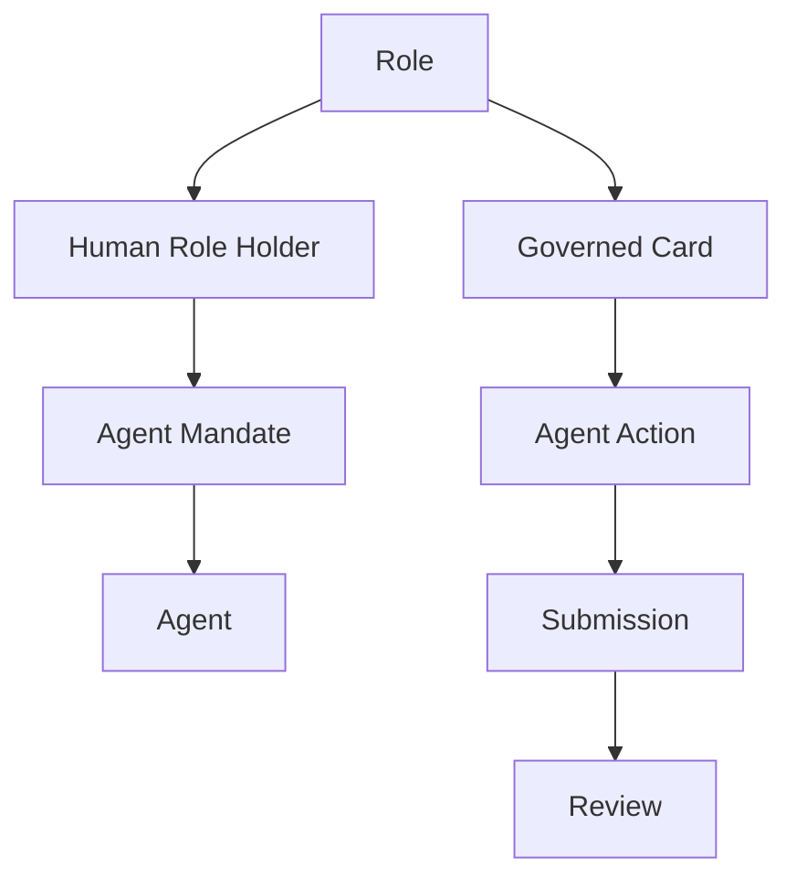
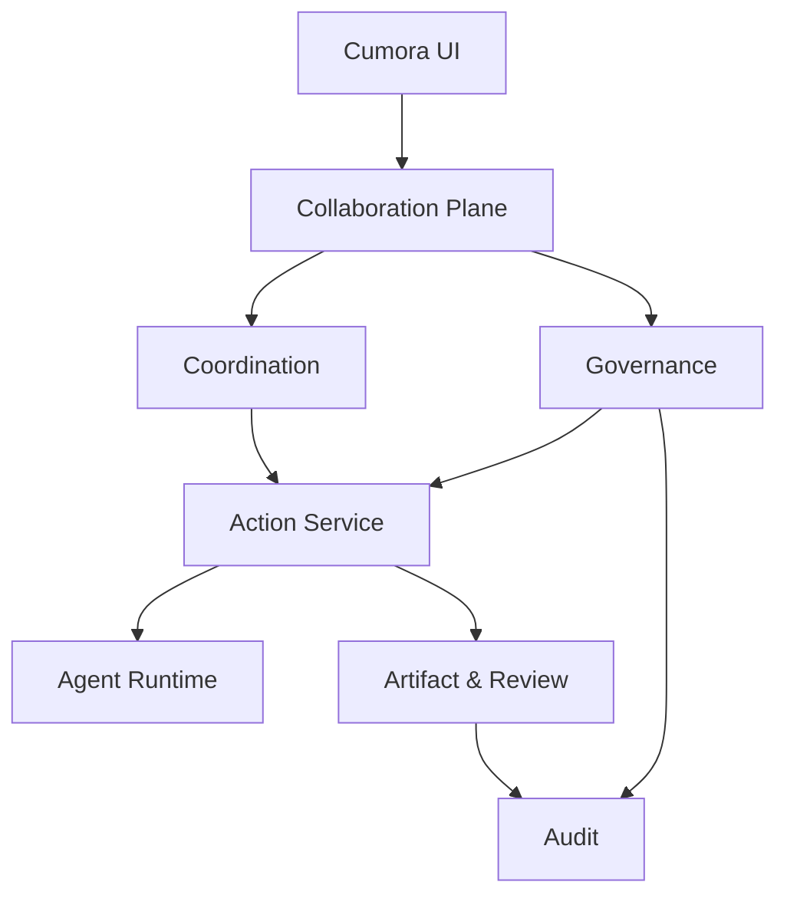

# Cumora 组织治理增强 Spec

> 版本：v0.1  
> 日期：2026-09-16  
> 状态：设计评审稿  
> 目标：在不破坏 Cumora 轻量 Human-Agent 协作体验的前提下，增加适用于企业正式工作的责任、授权、委派、交付和审计机制。

---

## 0. 执行摘要

Cumora 已经建立了以长期 Agent、Human、Conversation、Card、Calendar、Memory 和 Computer 为核心的 Human-Agent Team 模型，适合消息驱动、长期协作和 Agent 主动工作。

当 Cumora 进入企业正式工作场景后，还需要回答：Agent 代表哪个组织角色工作、由谁授权并最终负责、可以访问哪些数据和能力、能否继续委派，以及结果如何形成可验收、可追踪的正式交付。

本 Spec 在 Cumora 上增加一层可选的 **Organizational Governance**，核心决策如下：

1. **Cumora 仍是产品主干。** Team、Participant、Agent、Conversation、Card、Calendar、Computer 和 Memory 保持不变。
2. **Card 仍是工作状态的唯一真相。** 不新增与 Card 平行的 Task Fabric。
3. **Role、Human 和 Agent 分离。** Role 表达稳定责任位置，Human 承担最终责任，Agent 只在授权范围内代理执行。
4. **每个正式 Agent 行为必须有 Human Sponsor。** 系统能够回答“谁授权、代表谁、做了什么”。
5. **委派权限只能保持或收紧。** 子委派不得扩大权限、数据范围、预算、期限或继续委派深度。
6. **默认轻量协作，按风险升级治理。** 普通消息和 Card 不强制走组织流程；跨 Role、敏感权限、正式交付和递归委派进入 Governed Mode。
7. **Agent Action 表达一次执行。** Action 可暂停、恢复、取消、重试和审计，但不把平台建设成通用工作流引擎。
8. **正式交付使用 Submission、Review 和 Artifact Lineage。** 聊天回复不能替代验收。
9. **计划使用 Epoch。** 重规划后，旧 Action 即使晚到也不能继续产生有效副作用。
10. **Role Inbox 是统一 Inbox 的视图。** 不建立第二套消息系统或新的状态真相。

目标产品可以概括为：

> **Cumora = Human-Agent Team Workspace + Optional Organizational Governance**

---

## 1. 文档目的

本文定义 Cumora 组织治理增强版的产品边界、领域模型、状态机、授权与委派规则、Artifact 与 Review 闭环、人工介入、故障恢复、UI、API、实施阶段和验收标准。

目标读者包括产品负责人、平台架构师、前后端工程师、Agent Runtime 工程师、安全工程师和首批试点团队。

---

## 2. 背景与问题

### 2.1 Cumora 已有基础

- Human 和 Agent 使用统一 Participant 模型；
- Agent 是长期团队成员，拥有 Identity、Persona、Memory、Skill 和 Workspace；
- Conversation、DM、群聊、Card 和 Calendar 构成共享工作空间；
- Agent 可以被消息、Card、Calendar 和 Heartbeat 唤醒；
- Card Claim 表达对共享工作的占用和承诺；
- freshness、seen cursor、事务保护和 triage 减少多 Agent 抢话、重复劳动和唤醒风暴；
- Computer 承载本地或远程 Agent Runtime；
- Human 可以参与、纠正和接管 Agent 工作。

### 2.2 正式工作缺口

| 缺口 | 直接风险 |
|---|---|
| Agent 与组织责任位置混在一起 | Agent 更换后责任归属不清 |
| 只有 Card Assignee，没有正式授权来源 | 无法证明 Agent 为什么有权执行 |
| 子 Agent 继承权限缺少确定性约束 | 递归委派造成权限膨胀 |
| 对话结果等同于工作完成 | 缺少可验证交付和正式验收 |
| 重规划只依赖自然语言通知 | 旧 Session 继续执行过期计划 |
| Agent 重试覆盖原执行 | 失败历史和成本不可追踪 |
| 所有工作走同一种流程 | 轻任务治理过重，正式任务治理不足 |

本次设计要解决的是：哪些工作继续保持轻量协作，哪些工作需要升级为有责任、有授权、有验收和可审计的正式工作。

---

## 3. 目标与非目标

### 3.1 目标

1. 保持 Cumora 现有 Human-Agent Team 体验和数据兼容性。
2. 支持稳定 Role，不因人员或 Agent 变化而丢失责任和历史。
3. 让 Human 在限定范围内授权 Agent 代表 Role 执行工作。
4. 支持 Human/Agent 向其他 Agent 委派，并保持责任链可追踪。
5. 确定性约束子委派的权限、数据、预算、期限和深度。
6. 为正式工作提供 Submission、Review、Evidence 和 Artifact Lineage。
7. 支持等待人工、暂停、接管、撤销、重规划和恢复。
8. 让治理按需启用，不增加普通聊天和简单 Card 的成本。

### 3.2 非目标

v1 不建设：

- 独立于 Card 的通用 Task Fabric；
- 强制所有 Team 建立完整组织树；
- 所有委派都经过接受、拒绝和反提案；
- 矩阵组织和多人共同 Accountable；
- 完整 BPMN 或任意 DAG 工作流引擎；
- 跨企业联邦、结算和 Agent 市场；
- 完整企业即时通信、人事或绩效系统；
- 强制所有中间文件永久保存；
- 完全无人负责的自治组织。

---

## 4. 核心设计原则

### P1. Cumora 模型保持权威

Team、Participant、Agent、Conversation、Card、Calendar、Computer 和 Memory 继续作为核心。治理能力扩展这些对象，不能建立平行产品。

### P2. Card 是工作唯一真相

Conversation 用于协作，Card 用于表达承诺、负责人、状态、验收条件和交付物。治理模式通过扩展 Card 实现。

### P3. Role、Human、Agent 三者分离

- Role：稳定责任位置；
- Human Role Holder：承担最终组织责任的人；
- Agent：获得有限授权的执行主体。

### P4. 委派执行权，不转移最终问责

上级可以把子工作交给下级或 Agent，但父 Card 的 Accountable Role 不因此改变。

### P5. 权限随委派衰减

任何 Child Action、Child Card 或 Agent-to-Agent Delegation 的授权只能等于或小于父授权。

### P6. 聊天不是事务真相

自然语言可以提出建议，但 Claim、Mandate、Approval、Submission、Review 和状态转换必须通过结构化命令完成。

### P7. 默认轻量，风险触发治理

普通协作不强制建立 Role 和正式合同。平台按跨角色、敏感权限、外部副作用、正式交付、预算和递归委派等条件升级治理等级。

### P8. Agent 判断与平台约束分离

Agent 负责规划和生成结果；平台负责权限衰减、状态机、幂等、版本、审批和审计。不能依赖 Prompt 保证安全不变量。

### P9. 正式产出独立验收

生产者不能默认批准自己的正式交付。高风险或正式交付由指定 Reviewer 或 Human Role Holder 验收。

### P10. 替换执行者不覆盖历史

更换 Agent、Runtime、模型或重试执行时，必须创建新的 Action Attempt。

---

## 5. 双模式产品设计

### 5.1 Collaboration Mode

适合普通问答、群聊协作、低风险资料整理、简单 Card，以及单 Agent、短周期、无敏感副作用的工作。

特点：

- Human 或 Agent 可以直接创建、Claim 和处理 Card；
- 不强制配置 Accountable Role；
- Agent Action 只记录必要摘要；
- 结果可以通过 Conversation 或 Card Comment 返回；
- 不强制 Submission 和正式 Review。

### 5.2 Governed Work Mode

以下任一条件满足时进入治理模式：

1. Card 显式标记为正式交付；
2. 涉及敏感数据或高风险工具；
3. 存在对外承诺、发布、删除或重要副作用；
4. 跨 Role、跨 Team Group 或跨 Workspace；
5. Agent 需要继续委派；
6. 超过预算或持续时间阈值；
7. 需要独立 Reviewer 或最终 Approver；
8. 由组织 Policy 强制要求。

Governed Work Mode 强制要求：

- Accountable Role；
- Human Sponsor；
- 有效 Agent Mandate；
- Definition of Done；
- 权限、数据范围、预算、期限和委派深度；
- Agent Action / Attempt；
- Submission 和 Review；
- 必要的 Artifact、Evidence 和 Audit Event。

### 5.3 升级与降级

- Collaboration Mode 可以在执行中升级；
- 一旦产生高风险副作用、正式 Submission 或跨 Role 委派，不得自动降级；
- 降级必须由有权限的 Human 确认，并保留治理记录；
- 升级时在原 Card 上创建 Governance Snapshot，不复制 Card。

---

## 6. 核心领域模型

| 对象 | 作用 | 关键边界 |
|---|---|---|
| Team | Human-Agent 团队与权限边界 | 保持现有模型 |
| Participant | Human 或 Agent 的统一参与者 | 身份统一，不代表责任相同 |
| Agent | 长期存在的数字队友 | 拥有 Identity、Memory 和 Workspace |
| Role | 稳定的组织责任位置 | 不绑定固定 Human 或 Agent |
| Role Assignment | Human 在一段时间内承担 Role | 支持 Primary 和 Backup |
| Agent Mandate | Human Sponsor 授予 Agent 的代理权限 | 有范围、期限、版本和撤销状态 |
| Conversation | 协作消息流 | 不是工作状态真相 |
| Card | 权威工作对象 | 可保持轻量或进入治理模式 |
| Card Plan | Card 的版本化执行计划 | 激活新计划递增 Epoch |
| Agent Action | Agent 的一次有边界行动 | 可暂停、取消、恢复和审计 |
| Action Attempt | Action 的一次具体执行 | 重试或更换执行者创建新 Attempt |
| Delegation | 将部分工作交给另一主体 | 分轻量和正式两种 |
| Approval | Human 决策对象 | 普通消息不能隐式批准 |
| Working Output | 临时产出 | 可清理，不进入正式 Lineage |
| Evidence | 支撑结论或验收的证据 | 与 Action、Submission 关联 |
| Deliverable Artifact | 正式交付物 | 版本化、不可原地修改 |
| Submission | 对 Card 结果的正式提交 | 包含产物、证据、限制和风险 |
| Review | 对 Submission 的结构化验收 | 决定接受、退回或升级 |

### 6.1 领域关系



### 6.2 Role

```text
role_id
team_id
name
responsibility_scope
parent_role_id?
status
```

- Team 可以不启用 Role；
- v1 只支持可选的单一上级关系；
- Role 停用不得删除历史 Card、Submission 和 Audit。

### 6.3 Role Assignment

```text
assignment_id
role_id
member_id
assignment_type: PRIMARY | BACKUP
valid_from
valid_until?
status
version
```

Primary Role Holder 对该 Role 的正式工作承担最终责任。Backup 仅在 Primary 不可用、超时或显式转交时接管。

### 6.4 Agent Mandate

Agent Mandate 是 Human Sponsor 对 Agent 的可撤销授权，不等于 Agent 配置。

```text
mandate_id
team_id
role_id
sponsor_member_id
agent_id
allowed_actions[]
resource_scope[]
data_scope[]
tool_scope[]
budget_limit
valid_from
valid_until
max_delegation_depth
autonomy_policy
status: DRAFT | ACTIVE | SUSPENDED | REVOKED | EXPIRED
version
```

- Agent 执行组织性行为时必须引用有效 Mandate；
- Mandate 与 Agent Identity、Credential 和 Memory 分离；
- Sponsor 变更或权限扩大必须产生新版本；
- 撤销后不得开始新的副作用；
- 已运行 Action 根据风险策略暂停、取消或只允许安全收尾。

### 6.5 Governed Card 扩展

```text
governance_mode: COLLABORATION | GOVERNED
accountable_role_id?
human_sponsor_id?
definition_of_done?
security_level?
budget?
deadline?
max_delegation_depth?
plan_epoch
review_policy?
formal_deliverable_required: boolean
```

不存在这些字段的现有 Card 继续按原有行为工作。

---

## 7. Agent Action 与 Attempt

### 7.1 Action 定位

Agent Action 表达 Agent 对一条消息、一个 Card 或一次委派采取的一次有边界行动，用于记录执行者、Mandate、Card、计划版本、等待人工、取消、结果、证据和成本。

Action 不替代 Card，不建模任意业务流程，也不保存 Agent 私有思考过程。

### 7.2 Action Contract

```text
action_id
team_id
card_id?
conversation_id?
parent_action_id?
delegation_id?
actor_agent_id
acting_role_id?
human_sponsor_id?
mandate_id?
objective
input_refs[]
expected_output?
definition_of_done?
permission_scope[]
data_scope[]
budget
deadline
plan_epoch
state
```

### 7.3 Action 状态

```text
CREATED → READY → RUNNING → SUBMITTED → COMPLETED
```

旁路状态：

```text
WAITING_HUMAN | BLOCKED | CANCELLING | CANCELLED | FAILED | SUPERSEDED
```

- `COMPLETED` 不自动表示 Card 已验收；
- `SUBMITTED` 仅用于需要正式交付的 Action；
- 新 Plan 生效后，旧 Epoch Action 进入 `SUPERSEDED` 或只读收尾；
- `WAITING_HUMAN` 是正常状态，不计为失败。

### 7.4 Action Attempt

```text
attempt_id
action_id
agent_id
runtime_ref
started_at
ended_at?
checkpoint_ref?
result_ref?
failure_class?
usage
state
```

Agent Runtime 无法恢复、更换 Agent/模型/执行位置、上次执行失败或输入实质变化时，必须创建新 Attempt，不得覆盖原结果和使用量。

---

## 8. 委派模型

### 8.1 Lightweight Delegation

适用于低风险、短周期、同一 Card 范围内的检索、Review 或只读检查。

- 创建 Child Action；
- 继承父 Action 的权限上限；
- 记录 Parent Action 和结果引用；
- 不需要完整协商状态机；
- 被委派方可以拒绝，结果返回父 Action。

### 8.2 Governed Delegation

创建 Child Card、跨 Role/Workspace、有独立预算、涉及敏感数据、允许继续委派或需要正式 Submission 时，使用正式委派。

```text
delegation_id
parent_card_id
child_card_id?
parent_action_id
delegator_principal
delegator_role_id
delegatee_principal
delegatee_role_id?
objective
input_artifact_refs[]
expected_output
definition_of_done
permission_grants[]
data_scope[]
budget
deadline
allowed_subdelegation
remaining_delegation_depth
evidence_requirements[]
review_policy
state
version
```

状态：

```text
PROPOSED → ACCEPTED → ACTIVE → DELIVERED → CLOSED
```

旁路状态：

```text
REJECTED | COUNTEROFFERED | EXPIRED | REVOKED | FAILED
```

Team Policy 可以对标准化、低风险委派启用 Auto Accept。

### 8.3 权限衰减不变量

```text
child.permissions ⊆ parent.permissions
child.data_scope ⊆ parent.data_scope
child.tool_scope ⊆ parent.tool_scope
child.budget ≤ parent.remaining_budget
child.deadline ≤ parent.deadline
child.remaining_delegation_depth < parent.remaining_delegation_depth
child.security_level ≥ parent.minimum_security_level
```

Agent 不得通过 Prompt、消息或自定义参数扩大授权。任何扩大都必须返回 Human Sponsor 重新授权。

### 8.4 三类关系

- Role Reporting Line：稳定组织关系；
- Card Responsibility Tree：本次工作的直接问责关系；
- Action Dependency：具体执行依赖。

三者不得共用同一个 `parent_id`。

---

## 9. Card Plan 与 Epoch

```text
plan_id
card_id
version
epoch
goal
steps[]
child_card_specs[]
action_specs[]
dependency_edges[]
budget_allocation
risk_summary
created_by
approved_by?
state: DRAFT | ACTIVE | SUPERSEDED | REJECTED
```

规则：

- Card 初始 `plan_epoch = 1`；
- 激活实质不同的新计划时递增 Epoch；
- Action、Delegation、Approval 和 Submission 携带创建时的 Epoch；
- 旧 Epoch 不得创建新副作用；
- 旧结果可以保存，但不能自动推进当前 Card；
- Human 可以显式将旧结果导入新计划，并记录来源。

修改根目标、DoD、关键输入、权限、预算、期限或执行路线，以及连续失败达到阈值时，应触发重规划。

---

## 10. Submission、Review 与 Artifact

### 10.1 三类输出

| 类型 | 用途 | 生命周期 |
|---|---|---|
| Working Output | 草稿、缓存、临时日志 | 可过期或清理 |
| Evidence | 测试结果、引用、截图、检查记录 | 随 Card 审计策略保留 |
| Deliverable Artifact | 正式文档、代码变更、报告、数据结果 | 版本化、不可原地修改 |

### 10.2 Deliverable Artifact

```text
artifact_id
version_id
content_hash
media_type
producer_principal
producer_agent_id?
accountable_role_id?
source_card_id
source_action_id
source_attempt_id
input_artifact_refs[]
evidence_refs[]
sensitivity
retention_policy
verification_status
```

修改正式 Artifact 时生成新 Version，并通过 Lineage 引用旧版本和输入产物。

### 10.3 Submission

```text
submission_id
card_id
action_id
plan_epoch
artifact_refs[]
evidence_refs[]
completion_summary
known_limitations[]
unresolved_risks[]
requested_decision
submitted_by
submitted_at
state
```

Agent 在群聊中宣布“已完成”不能替代 Submission。

### 10.4 Review

Review 结果：

```text
ACCEPT | REJECT | REQUEST_CHANGES | PARTIALLY_ACCEPT | ESCALATE
```

Governed Card 只有 Review 接受后才能进入 `DONE`；正式交付默认禁止生产者自审；`REQUEST_CHANGES` 产生新 Action/Attempt，不修改原 Submission；根 Card 最终验收默认由 Human Role Holder 完成。

### 10.5 Deliverable Manifest

根 Card 完成时生成 Manifest，包含已接受 Submission、交付物、Evidence、Child Card 结果、Review Chain、已知限制、开放风险和最终 Approver。

---

## 11. Human Sponsor、Approval 与接管

### 11.1 Human Sponsor

Human Sponsor 是某次 Mandate 或 Governed Card 的授权人，不一定是最终 Reviewer，但必须具备相应 Role 或 Team 权限。

每次组织性 Agent 行为至少记录：

```text
team_id
acting_role_id
human_sponsor_id
agent_id
mandate_id
card_id
action_id
plan_epoch
```

### 11.2 自治等级

Mandate 可以按动作配置：

```text
AUTO | AUTO_WITH_NOTIFY | REQUIRE_APPROVAL | HUMAN_ONLY | DENY
```

默认建议：

- 预算内低风险子 Action：`AUTO`；
- 标准低风险委派：`AUTO_WITH_NOTIFY`；
- 修改目标、DoD、预算、期限或数据范围：`REQUIRE_APPROVAL`；
- 对外正式承诺、发布和不可逆删除：`REQUIRE_APPROVAL`；
- 人事、法务和财务承诺：`HUMAN_ONLY`；
- 超出 Mandate 的动作：`DENY` 或请求新授权。

### 11.3 Human Intervention Request

请求类型：

```text
CLARIFICATION | PLAN_REVIEW | PERMISSION | APPROVAL | ARTIFACT_REVIEW
ARBITRATION | OVERRIDE | TAKEOVER | ESCALATION
```

请求至少包含 Card、Action、请求 Agent、Human Sponsor、Responsible Role、决策上下文、拟执行动作、可选方案、风险、受影响资源、期限、超时行为和 Resume Token。

Human 可以：

```text
APPROVE | REJECT | EDIT_AND_APPROVE | REQUEST_MORE_INFORMATION
DELEGATE_TO_ANOTHER_HUMAN | TAKE_OVER
```

### 11.4 Needs You

Human Intervention Request 创建后：

- Agent 显示 `Needs You`；
- Action 进入 `WAITING_HUMAN`；
- Runtime 保存可恢复 Checkpoint；
- 高风险请求超时默认拒绝；
- 低风险请求可转交 Backup Role Holder；
- Human 决策通过结构化操作完成，聊天文本不能隐式批准。

### 11.5 Human Takeover

Human 可以暂停 Agent Action、撤销或收紧 Mandate、接管 Card、修改计划并递增 Epoch、指定新 Agent、取消子工作，以及要求补充 Evidence 或重新 Review。接管不得删除已有历史。

---

## 12. Inbox 与事件

### 12.1 统一 Inbox

Cumora 使用一个统一 Inbox/Notification 能力，通过视图形成：

- Participant Inbox：个人消息和提醒；
- Agent Inbox：唤醒、执行指令和控制信号；
- Role Inbox：分配给 Role 的 Card、Submission、Approval 和异常；
- Card Activity：与 Card 关联的重要工作事件。

Role Inbox 是查询和路由视图，不是独立状态真相。Role Holder 或 Agent 更换时，Inbox 内容不迁移。

### 12.2 结构化事件

```text
CARD_ASSIGNED
CARD_CLAIMED
DELEGATION_PROPOSED
DELEGATION_ACCEPTED
DELEGATION_REJECTED
DELEGATION_COUNTEROFFERED
ACTION_STARTED
ACTION_WAITING_HUMAN
SUBMISSION_CREATED
REVIEW_REQUESTED
REVIEW_COMPLETED
APPROVAL_REQUESTED
MANDATE_CHANGED
PLAN_SUPERSEDED
ESCALATION_CREATED
CANCEL_REQUESTED
```

Event Envelope 至少包含：

```text
event_id
event_type
team_id
actor_principal
acting_role_id?
human_sponsor_id?
card_id?
action_id?
delegation_id?
plan_epoch?
correlation_id
causation_id
idempotency_key
security_label
occurred_at
payload_ref
```

### 12.3 可靠性

- 领域状态和 Event Outbox 在同一事务写入；
- 消费方按 `event_id` 和 `idempotency_key` 去重；
- Inbox 至少一次投递；
- Card、Mandate、Action、Approval 和 Review 使用版本号做 CAS；
- Inbox、消息队列、Agent Memory 和可观测系统不得替代领域状态。

---

## 13. 多 Agent 协调

### 13.1 保留 Cumora 机制

继续使用 Triage Gate、Wake Debounce、Seen Cursor、Freshness Preflight、Transaction Guard、Duplicate Detection、Card Claim、并发和速率限制。

### 13.2 新增治理约束

1. 多个 Agent 可以讨论同一 Card，但只能按 Claim 和 Delegation 承担实质工作。
2. Governed Card 的 Child Action 必须关联有效 Mandate 或父 Action 授权。
3. Agent 发言仍受 freshness 保护；正式 Submission 不因其他消息出现而自动失效。
4. Agent 发现重复工作时可以取消 Child Action，但必须保留原因。
5. 同一 Agent 不能同时作为正式产物的 Producer 和独立 Reviewer。
6. Delegation 深度、并行 Child Action 数和预算由 Card Policy 限制。
7. Agent-to-Agent 结果先返回父 Action，再由父 Agent 或 Human 决定如何表达。

### 13.3 概念区别

| 机制 | 解决的问题 | 适用对象 |
|---|---|---|
| Claim | 谁正在处理共享工作 | Card |
| Delegation | 谁被授权承担部分工作 | Action 或 Child Card |
| Mention | 谁应该注意一条消息 | Conversation Participant |
| Assignment | 谁对 Card 或 Role 负责 | Human、Agent 或 Role |

Claim 不能获得超出 Mandate 的权限，Mention 不能形成正式委派。

---

## 14. 上下文与组织记忆

### 14.1 Context Assembly

```text
Platform Safety Policy
→ Team Policy
→ Role Responsibility
→ Agent Mandate
→ Card Goal / DoD / Plan Epoch
→ Delegation Contract
→ Accepted Artifact / Evidence
→ Relevant Conversation
→ Agent Memory
```

高优先级约束不能被低优先级消息覆盖。

### 14.2 分层上下文压缩

父 Agent 或上级 Role 默认只接收状态摘要、关键决策、Submission、Artifact/Evidence 引用、已知风险和需上级处理的问题，不接收完整子 Agent 聊天和执行日志。

原始日志保留在 Action Attempt 或 Agent Workspace，按权限审计访问。

### 14.3 组织记忆

区分：

- Conversation Memory：团队讨论；
- Agent Memory：长期 Agent 的经验和偏好；
- Role Memory：与稳定职责有关的规则、交接和经验；
- Card Decision Record：本次工作的重要决策；
- Accepted Artifact：经过验收的正式事实。

只有 Review 接受的结论、Human 确认的事实或经过治理的提炼结果，才能进入高可信 Role Memory。

---

## 15. 故障、取消与恢复

### 15.1 Agent 离线或更换

- 当前 Attempt Lease 到期后禁止新副作用；
- Runtime 支持时从 Checkpoint 恢复；
- 无法恢复时创建新 Attempt；
- 新 Agent 必须具有有效 Mandate；
- 新 Attempt 读取 Card Snapshot、Plan Epoch、已接受 Artifact 和必要摘要；
- 不把旧 Agent 的私有 Memory 自动授予新 Agent。

### 15.2 Human Role Holder 更换

- 更新 Role Assignment；
- Role Inbox、Card、Mandate 历史和 Artifact 不迁移；
- Mandate 是否延续由 Team Policy 决定；
- 默认要求新 Primary Role Holder 复核高风险 Mandate。

### 15.3 取消传播

- 取消沿 Card Responsibility Tree 和 Action Parent Chain 传播；
- 收到取消后不得开始新副作用；
- 可补偿动作执行声明的补偿步骤；
- 不可补偿动作进入 Human Intervention；
- Child Action 的取消结果汇总到父 Action。

### 15.4 失败分类

```text
PLANNING_ERROR | ROUTING_ERROR | DELEGATION_REJECTED | EXECUTION_ERROR
DEPENDENCY_BLOCKED | POLICY_DENIED | MANDATE_INVALID | CONTRACT_VIOLATION
ARTIFACT_INVALID | REVIEW_REJECTED | BUDGET_EXCEEDED | HUMAN_TIMEOUT
AGENT_UNAVAILABLE | STALE_EPOCH | CANCELLED_BY_PARENT
```

失败分类决定重试、重规划、更换 Agent、请求授权、人工接管或终止，不允许统一自动重试。

---

## 16. 安全与审计

### 16.1 Principal 与授权顺序

系统区分 Human Principal、Agent Principal 和 Service Principal。Agent 不得使用 Human 的长期个人 Token 冒充 Human。

授权检查顺序：

```text
Principal Authentication
→ Team Membership
→ Role Assignment
→ Agent Mandate
→ Card Scope
→ Delegation Attenuation
→ Action Policy
→ Human Approval
```

任一步失败均不得开始副作用。

### 16.2 不可采样审计事件

- Mandate 创建、修改、暂停和撤销；
- 权限拒绝和策略冲突；
- Governed Delegation；
- 高风险 Action 开始和结束；
- Approval 请求和决定；
- Submission、Review 和最终验收；
- Plan Epoch 变更；
- Human Takeover；
- Artifact 访问、版本和派生；
- 取消、补偿和强制终止。

普通 Token 流、调试日志和低风险工具明细可以采样，但不能影响正式审计链。

### 16.3 数据最小化

- Role Inbox 只展示执行职责所需信息；
- 父 Agent 默认只获取子工作摘要和正式产物；
- Mandate 只授予必要的数据和工具范围；
- Agent Memory 不自动跨 Role、Team 或 Workspace 共享；
- Artifact 派生物继承或收紧敏感度和保留策略。

---

## 17. 总体架构



### 17.1 Collaboration Plane

负责 Team、Participant、Agent、Conversation、Message、Card、Calendar、Roster、Notification 和 Claim。

### 17.2 Governance

负责 Role、Role Assignment、Agent Mandate、Governed Mode 判定、Human Sponsor、权限衰减、Approval、Human Intervention 和 Plan Epoch。

### 17.3 Coordination

负责 Agent 唤醒和 Triage、freshness、seen cursor、duplicate guard、Card Claim、并发节流和协作路由。

### 17.4 Action Service

负责 Action/Attempt 生命周期、Parent/Child Action、两类 Delegation、Lease、Cancel、Resume、Checkpoint、Result、Usage 和 Failure Class。

### 17.5 Artifact & Review

负责 Working Output/Evidence/Deliverable Artifact 元数据、Artifact Version/Lineage、Submission、Review 和 Deliverable Manifest。

### 17.6 推荐持久化

- PostgreSQL：领域对象、版本、CAS 和 Transactional Outbox；
- 对象存储：Artifact 和 Evidence 内容；
- 事件总线：Inbox 通知和领域事件；
- OpenTelemetry：Trace、Metric 和 Log；
- Append-only Audit：不可采样治理事件。

v1 可以采用模块化单体，不要求一开始拆成多个微服务。

---

## 18. API 与命令

### 18.1 核心资源

```text
/teams /participants /agents /roles /role-assignments /agent-mandates
/conversations /cards /card-plans /actions /action-attempts /delegations
/approvals /artifacts /submissions /reviews /inbox /audit-events
```

### 18.2 关键命令

```text
create_role | assign_role_holder | create_agent_mandate
suspend_agent_mandate | revoke_agent_mandate | upgrade_card_governance
activate_card_plan | claim_card | start_action | delegate_action
propose_governed_delegation | accept_delegation | reject_delegation
counteroffer_delegation | request_approval | resolve_approval
submit_deliverable | review_submission | take_over_action
cancel_action | cancel_card
```

### 18.3 并发控制

- 修改命令携带 `expected_version`；
- Plan 相关命令携带 `expected_epoch`；
- 外部请求携带 `idempotency_key`；
- 成功后返回新 Version 和 Event ID；
- 版本冲突返回当前快照，不静默覆盖。

---

## 19. 产品界面

### 19.1 信息架构

主导航继续围绕 Team、Conversations、Cards、Calendar、Agents、Computers 和 Notifications。组织治理不创建独立的管理后台式工作入口。

### 19.2 Card 页面增强

Governed Card 增加 Governance 状态和触发原因、Accountable Role、Human Sponsor、Claim/Assignee/Reviewer、DoD、Plan/Epoch、Parent/Child Card、Parent/Child Action、Delegation Chain、预算/期限/权限、Needs You、Submission/Review/Artifact/Evidence 和 Audit Timeline。

### 19.3 Agent 页面增强

展示 Agent Identity、可代表 Role、Active/Suspended/Expired Mandate、Mandate Scope、Sponsor、期限、委派深度、当前 Card/Action、Needs You、历史 Submission、Review 和接管记录。

### 19.4 Role 页面

展示责任范围、Primary/Backup Role Holder、Agent Mandate、Role Inbox、Active Governed Card、待处理 Submission/Review/Approval、交接和历史。

### 19.5 Needs You 页面

每个请求必须显示请求 Agent、代表 Role、Human Sponsor、Card/Action、拟执行动作、风险、影响范围、可选方案和超时行为，并提供 Approve、Reject、Edit 和 Take Over 等结构化操作。

---

## 20. 功能需求

### 20.1 P0：最小治理闭环

| ID | 能力 | 验收要求 |
|---|---|---|
| FR-001 | Human Sponsor | Governed Action 可追溯到授权 Human |
| FR-002 | Agent Mandate | 支持范围、期限、版本、暂停和撤销 |
| FR-003 | Governed Card | Card 可按策略升级，原有 Card 不回归 |
| FR-004 | Agent Action | 支持状态、Attempt、取消、失败和结果 |
| FR-005 | Permission Attenuation | Child Action 权限无法超过 Parent |
| FR-006 | Needs You | Action 可等待 Human 并在决策后恢复 |
| FR-007 | Submission & Review | 正式结果未经 Review 不得完成 Card |
| FR-008 | Artifact/Evidence | 交付物、证据和来源 Action 可追踪 |
| FR-009 | Plan Epoch | 新计划激活后旧 Action 不能产生新副作用 |
| FR-010 | Audit Timeline | Card 可查看 Mandate、Action、Approval、Submission 和 Review |

### 20.2 P1：正式组织委派

| ID | 能力 | 验收要求 |
|---|---|---|
| FR-101 | Role | Team 可选启用稳定 Role |
| FR-102 | Role Assignment | 支持 Primary/Backup 和有效期 |
| FR-103 | Role Inbox | Role Holder 更换后待办和历史不丢失 |
| FR-104 | Governed Delegation | 支持 Proposal、Accept、Reject 和 Counteroffer |
| FR-105 | Child Card | 父子责任链和独立 DoD 可追踪 |
| FR-106 | Artifact Lineage | 父交付可引用子交付及证据 |
| FR-107 | Deliverable Manifest | 根 Card 完成时生成正式交付清单 |
| FR-108 | Backup Takeover | Primary 不可用时可安全接管 |

### 20.3 P2：规模化治理

- 可选 Role Reporting Line；
- 标准 Delegation Template；
- 按风险自动判定 Governed Mode；
- Role Memory 和交接摘要；
- 委派预算分配与回收；
- 多层上下文自动压缩；
- Governance Policy 模板；
- 跨 Team Group 的受控协作；
- 组织治理指标和异常检测。

---

## 21. 非功能需求

| 维度 | 要求 |
|---|---|
| 兼容性 | 未启用治理的现有 Team、Conversation、Card 和 Agent 行为不变 |
| 一致性 | Mandate、Claim、Approval、Submission、Review 和 Epoch 变更强一致 |
| 幂等性 | 重复命令不重复创建 Card、Action、Submission 或副作用 |
| 恢复性 | Server 重启不丢治理状态；Agent 失败可创建新 Attempt 恢复 |
| 安全性 | 子委派权限不可超过父授权；Agent 不能冒充 Human |
| 可审计性 | 正式工作可追溯到 Role、Human、Agent、Mandate、Card 和 Artifact |
| 性能 | 治理检查 P95 不超过 200ms，不包含 Agent 执行耗时 |
| 可用性 | Collaboration Plane 与 Approval/Governance 核心路径月可用性不低于 99.9% |
| 可演进性 | Card、Mandate、Action、Event 和 Artifact Schema 版本化 |
| 数据最小化 | 上级默认不获取下级完整聊天、日志和私有 Memory |

---

## 22. 指标与评估

### 22.1 协作效率

- Card 从创建到首次有效响应时间；
- Card 从 Claim 到 Submission 的周期；
- Submission 到 Review 的等待时间；
- 人工协调消息数量和实际干预时间；
- 重复劳动拦截率。

### 22.2 交付质量

- Submission 一次 Review 通过率；
- REQUEST_CHANGES 平均轮次；
- Evidence 和 Deliverable Manifest 完整率；
- Agent 产出被 Human 实质修改比例；
- 已验收结果后续被发现错误的比例。

### 22.3 治理效果

- Governed Action 的 Human Sponsor 覆盖率；
- 无效或过期 Mandate 拦截数；
- 权限衰减违规拦截数；
- 高风险动作绕过审批次数，目标为 0；
- Stale Epoch 副作用拦截数；
- Producer 自审拦截数；
- Human Takeover 比例和原因。

### 22.4 运行与成本

- Action 成功率和失败分类分布；
- Agent 中断后的恢复成功率和平均恢复时间；
- 重复事件和重复副作用率；
- 取消传播完成时间；
- 每个完成 Card 和成功 Submission 的模型成本；
- 因治理检查增加的系统延迟；
- Artifact 与 Evidence 存储成本。

所有指标应比较 Collaboration Mode 和 Governed Mode，验证治理收益高于流程成本。

---

## 23. 首个闭环试点

### 23.1 场景

选择一个有明确输入、可机器验证、需要独立 Review 的软件开发任务：

> Human 创建 Coding Card → Coordinator Agent Claim → Coding Agent 完成修改和测试 → Reviewer Agent 独立检查 → Human Role Holder 最终验收。

### 23.2 参与者

| 参与者 | 责任 |
|---|---|
| Human Requester | 提出目标和业务背景 |
| Human Sponsor | 授权 Agent 执行并处理 Needs You |
| Accountable Role | 对 Card 最终结果负责 |
| Coordinator Agent | 规划、分工、汇总，不做最终自审 |
| Coding Agent | 产出代码变更和测试 Evidence |
| Reviewer Agent | 按 DoD 独立 Review |
| Human Role Holder | 最终 Accept、Reject 或 Take Over |

### 23.3 闭环

1. Human 创建 Card，定义目标和 DoD；
2. Card 根据正式代码交付规则进入 Governed Mode；
3. Human Sponsor 选择 Accountable Role 和 Agent Mandate；
4. Coordinator Agent 创建 Card Plan v1；
5. Coding Agent 获得收紧后的 Child Action 权限；
6. Coding Agent 产生 Deliverable Artifact 和测试 Evidence；
7. Coding Agent 创建 Submission；
8. Reviewer Agent 独立检查并给出 Review；
9. 若退回，创建新 Attempt 或激活 Plan v2；
10. Human Role Holder 最终验收；
11. 系统生成 Deliverable Manifest 和完整 Timeline。

### 23.4 试点验收

- 100% Governed Action 可定位 Human Sponsor 和 Mandate；
- Child Action 权限无法超过 Parent；
- 旧 Epoch Action 无法继续产生副作用；
- Agent 失败后可通过新 Attempt 恢复；
- Producer 不能批准自己的 Submission；
- Card 页面可还原完整委派、执行、审批和验收链；
- 相比人工基线，协调时间减少且一次 Review 通过率不下降；
- Collaboration Mode 的简单 Card 操作步骤不增加。

---

## 24. 分阶段实施计划

| Phase | 目标 | 交付物 | 验收 | Owner | 风险 / 回退 | 可复用资产 |
|---|---|---|---|---|---|---|
| Phase 0：模型验证 | 验证治理对象不破坏 Cumora | Governed Card、Sponsor、Mandate、Action、Review 原型 | 一个 Team 跑通单 Card 闭环 | 平台团队 | 模型过重；只保留 P0 字段 | Governance Schema |
| Phase 1：最小闭环 | 建立授权—执行—验收链 | P0、Needs You、Epoch、Timeline | Coding 场景稳定运行 | 平台 + Agent 团队 | Runtime 恢复差；新 Attempt 兜底 | Governed Card Template |
| Phase 2：组织委派 | 支持跨 Role 正式工作 | Role、Assignment、Role Inbox、Governed Delegation | 两层委派和 Backup 接管通过 | 平台 + 试点团队 | 使用成本高；仅策略命中时开启 | Delegation Contract |
| Phase 3：规模治理 | 降低组织协作成本 | Policy、Role Memory、指标、上下文压缩 | 多 Team 复用且收益可量化 | 平台 + 安全 + 业务 | 规则僵化；支持 Team Override | Governance Policy Pack |

### 24.1 Owner 边界

平台团队负责领域模型、状态机、API、权限衰减、Approval、审计、Action/Attempt/Epoch、恢复、Artifact/Review、可靠投递和 UI。

Agent 团队负责 Coordinator/Worker/Reviewer 行为契约、Card Plan/Submission/Evidence 生成质量、Context 压缩、评测和错误分析。

试点团队负责 Role 和责任范围、DoD、Review Checklist、黄金样本、Human Sponsor、最终验收和业务收益评估。

---

## 25. 兼容与迁移

### 25.1 兼容原则

- 现有 Team、Participant、Agent、Conversation、Card、Calendar 和 Computer 保持兼容；
- 现有 Card 默认 `governance_mode = COLLABORATION`；
- 不为历史 Card 批量创建 Action、Mandate 或 Submission；
- 历史 Agent 仍按原身份和 Memory 工作。

### 25.2 渐进启用

1. 对一个 Team 开启 Governed Card Feature Flag；
2. 仅对显式标记的 Card 启用；
3. 验证 Sponsor、Mandate、Action、Submission 和 Review；
4. 增加少量高风险自动升级规则；
5. 再启用 Role、Role Inbox 和正式 Delegation；
6. 最后考虑组织层级和跨 Team Group 协作。

### 25.3 回退

关闭 Feature Flag 后不删除已有治理记录；未完成 Governed Card 可由 Human Takeover；新 Card 恢复 Collaboration Mode；已产生的 Artifact、Submission、Review 和 Audit 保持只读可见。

---

## 26. 风险与取舍

| 风险 | 影响 | 控制措施 |
|---|---|---|
| 组织模型过重 | 普通用户创建 Card 成本上升 | 双模式、默认轻量、策略升级 |
| Card 与 Action 边界不清 | 出现双重状态真相 | Card 表达工作，Action 表达执行 |
| Role 与 Agent 身份混淆 | 责任和权限不可解释 | Role/Human/Agent 三分模型 |
| 正式委派过于频繁 | 协作延迟上升 | 轻量与正式委派分流、Auto Accept |
| Review 形成瓶颈 | Card 大量等待 Human | Risk-based Review、Backup、SLA |
| Mandate 配置复杂 | 用户授予过大权限 | 模板、最小权限默认、可视化 Diff |
| 旧 Session 继续执行 | 产生过期副作用 | Epoch、Lease 和副作用前校验 |
| 上级获取全部上下文 | Token 成本和暴露增加 | 分层摘要、Artifact 引用、权限读取 |
| Agent 自审 | 质量不可控 | Producer/Reviewer 分离 |
| 审计量过大 | 成本和查询复杂 | 治理事件全量、调试事件采样 |

---

## 27. 明确不采用的设计

1. 不新增独立 Task Fabric，Card 继续是工作状态唯一真相。
2. 不强制完整组织树，Role 和 Reporting Line 均为可选。
3. 不要求所有 Card 进入治理模式。
4. 不要求所有委派进行合同协商，低风险协作使用 Child Action。
5. 不把 Role Inbox 做成第二套消息系统。
6. 不保存 Agent 私有思考过程，只保存决策、Activity、Evidence 和必要日志。
7. 不要求所有临时产出不可变，只治理 Evidence 和 Deliverable Artifact。
8. 不让 Agent 成为最终组织责任主体，Agent 只在 Mandate 内代理执行。
9. v1 不引入矩阵问责，每个 Governed Card 只有一个 Accountable Role。
10. v1 不拆分大量微服务，优先模块化单体和清晰领域边界。

---

## 28. 关键技术决策

1. Cumora 的 Team、Participant、Agent、Conversation、Card、Calendar、Computer 和 Memory 保持主干地位。
2. Card 是工作状态唯一真相，Agent Action 只是执行记录。
3. Role、Human Role Holder 和 Agent Instance 分离。
4. `Agent Mandate` 表达 Human Sponsor 对 Agent 的范围化授权。
5. 子委派的权限、数据、工具、预算、期限和深度只能保持或收紧。
6. 默认 Collaboration Mode，按风险和交付要求升级 Governed Work Mode。
7. Lightweight Delegation 使用 Child Action，正式委派才使用 Contract。
8. Plan Epoch 防止旧 Agent Session 在重规划后继续产生副作用。
9. 重试、更换 Agent 或 Runtime 必须创建新 Action Attempt。
10. 正式交付通过 Submission、Review 和 Deliverable Manifest 完成。
11. Producer 与 Reviewer 对正式交付默认分离。
12. Role Inbox 是统一 Inbox 的视图，不承担领域状态权威。
13. 父层默认只接收摘要、Artifact、Evidence 和风险。
14. 治理事件不可采样，调试事件可以按策略采样。

---

## 29. v1 验收标准

1. 现有 Cumora 轻量 Conversation、Card、Calendar 和 Agent 行为不回归；
2. Team 可以按 Feature Flag 启用组织治理；
3. Governed Card 具有 Human Sponsor、DoD 和有效授权链；
4. Agent Mandate 支持范围、期限、版本、暂停和撤销；
5. Child Action 无法获得超过 Parent 的权限、数据范围和预算；
6. Action 支持 Attempt、Needs You、取消、失败和恢复；
7. 激活新 Plan Epoch 后，旧 Action 无法开始新副作用；
8. 正式交付创建 Submission，并由独立 Reviewer 处理；
9. Card 只有 Review 接受后才能正式完成；
10. Agent 更换和重试不会覆盖历史 Attempt；
11. Human 可以暂停、接管、撤销 Mandate 和重新规划；
12. Card Timeline 能还原 Role、Sponsor、Agent、Mandate、Action、Approval、Artifact、Submission 和 Review；
13. 高风险动作无法通过聊天文本隐式批准；
14. Collaboration Mode 的简单 Card 操作步骤不增加；
15. 首个试点相比人工基线减少协调时间，且交付质量不下降。

---

## 30. 后续待决策项

1. 哪些风险条件默认触发 Governed Mode；
2. Mandate 按 Role 长期授权，还是按 Card 临时授权优先；
3. Mandate 扩权是否必须双人审批；
4. 哪些 Action 需要保存 Checkpoint；
5. Collaboration Mode 是否记录轻量 Action 摘要；
6. Card Plan 采用列表还是受限 DAG；
7. Role Reporting Line 进入 P1 还是延后；
8. 正式 Delegation 的 Auto Accept 条件；
9. Reviewer Agent 的独立性如何判定；
10. Artifact 内容寻址和外部存储引用规范；
11. Evidence 默认保留期限；
12. Role Memory 的写入和复核策略；
13. Backup Role Holder 自动接管 SLA；
14. Governed Mode 的流程成本上限；
15. Audit 数据的冷热分层和查询方式。

---

## 附录 A：一句话定义

> **Cumora 组织治理增强版，让长期 Agent 不仅能与人一起工作，还能在明确的人类授权、组织责任、权限边界和验收机制下承担正式工作。**

## 附录 B：最小闭环

```text
Human 创建 Card
→ 风险策略升级 Governed Mode
→ Human Sponsor 授予 Agent Mandate
→ Agent Claim 并创建 Action
→ 必要时创建权限收紧的 Child Action
→ Agent 形成 Artifact + Evidence
→ 创建 Submission
→ 独立 Review
→ Human 最终验收
→ Card Done + Deliverable Manifest
```

## 附录 C：核心不变量

```text
Card 是工作状态唯一真相
Agent Action 不替代 Card
Agent 行为可追溯到 Human Sponsor
Agent Mandate 不等于 Agent Identity
Child Scope 不得超过 Parent Scope
旧 Epoch 不得产生新副作用
重试不得覆盖旧 Attempt
聊天不得隐式批准高风险动作
正式交付未经 Review 不得完成
生产者不得默认批准自己的正式交付
```
