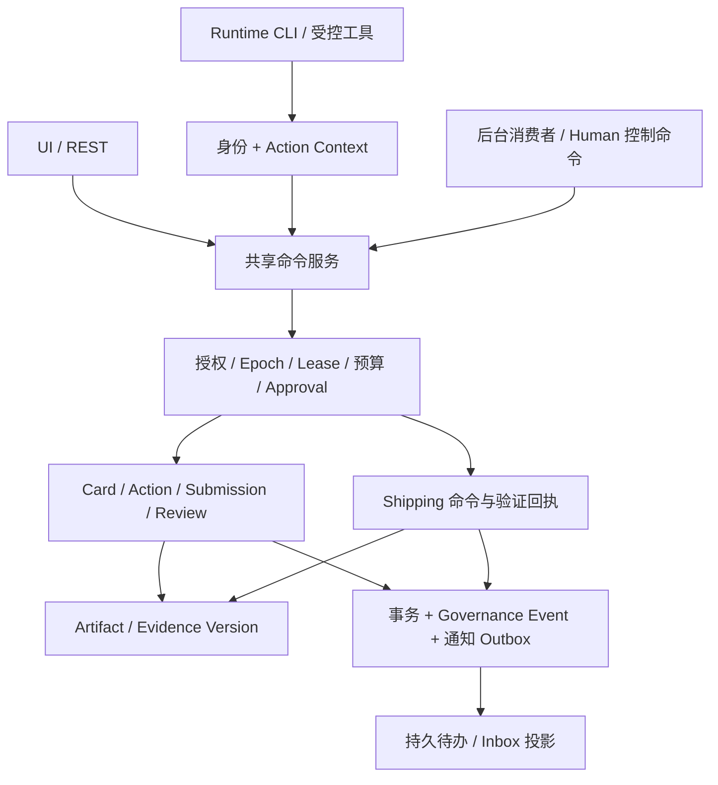

# Cumora 组织治理增强 Spec

> 版本：v0.2
> 日期：2026-09-16
> 状态：修订设计评审稿；定义目标行为，不表示仓库已实现这些能力
> 前版：[v0.1](cumora-organizational-governance-spec-v0.1.md)
> 目标：在现有 Human-Agent 协作与 Shipping 能力上建立可执行、可验收的责任、授权、委派和审计协议。

## 0. 执行摘要与修订决策

Cumora 保留长期 Agent、Human、Conversation、Card、Calendar、Computer、Memory 和 Shipping。组织治理作为可选扩展，首先在一个 Workspace 内完成“授权—执行—提交—独立验证—人工验收”的闭环。

本版消除 v0.1 与现有实现及分期之间的冲突，以下决策适用于全文：

| 议题 | v0.2 决策 |
|---|---|
| Team 与租户 | Team 是产品称谓，对应现有 Company/Workspace；存储与 API 统一使用 `company_id`，不新增 Team 租户根 |
| Card 与 Shipping | Card 权威记录工作承诺、执行与验收状态；Shipping 权威记录软件验证和发布生命周期；通过引用和明确门禁关联 |
| 最小 Role | Role 与单一 Primary Assignment 属于 P0；Backup、正式组织委派属于 P1 |
| 治理启用 | P0 由 Human 显式启用 Card；不依赖自动风险识别；对已受治理资源的访问检查始终生效 |
| Action 与 Runtime | 新增执行上下文；既有 Runtime JWT 只证明身份与运行位置，不能替代工作授权 |
| Epoch 保证 | 禁止旧执行在平台控制的提交/派发边界开始新操作；已派发外部操作单独对账，不承诺撤回外部效果 |
| 权限与预算 | P0 使用精确资源 ID、枚举动作、整数预算和事务预留；子授权必须同时受父授权和接收者 Mandate 限制 |
| Review 与 Verification | Shipping 验证结论只写在 Shipping；Review 以引用方式聚合，不复制可编辑的验证结论 |
| 审计与通知 | 长期治理事件、持久待办与短期实时 outbox 分开；通知丢失不影响状态和恢复 |
| 回退 | 关闭新建入口不关闭已有治理对象的门禁；已有工作仍可人工处理、取消和审计 |

本版的 P0 是首个可交付版本；P1、P2 是后续范围，不计入 P0 验收。跨 Workspace 授权不属于本版任何阶段。

## 1. 文档目的与规范用语

本文供产品、平台、Agent Runtime、安全和试点团队共同实施。文中的“必须”“不得”是验收约束；“建议”是可替换的实现选择。示例字段是最小协议，数据库迁移须补齐类型、索引、外键与约束。

原文中“Card 是工作唯一真相”在本版精确定义为：Card 是工作承诺及最终验收状态的唯一权威；Action 执行状态、Submission 决策状态、Shipping 发布状态各自有明确所有者，不互相覆盖。

相关事实源：

- [现有 Shipping 产品协议](SHIPPING.md)。
- [当前数据库迁移](../server/src/db/migrate.ts)与[增量迁移目录](../server/src/db/migrations)。
- [Card REST 实现](../server/src/api/router.ts)、[Agent CLI 实现](../server/src/agents/cli.ts)。
- [Runtime 入口](../server/src/agents/runtime/server.ts)、[Runtime JWT](../server/src/agents/runtime/jwt.ts)。
- [实时 outbox](../server/src/realtime-outbox.ts)。

## 2. 现状、术语与领域所有权

### 2.1 可复用基础与待补能力

| 当前基础 | 治理实施要求 |
|---|---|
| `companies`、`company_members`、`participants` | 复用租户与身份；新增业务责任 Role，不能把人设职位当作授权 |
| `board_cards` 与 `board_columns` | 保留原 Card ID；增加治理状态、版本、Epoch 与验收门禁 |
| Claim 使用 `assignee_id` 和 `updated_at` 判断占用 | Governed Card 使用独立 Lease；普通编辑不再影响治理 Claim 的有效期 |
| REST 与 CLI 各自修改 Card | 收敛到共享命令服务，禁止治理规则只存在于某一入口 |
| Runtime JWT 绑定 Agent、Company、Computer、assignment | 保留身份校验，叠加 Action Context 与每次操作的实时授权 |
| `agent_runs`、`agent_events`、`tool_calls`、`llm_calls` | 关联 Attempt；运行遥测不成为治理状态或授权来源 |
| Shipping Feature、Verification、Release、Evidence | 复用其领域生命周期，增加版本绑定和不可变验证回执 |
| PostgreSQL 事务与 `realtime_outbox` | 复用通知机制；新增长期治理事件与持久消费记录 |

上述既有能力不代表已经具备治理一致性；P0 必须完成对应适配后才能开放 Governed Mode。

### 2.2 术语映射

| 产品概念 | 技术含义 |
|---|---|
| Team / Workspace | 当前 `companies.id` 所标识的租户 |
| Agent Workspace | Agent 的文件/记忆空间，不是独立租户 |
| Human Principal | 登录 `users.id`，须有有效 `company_members` 成员关系 |
| Agent Principal | 租户内 `participants.kind = agent` 的参与者与当前 runtime assignment |
| Service Principal | 具备明确服务权限的后台执行器，不冒充 Human 或 Agent |
| Role | 新的稳定业务职责对象，不等于 `company_members.role` 或 `participants.role` |

Role Assignment 使用 `human_user_id`，界面需要名册信息时解析对应的 Human Participant。所有新领域对象必须可确定所属 Company；跨对象引用通过同租户复合外键或等效事务约束验证。不得仅凭全局 ID、请求中的 `company_id` 或聊天成员身份授予访问。

### 2.3 Card、Governance、Artifact 与 Shipping 的边界

| 对象/域 | 权威内容 | 不承担的职责 |
|---|---|---|
| Card | 目标、DoD、责任人、当前计划、工作状态、最终验收引用 | 发布到生产的实际状态 |
| Governance | Role、Mandate、授权、审批、预算、Epoch、问责链 | 软件发布流程的第二套状态机 |
| Action / Attempt | 一项有界执行与各次尝试、Lease、结果、失败 | Card 最终验收 |
| Artifact / Evidence | 不可变内容版本、来源、访问范围、保留策略 | 用单一 `verified=true` 替代具体版本的验证结论 |
| Submission / Review | 一个确定版本的交付包及其验收决定 | 复制 Shipping Verification 的独立可编辑结论 |
| Shipping | Feature 契约、不变量、Verification、Release、Readback、Friction、Regression | 绕过治理授权或直接完成 Governed Card |

保留现有 Shipping 导航、API 和状态名称。`shipping_features.board_card_id` 继续关联同租户 Card；P0 一个 Governed Card 最多绑定一个 Feature，一个 Feature 最多绑定一个 Governed Card。约束只针对治理关联，不批量改变既有轻量数据。

## 3. 目标、范围与非目标

P0 必须实现最小 Role、单一 Primary Human、Card 级 Mandate、Action/Attempt、一次子委派、预算预留、Epoch、Needs You、Artifact/Evidence、Submission、Review、Shipping 适配与审计。首个试点在单 Workspace、单 Card 中运行。

P1 扩展同 Workspace 的 Child Card、跨 Role 正式委派、Backup 和 Role Inbox。P2 扩展模板、明确的风险触发规则、Role Memory、指标与受限计划依赖。

本版不建设独立 Task Fabric、任意 BPMN/DAG 引擎、矩阵问责、跨 Workspace 授权、跨企业联邦、Agent 市场或人事绩效系统。不要求所有 Team 配置组织树，不强制普通聊天和轻量 Card 创建治理记录。

## 4. 核心不变量

1. 每个 Governed Card 恰有一个 Accountable Role；执行授权不转移该 Card 的最终问责。
2. 每个 Governed Agent Action 绑定有效 Human Sponsor、Mandate 版本、Card 和 Epoch；Human 操作使用真实 Human 身份，不伪造 Agent Attempt。
3. 子授权不得超过父授权，也不得超过接收 Agent 自己的有效授权与资源访问权。
4. 平台规则、租户权限和资源 ACL 始终是上限；Role Reporting Line 本身不授予资源访问。
5. 治理状态变更通过结构化命令完成，聊天、Mention、Memory 和 Prompt 不能创建批准或扩大权限。
6. 所有受治理资源的读写都执行相应访问检查；不能省略 Action Context、改走旧 API 或声称 Collaboration Mode 绕过限制。
7. 已接受的交付版本、审批内容、验证回执与执行历史不能原地改写。
8. 只有当前 Epoch 的有效 Submission 满足 Review Policy，Card 才能进入 `DONE`。
9. Producer 不得独立验证自己的交付；最终人工验收与独立技术验证是不同决策。
10. 旧 Epoch、失效 Lease、撤销授权不能通过平台开始新的受治理操作；历史结果可隔离归档，不能自动推进当前工作。

## 5. 双模式与启用规则

### 5.1 Collaboration Mode

普通 Conversation、Card、Calendar 和 Agent 协作保持现有产品流程，不强制 Role、Mandate、Action 或 Submission。继续使用现有遥测。现有平台安全规则与 Shipping 原有门禁始终生效。

兼容性不意味着轻量请求有权修改治理资源。访问治理 Card、其 Artifact 或关联的治理 Shipping Feature 时，由服务端解析资源的治理归属并执行门禁。

### 5.2 Governed Work Mode

P0 仅由有权 Human 调用 `upgrade_card_governance` 显式开启。启用事务必须具备：Accountable Role 及有效 Primary、Human Sponsor、DoD、Review Policy、预算单位与限额、期限、初始计划，以及执行者的有效 Card 级 Mandate。没有执行者时可以保存设置草稿，但不得激活治理执行。

升级在原 Card 上写入治理快照，激活初始 Epoch 1，终止旧的轻量 Claim。旧调用因缺少有效执行上下文而被拒绝，不自动继承权限。升级前的消息、产出和已完成操作保留为历史，不追认成已授权执行或已接受交付。P0 仅允许未完成 Card 升级。

P2 可按工具类别、资源标签、正式交付标记或预算阈值提出升级要求；条件命中时先阻止该操作，待治理配置完整后再执行。无法确定风险不能成为自动授权的理由。跨 Workspace 请求直接拒绝，不能靠升级获得跨租户访问。

### 5.3 生命周期与降级

P0/P1 的 Card 一旦进入 GOVERNED 不允许降级。可暂停、取消或归档，历史仍保留；后续轻量需求可以单独建立无权限继承的新 Card。Feature Flag 只控制新建与升级入口，不能撤销已有资源的治理门禁。

## 6. Role、Assignment 与 Mandate

### 6.1 Role 与责任归属

```text
Role:
  role_id, company_id, name, responsibility_scope
  grantable_grants[]                    # 精确授权上限，不从职责自然语言推断
  status: ACTIVE | INACTIVE
  version, created_at, updated_at
  parent_role_id?                       # P2，同租户且无环

RoleAssignment:
  assignment_id, company_id, role_id, human_user_id
  assignment_type: PRIMARY | BACKUP     # P0 只开放 PRIMARY
  valid_from, valid_until?, version
  status: ACTIVE | ENDED
```

同一 Role 的有效 PRIMARY 任期不得重叠；启用 Governed Card、授权和最终验收时必须有且仅有一个有效 PRIMARY。人选必须是该 Workspace 当前 Human 成员。失去成员资格立即失去决策权，不等待任期结束或后台清理。

Role 的 grantable_grants 由具备相应管理与转授权资格的 Human 配置，并与该 Human 的转授权上限取交集；所有配置变更审计。`responsibility_scope` 仅用于说明职责。P0 同一 Card 的各执行 Mandate 使用其 Accountable Role；P1 跨 Role 时由各 Role 的有效 Sponsor 分别授权。

Role 停用不得删除历史，且会阻止其新的治理执行。Role Assignment 变更保存原任期，不覆盖已有事件中的责任人快照。P0 显式转交时暂停原任期签发的 Mandate，由新 Primary 复核并签发新版本；恢复相关 Card 需递增 Epoch。P1 Backup 接管也必须先原子结束旧 PRIMARY 任期并激活新任期，不能只因超时产生第二个 Primary。

### 6.2 Agent Mandate

P0 使用按 Card、按 Agent 授权。Human Sponsor 必须是所代表 Role 的当前 Primary，并具有所授资源和动作的转授权资格；单纯拥有读取权限不足以转授权。Workspace owner/admin 可管理 Role 与显式接管流程，但不能凭管理身份绕过平台禁令或资源 ACL。P1 如需授权代理人须新增显式的 grant 权限，不隐式继承。可为待升级 Card 预先创建/激活 Mandate，但只有 Card 升级且 Plan 激活后才能领取执行资格。

```text
AgentMandate:
  mandate_id, mandate_version, company_id, card_id, role_id
  sponsor_user_id, sponsor_assignment_id, agent_id
  grants[]                             # 第 8 节的规范化授权元组
  data_resource_ids[], tool_ids[]
  budget_account_id, budget_limit_microusd, model_call_limit
  valid_from, valid_until
  max_delegation_depth, allowed_delegatee_ids[]
  autonomy_policy, policy_version
  status: DRAFT | ACTIVE | SUSPENDED | REVOKED | EXPIRED
  version                              # 当前状态的 CAS 版本
```

授权内容版本不可变；任何范围、Sponsor、期限、自治等级或预算变化创建新的 `mandate_version`。`version` 仅用于状态并发控制，不能替代内容版本。新版本激活后旧版本不得用于开始操作，绑定旧版本的 Action 被阻止并进入恢复/重规划流程；不得自动升级到新权限。

| 当前状态 | 命令/条件 | 后继状态 |
|---|---|---|
| DRAFT | Sponsor 审核并激活 | ACTIVE |
| ACTIVE | 暂停 | SUSPENDED |
| SUSPENDED | 同一有效 Sponsor 恢复，内容未变且未过期 | ACTIVE |
| DRAFT / ACTIVE / SUSPENDED | 撤销 | REVOKED |
| DRAFT / ACTIVE / SUSPENDED | 到达 valid_until | EXPIRED |

REVOKED/EXPIRED 为终态。到期判断使用数据库时间，不依赖后台及时更新状态。恢复 Mandate 不恢复旧 Attempt 的 Lease，执行者必须重新获取执行资格。

## 7. Governed Card、Claim 与计划

### 7.1 Card 扩展与状态

```text
governance_mode: COLLABORATION | GOVERNED
governance_state?: READY | IN_PROGRESS | IN_REVIEW | PAUSED | DONE | CANCELLED
version
accountable_role_id?, human_sponsor_user_id?
definition_of_done?, review_policy_snapshot?, policy_version?
budget_account_id?, deadline?
plan_epoch?, active_plan_id?, accepted_submission_id?
shipping_feature_id?, delivery_gate?: CODE_ACCEPTED | PRODUCTION_READBACK
parent_card_id?, parent_epoch_at_delegation?  # P1
archived_at?
```

这些字段在 Collaboration Card 上可空；进入治理后必填项由数据库与命令服务共同约束。`shipping_feature_id` 是已有 Feature/Card 关联的 API 投影，不新增一条可独立编辑的反向关系。

| 当前状态 | 触发及条件 | 后继状态 |
|---|---|---|
| READY | 有效 Claim 的根执行开始 | IN_PROGRESS |
| IN_PROGRESS | 当前 Epoch 正式提交交付包 | IN_REVIEW |
| IN_REVIEW | REQUEST_CHANGES 或 REJECT | IN_PROGRESS |
| IN_REVIEW | Human 显式撤回待审候选并记录原因 | IN_PROGRESS |
| IN_REVIEW | 人工最终 ACCEPT，全部门禁通过且生成 Manifest | DONE |
| READY / IN_PROGRESS / IN_REVIEW | Human 暂停 | PAUSED |
| PAUSED | Human 恢复且版本/授权仍有效 | 恢复暂停前状态；恢复 IN_REVIEW 还需 Submission 有效 |
| READY / IN_PROGRESS / IN_REVIEW / PAUSED | 取消意图生效 | CANCELLED |
| READY / IN_PROGRESS / IN_REVIEW / PAUSED | 激活新计划 | READY |
| DONE | Human 显式 reopen 并激活新 Epoch | READY |

未列出的转换一律拒绝。CANCELLED 终态；新需求创建新 Card。归档为终态 Card 的展示标记，不作为完成状态；只允许在 DONE/CANCELLED 且无未决外部操作时归档。IN_PROGRESS 不要求始终有存活 Runtime；具体阻塞与等待原因由 Action 汇总展示。

Card 的治理状态是权威，列是展示映射。`DONE` 映射到 `kind=done`，IN_PROGRESS/IN_REVIEW 通常映射到 doing；无合适列时不移动，仍显示治理状态。治理 Card 的拖拽只能请求合法转换或同义列内排序；直接移动到 Done 必须拒绝并返回 Review 入口。重命名或重排列不得改变治理状态。

### 7.2 Claim 与 Assignment

Governed Claim 使用独立记录：`claim_id, card_id, holder_principal, lease_expires_at, generation, version`。同一 Card 最多一个有效 Claim，领取/续租/替换均为事务操作。具体 Lease TTL 由受控配置给出，过期立即失去根执行资格，普通评论或编辑不得续租。

`assignee_id` 继续表示展示分配，不是独占锁或授权。Claim 负责根生产执行；Child Action 在有效根 Claim 下工作，不各自抢占 Card。独立 Reviewer 使用单独授权的 Review Action，无需接管 Producer 的 Claim。旧 `card assign` 不得撤销或替换治理 Claim。

### 7.3 Card Plan 与 Epoch

```text
CardPlan:
  plan_id, company_id, card_id, version, epoch
  goal, definition_of_done, input_version_refs[], steps[]
  action_specs[], budget_allocation, deadline, risk_summary
  review_policy_snapshot, shipping_contract_revision?
  created_by, approved_by?, created_at
  state: DRAFT | ACTIVE | SUPERSEDED | REJECTED
```

P0 计划为有序步骤列表，Child Action 仅一层，不提供任意 DAG。每个 Governed Card 恰有一个 ACTIVE Plan；首次启用为 Epoch 1。激活新 Plan 必须由有权 Human 批准，并在事务中更新 Card Epoch、失效旧执行资格和待决请求，保存原因与旧计划引用。

目标、DoD、关键输入版本、授权内容版本、预算上限、期限、Review Policy 或执行路线发生实质变化必须新建 Plan 并递增 Epoch；普通进度备注、排序和不改变合同的执行重试无需重规划。配额在既定上限内的消费/预留不算合同变化。

关键输入指批准计划时的外部基线和需求；按计划生成的候选产物不是基线变更。Plan 可预先声明“验证本 Card/Epoch 的候选产物”步骤，服务端在创建每次 VERIFY Action 时将该输入槽一次性绑定到明确版本，此后不可移动。返工产物需要新的 VERIFY Action，不要求仅因新产物生成就递增 Epoch。

旧 Epoch 结果保存到历史，不接受旧 Submission 的新验收，不推进当前 Card。Human 导入旧产物时创建新 Epoch 下的显式引用与审计记录，并重新验证适用性。P1 子 Card 自有 Epoch，但操作还必须校验委派时绑定的父 Card Epoch 及整条祖先链；父计划失效不等到异步取消消息到达才生效。

## 8. 权限、数据与预算协议

### 8.1 权限表示与有效权限

P0 的 grant 为精确元组 `(company_id, resource_type, resource_id, operation)`；动作来自服务端枚举注册表，资源 ID 由服务端解析。空集合表示无权限，不表示全部；拒绝未知动作、通配符、任意脚本表达式、跨租户 ID 和客户端自定义权限名称。不同元组不能把资源与动作重新组合形成笛卡尔积。

创建新 Artifact 等尚无 ID 的操作以具体的 Card/容器 ID 为授权资源，由服务端分配对象 ID 并强制继承 Company、Card 和访问标签。读取版本使用明确版本 ID；集合查询必须按可见资源过滤，不能只在单对象读接口实施范围限制。

为避免每生成一个产物就重新扩权，注册表可以包含针对精确 Card ID 的 `card.outputs.read`、`card.outputs.publish` 操作：仅覆盖该 Card 当前 Epoch 的正式输出集合，读取请求仍绑定具体 Version，并叠加敏感度及 Artifact ACL。它们不包含任意文件路径、私有 Memory 或其他 Card。此类容器资源可列入 data_resource_ids，包含关系由固定资源解析器确定，不能由 Agent 自定义。

```text
root_effective_grants = platform_allowed ∩ membership_and_resource_acl
                      ∩ role_grantable_scope ∩ mandate_grants ∩ card_plan_grants

child_effective_grants = parent_effective_grants ∩ requested_child_grants
                       ∩ delegatee_mandate_grants ∩ delegatee_resource_acl
                       ∩ platform_allowed
```

创建时如果请求的子范围超过交集则拒绝，并返回无敏感泄漏的差异；不得静默扩大。执行时重新校验当前上限及全部授权链，不能只依赖创建快照。拒绝优先；Human Approval 也不能越过这些上限。扩大权限需重新授权并按第 7 节激活新计划。

`data_resource_ids` 和 `tool_ids` 都是有限枚举集合。Child 的数据、工具集合为父范围与接收者范围的子集。有效期限不晚于父 Action、Card 和 Mandate 的最早期限；剩余深度每一跳恰好减 1，0 表示不可委派；P0 根 Action 最大为 1。

### 8.2 数据分类与执行环境

采用固定等级 `PUBLIC < INTERNAL < CONFIDENTIAL < RESTRICTED`，数字越大越敏感。衍生产物至少继承所有输入的最高敏感度，P0 不支持降密。执行环境的允许等级上限必须覆盖输入等级；资源允许的目的地也必须覆盖实际工具/Connector，不能仅比较一个安全数字。

授权读写、上下文组装、搜索、缓存命中和 Artifact 下载都执行范围校验。长期 Agent 身份可以复用，但治理执行的会话、暂存目录和缓存须按 Card/权限域隔离；不得把某 Mandate 下读取的敏感内容自动带入另一 Role 或轻量会话。已进入模型上下文的内容不能靠后续撤销“遗忘”；撤销阻断后续访问与输出，跨权限域必须创建干净上下文。

### 8.3 预算预留、消费与回收

P0 同时支持 `budget_limit_microusd`（整数微美元）和 `model_call_limit`（整数次数），任一上限耗尽都阻止新调用。禁止浮点货币计算；存量 `llm_calls` 仍为用量事实源，通过唯一调用 ID 关联 Attempt 后结算，不重复建立使用量事实。

预算账户记录 `limit, spent, reserved, version`，正常准入与预留必须保持 `available = limit - spent - reserved >= 0`。在同一事务内锁定相关 Card、Mandate 和父子账户后，预留 Child 配额或单次调用最大可计量成本；不同分支不能分别读取相同 remaining 值后各自通过。异常超额结算的冻结规则见下文，不能拒绝登记已发生的真实消费。

Child 配额是父账户的 reserved，在子账户消费时沿祖先链将对应 reserved 转为 spent；这是同一笔消费的层级归属，不把父预留和子消费重复相加计费。完成/取消只回收确定未消费且无在途调用的配额；UNKNOWN 外部调用保留预留直至对账。重试和换 Agent 不重置 Card 累计成本。

P0 的硬金额上限只对能在调用前确定成本上界、服务端登记派发并可靠回传用量的 Runtime 成立；采用固定费率快照与最大输出额度预留。不能提供该能力的 BYOA Runtime 不进入 P0 Governed 执行，不能把事后估算宣称为硬预算。超出预留的异常实际账单如实记账、冻结后续执行并审计，不篡改成本以维持形式不变量。

## 9. Action Context 与副作用边界

### 9.1 执行上下文

Runtime 身份认证保留现有 JWT，新增服务端签发、短期有效、绑定具体 Attempt 的执行凭证。示例请求上下文：

```text
execution_token
action_id, attempt_id
expected_epoch, expected_version
idempotency_key
```

服务端从凭证和领域记录解析 `company_id, agent_id, runtime_assignment_id, mandate_id, mandate_version, action_id, attempt_id, lease_generation, plan_epoch`。不得信任 Agent 自填的 Sponsor、Role、scope 或其他 Action ID；不能通过更换参数领取另一个活动 Action 的权限。

根 Action 创建由有权 Human 发起，Child 创建由有效父 Action 发起；Attempt 的领取是受控 bootstrap 命令，校验服务端分配、Mandate 与 Card 后才签发执行凭证，不要求尚未存在的 Attempt 凭证。普通治理工具调用必须携带该凭证。控制平面的撤销、暂停、取消和重规划使用独立 Human/Service 授权，不依赖被撤销 Agent 的可用性。

### 9.2 校验与提交

Agent 的受治理操作按以下顺序解析并检查：身份及当前运行位置、租户成员和资源归属、Role/Sponsor 任期、Mandate 内容版本及状态、Card/祖先 Epoch、Action 状态、Attempt Lease/generation、资源/工具范围、预算、命令内容对应的 Approval。Human/Service 命令验证自身成员或服务资格、所需职责、资源范围和相同的版本/领域门禁，不要求伪造 Agent Mandate 或 Attempt。

最终检查必须与数据库业务变更、幂等回执、治理事件和通知 outbox 同事务提交。撤销、Epoch 更新、接管与执行通过共同锁或 CAS 建立确定顺序。请求入口预检不能替代提交点校验；代码必须采用固定锁顺序并对事务冲突做有界重试。

敏感读取也验证 scope；Agent 执行读取额外验证 Epoch、Lease，并先持久化必要的访问审计再释放内容。已发出的内容不可收回；后续读取与下载令牌受撤销策略控制。Human 审计历史使用独立只读权限，不要求已结束的 Attempt 仍然存活。

### 9.3 不同副作用的保证

| 操作 | 提交/派发边界 | 本版保证 |
|---|---|---|
| Card、Submission、Review 等数据库变更 | 最终授权与业务写入所在事务提交 | 撤销/新 Epoch 若先提交，旧执行不能再写业务状态 |
| 受控外部 Connector | Dispatcher 重新校验后原子取得一次派发许可 | 未派发操作可阻止；已取得许可的在途操作可能完成，必须对账 |
| 治理暂存文件与 Artifact 发布 | Attempt 隔离暂存；正式导入走平台命令 | 旧执行不能发布或覆盖正式版本；本地草稿残留不等于正式提交 |
| 受控编译/测试命令 | 注册工具在无外部凭据、限制网络的隔离执行区启动 | 允许生成草稿和测试证据；不持有发布权限，终止后隔离其迟到结果 |
| 任意本地 Bash、网络、第三方个人凭据 | 平台外 | 不承诺 Epoch、撤销或幂等保证；P0 不允许作为受治理执行通道 |

平台外部操作记录 `operation_id, request_hash, idempotency_key, state, provider_receipt`，状态为 `PREPARED → DISPATCHED → SUCCEEDED | FAILED | UNKNOWN`，未派发时可转 CANCELLED。许可发放与撤销有明确先后顺序；不声称网络发送、远端提交和本地事务原子。

只对支持幂等键和查询回执的适配器自动重试。远端可能成功但本地未收到响应时进入 UNKNOWN，禁止盲目重放；先查询或人工对账。UNKNOWN 未消解前不回收对应预算，不终结相关 Attempt。补偿是新的有权操作，有自己的审批和审计，不用旧授权执行“收尾”。P0 Coding 试点以提交代码包和验证为终点，不自动部署生产。

执行停止后仍可提交严格绑定原 `operation_id` 的状态、计量和隔离历史结果；该通道不得创建产物发布、改变当前 Card、重新派发或授予数据访问。它使用专用控制面授权，不是旧凭证的通用豁免。

## 10. Action、Attempt 与恢复状态机

### 10.1 对象与运行映射

```text
AgentAction:
  action_id, company_id, card_id, plan_epoch, parent_action_id?
  purpose: PRODUCE | COORDINATE | VERIFY
  objective, input_version_refs[], expected_output, definition_of_done
  permission_snapshot, authorization_chain_refs[], budget_account_id, deadline
  remaining_delegation_depth, assigned_agent_id, active_attempt_id?
  state, version, terminal_reason?, created_at

ActionAttempt:
  attempt_id, company_id, action_id, agent_id
  mandate_id, mandate_version, sponsor_user_id, sponsor_assignment_id
  runtime_assignment_id, runtime_ref, model_ref
  state, lease_generation, lease_expires_at?, last_heartbeat_at?
  started_at, ended_at?, checkpoint_ref?, result_ref?, failure_class?
  usage_ledger_refs[], version
```

Action 的工作合同与权限上限不可原地修改。Attempt 保存每次实际执行者、授权快照及运行位置；`assigned_agent_id` 是当前路由信息，不替代历史 Attempt 的主体。服务端创建 Action 时验证指定执行者的有效 Mandate，再在领取 Attempt 时复核。

一个 Action 同时最多一个可执行 Attempt；一个 Attempt 可关联多个 `agent_runs`，例如等待后继续的回合。P0 一个治理 run 只处理一个 Attempt，避免上下文和成本归属混杂。通过关联字段复用 run/tool/llm 记录，不把 `agent_runs.completed` 解释成 Action 或 Card 验收。

### 10.2 Action 转换

| 当前状态 | 条件/命令 | 后继状态 |
|---|---|---|
| CREATED | 合同、Mandate、预算准备成功 | READY |
| READY | 成功领取唯一 Attempt | RUNNING |
| RUNNING | 创建人工介入请求并保存恢复摘要 | WAITING_HUMAN |
| BLOCKED | 有权创建人工介入请求 | WAITING_HUMAN |
| READY / RUNNING | 依赖、执行环境或可恢复失败阻塞 | BLOCKED |
| RUNNING | Card 暂停，当前 Attempt 停止 | BLOCKED |
| WAITING_HUMAN | 有效 Human 决定允许恢复 | READY |
| WAITING_HUMAN | 请求被拒绝或超时，允许人工重新决策 | BLOCKED |
| BLOCKED | 阻塞解除，无未解决的必需人工请求，旧 Attempt 已封存，重新授权通过 | READY |
| RUNNING | 正式生产结果提交 | SUBMITTED |
| RUNNING | 检索/验证完成或 Child 产物交回父执行者，且用量和在途操作结清 | COMPLETED |
| SUBMITTED | 提交回执、用量与在途操作全部结清 | COMPLETED |
| CREATED / READY / RUNNING / WAITING_HUMAN / BLOCKED / SUBMITTED | 取消 | CANCELLING |
| CANCELLING | 停止与在途操作对账完成 | CANCELLED |
| 任意非终态 | 新 Epoch 生效 | SUPERSEDED |
| 任意非终态 | 不可恢复失败或有权决定终止 | FAILED |

终态为 COMPLETED、CANCELLED、SUPERSEDED、FAILED，不能重新打开。新 Epoch 下旧 Action 即使已经 COMPLETED 也只保留为历史，不改写终态。SUPERSEDED 可以存在未决外部操作记录，但这些记录只能对账，不能继续工作。

Action COMPLETED 仅表示该执行已结束，Submission 可以仍待 Review。Review 退回创建新 Action 和新 Submission，原 Action、Attempt、Submission 不重开。相同合同的执行失败重试使用原非终态 Action 的新 Attempt；合同实质变化则采用新 Plan/Epoch 和新 Action。

### 10.3 Attempt、Lease 与 Checkpoint

Attempt 状态为 `RUNNING | WAITING_HUMAN | STOPPING | SUCCEEDED | FAILED | LOST | CANCELLED`。创建并领取后为 RUNNING；等待请求使其进入 WAITING_HUMAN 并撤销写入 Lease；只保留控制面心跳/报告资格。SUCCEEDED/FAILED/LOST/CANCELLED 为不可重开的终态。

| 场景 | Attempt 处理 | 后续执行 |
|---|---|---|
| 正常完成 | RUNNING → SUCCEEDED | 更新 Action，不自动完成 Card |
| 可恢复失败 | RUNNING → FAILED | Action BLOCKED，允许新 Attempt |
| Lease 到期/运行位置失效 | RUNNING → LOST；若有未决外部操作则先 STOPPING | 拒绝旧 generation；对账后才可创建替代 Attempt |
| 等待 Human | RUNNING → WAITING_HUMAN | 无业务读写权限；保存恢复摘要 |
| Human 批准后恢复 | WAITING_HUMAN → RUNNING，重新领取 Lease 并增加 generation | 同运行实例且 Checkpoint 可用时复用 Attempt |
| 等待后无法恢复原实例 | WAITING_HUMAN → CANCELLED | 新 Attempt 从恢复摘要开始 |
| 取消/暂停/旧 Epoch | RUNNING 或 WAITING_HUMAN → STOPPING → CANCELLED | 先阻止操作，异步停止进程并对账 |

模型、执行位置或 Agent 更换必须产生新 Attempt，旧 Lease 先失效。计划中已批准的候选 Agent 可在等同或更窄权限下替换；未预先授权的执行者、授权内容版本变化或范围变化需先新计划。替换不能继承旧 Agent 私有 Memory。

P0 保证基于 Card Snapshot、固定输入版本、操作回执和恢复摘要创建新 Attempt。Runtime 原生 Checkpoint 是可选优化；不承诺跨模型、跨引擎或跨主机原样恢复。恢复摘要必须可持久化，不保存模型私有思考过程。租约过期按数据库时间判断，新领取必须增加 generation；不能只依赖后台停止进程。

## 11. 委派与独立 Reviewer

### 11.1 P0 轻量委派

在同 Card、同 Workspace 内创建 Child Action；无需 Proposal/Counteroffer。父 Action 必须有 delegate 权限、可用深度、有效 Attempt、预算和明确的接收 Agent。接收者同时具有自己的 Card 级 Mandate，不能直接使用父 Agent 的 Mandate 冒充其身份。

子 Action 创建与预算预留同事务完成。子层最大深度为 0；Parent 取消或失效后 Child 立即失去操作资格。Child 在 READY 时可以通过服务端分配的身份回执拒绝，记录 `DELEGATION_REJECTED` 并终结，释放未用预算；接受即为领取 Attempt。父 Action 在 Child 终态且结果/预算结清前不能 COMPLETED。结果先归入父 Action 的引用，必要的用户可见表达由父执行者决定。

P0 Child 只发布产物和结果引用，由生产根 Action 提交整个 Card 的 Submission；Child 的完成不触发 Card IN_REVIEW。正式独立的子 Card Submission 属于 P1。

父 Action 等待子结果可进入 `BLOCKED`，原因记为 `WAITING_CHILDREN`；已成立的 Child 授权依赖父合同、Mandate、Card Claim 和祖先 Epoch，不要求父 Runtime 同时运行。单个父 Attempt 结束不自动撤销委派；父 Action 取消/失效、Card 暂停、Claim 失效或授权撤销则阻止 Child。父 Action 待所有子结果就绪后，按第 10 节重新领取执行资格再汇总。

### 11.2 Reviewer 的授权来源

正式独立验证必须由 Human/Plan 单独指定 Reviewer，并为其签发 VERIFY Action 与独立 Mandate。它是同 Card 下与生产分支平行的根 Action，使用专门预留预算，不作为 Producer 的权限扩展子任务。Producer 的授权无需包含批准自己交付的能力。

生产分支可以委派只读自检，但这种自检只作为 Evidence，不能满足独立 Review 门禁。服务端计算产物版本的 `producer_principal_ids`，包含实际创作或修改正式内容的主体；只汇总引用不自动算作创作者。VERIFY Actor 必须不在该集合和 Shipping 当前验证版本的 builder 集合中，也不得兼任该 Submission 的生产 Action。

P0 的独立性保证是可验证的主体/执行分离，不宣称不同 Agent ID 必然带来认知独立；是否要求不同模型或运行环境由更严格的 Review Policy 决定。原始候选版本不可被 Reviewer 原地改写；Reviewer 若修改交付内容，产生新版本并加入 Producer 集合，需要另外的独立验证者。

### 11.3 P1 正式委派

适用于同 Workspace 内的 Child Card、跨 Role、有独立 DoD 的子工作。子 Card 的 Accountable Role 不改变父 Card 的责任人。跨 Workspace 委派拒绝。

```text
Delegation:
  delegation_id, company_id, version, contract_revision
  parent_card_id, parent_epoch, parent_action_id
  child_card_id?, delegatee_role_id, delegatee_agent_id
  objective, definition_of_done, input_version_refs[], expected_output
  grants[], data_resource_ids[], tool_ids[], budget_reservation_id
  deadline, remaining_delegation_depth, review_policy_snapshot
  proposed_by, accepted_by?, state
```

| 当前状态 | 命令/条件 | 后继状态 |
|---|---|---|
| PROPOSED | 接收方有效授权主体接受具体合同版本 | ACCEPTED |
| PROPOSED | 拒绝 | REJECTED |
| PROPOSED | 反提案 | COUNTEROFFERED；另建 PROPOSED 合同版本 |
| ACCEPTED | 双方授权、祖先 Epoch、预算再次校验通过 | ACTIVE |
| ACTIVE | Child Card 已验收并提交引用 | DELIVERED |
| DELIVERED | 父方确认收讫并结算预算 | CLOSED |
| PROPOSED / ACCEPTED / ACTIVE / DELIVERED | 撤销、过期或不可恢复失败 | REVOKED / EXPIRED / FAILED |

终态不重新打开。接收时预留预算，激活时不能重复预留；取消只能释放未消耗且无在途操作的部分。Auto Accept 只用于预先配置的模板和边界，仍记录代表接收方的授权来源。父方 CLOSED 表示接收结果，不替代父 Card 最终 Review。

Role Reporting Line、Card Responsibility Tree、Action Parent Chain 是三种不同关系；分别建模、校验同租户与无环，不共用一个 `parent_id`。

## 12. Artifact、Evidence 与 Submission

### 12.1 产出类别与不可变性

| 类型 | 持久化与约束 |
|---|---|
| Working Output | 按 Attempt 隔离的草稿和缓存，可按短期策略清理，不视为交付 |
| Evidence | Artifact Version 的证据用途；记录工具/测试、输入版本、时间、执行主体和可信来源 |
| Deliverable Artifact | 正式内容的不可变版本；修改产生新 Version，保留 Lineage |

Evidence 与 Deliverable 共享存储、访问和版本机制。正式快照从可变的 Agent Workspace、Yjs 文档或外部仓库导入；不能只保存一个可变 URL 就声明内容不可变。

```text
ArtifactVersion:
  artifact_id, version_id, company_id, card_id
  content_hash, hash_algorithm: SHA256, media_type, byte_size
  storage_object_id, storage_version?, external_source_ref?
  producer_principal_ids[], source_action_id?, source_attempt_id?
  source_human_operation_id?             # Human 产出时使用
  input_version_refs[], evidence_version_refs[], derived_from_version_id?
  sensitivity, allowed_reader_scope, retention_until, created_at

Submission:
  submission_id, company_id, card_id, action_id?, human_operation_id?
  plan_epoch, revision, version
  artifact_version_refs[], evidence_version_refs[], producer_principal_ids[]
  definition_of_done_snapshot, review_policy_snapshot
  shipping_contract_revision?, verification_receipt_refs[]
  completion_summary, known_limitations[], unresolved_risks[]
  submitted_by, submitted_at
  state: PENDING_REVIEW | ACCEPTED | CHANGES_REQUESTED | REJECTED | SUPERSEDED
```

Artifact 发布采用先上传暂存、校验 hash/大小、再事务登记的流程；正式对象键或对象版本不可覆盖。孤立暂存由 GC 回收。外部引用必须绑定不可变版本且可保留必要快照，缺失内容或无法验证的链接不能满足必需证据。

Submission 内容不可修改，状态转换使用 CAS；每个 Card/Epoch 最多一个 PENDING_REVIEW 候选。同 Epoch 的修订创建新 Submission 并引用前次 ID；前次 CHANGES_REQUESTED/REJECTED 保持原决定。候选撤回或 Epoch 更新使仍待审候选 SUPERSEDED，已 ACCEPTED 的历史决定不改写。

## 13. Review、Shipping 适配与最终验收

### 13.1 通用 Review 协议

Review 是追加写的决定记录：`review_id, company_id, submission_id, stage, decision, reviewer_principal, basis_refs[], plan_epoch, policy_version, comment, created_at`。

`stage` 为 INDEPENDENT_CHECK 或 FINAL_ACCEPTANCE；P0 决定仅支持 ACCEPT、REQUEST_CHANGES、REJECT。升级协调通过 Human Intervention 表达，P0 不支持 PARTIALLY_ACCEPT，避免不明确的剩余 DoD 和完成语义。

非 Shipping Card 的 INDEPENDENT_CHECK 可保存通用检查结论。Shipping Card 的该阶段只引用第 13.2 节的不可变验证回执，结果由适配器派生，不能再由通用 Review API 独立填写一份 pass/fail。

所有必需独立检查通过后，由 Accountable Role 的当前 Primary 作 FINAL_ACCEPTANCE。Sponsor 可以同时是最终验收人，但独立验证者和最终验收人都不能属于该交付版本的 Producer 集合；若 Primary 亲自修改了交付内容，必须显式转交责任并按第 6、7 节重新建立有效计划与验证，再由合格的新 Primary 验收。

FINAL_ACCEPTANCE=ACCEPT 时，在单一事务中复核当前 Epoch、DoD/策略版本、Artifact 版本、独立性、全部门禁、无未决外部操作及执行分支已结清，写 Review、Submission ACCEPTED、Card DONE、Manifest 和事件。Agent 不持有最终验收权限，不能把技术验证 ACCEPT 直接映射成 Card DONE。

REQUEST_CHANGES/REJECT 使待审 Submission 进入对应终态，并使 IN_REVIEW Card 回到 IN_PROGRESS；整改使用新生产 Action。同一候选只能有一个终结决定，冲突返回当前状态。已接受交付发现问题须 Human reopen、新 Epoch、新 Submission，不删除原决定。

### 13.2 Shipping 验证结果的唯一写入点

保留 `shipping_features`、`shipping_invariants`、`shipping_verifications` 及原有状态枚举，治理模式增加如下适配：

1. Feature 增加契约修订标识；修改目标、不变量、必需验证项、builder 或发布门禁时生成新契约修订，并通过统一命令触发 Card 重规划。普通进度备注不触发。
2. 每次验证完成在 Shipping 域追加 `shipping_verification_results`：绑定 square ID、验证尝试 ID、契约修订、Card Epoch、候选 Artifact Version 集合/hash、验证者、producer/builder 快照、Evidence Version 和原生结论。结果不可覆盖。
3. 现有 verification 行保存最新工作状态与 `latest_result_id` 投影；已完成的结果和证据不因下一次验证而被改写。新的候选版本使旧结果不再满足当前门禁，但旧回执保留。
4. `cumora ship square ... passed/failed`、REST 和 UI 都调用相同 Shipping 命令服务创建回执。对治理 Feature，不接受无版本绑定的直接状态 PATCH；旧接口可适配新协议或返回明确的升级错误。
5. Review 使用唯一引用 `(submission_id, verification_result_id)` 聚合这些结果；验证结论只来自 Shipping，不能双向写入两套状态。失败仍按现有 Shipping 行为生成 Friction/Regression，并引用该结果 ID 去重。
6. 所有 required square 都必须有针对当前契约和候选版本的 passed 结果，且仍满足现有 ready 门禁，包括 user-path、trace、release-note。`waived` 不视为 required passed。增删 builder 不能抹除历史 producer 身份以允许自审。

P0 使用先登记候选 Artifact/Evidence，再独立验证，再提交冻结交付包的流程；也允许先提交候选，再追加独立 Review 依据。Submission 内容冻结后新增验证回执仅通过追加 Review 依据关联，不能修改其候选 Artifact 集合；所有回执必须匹配该集合。不同候选代码版本不能共用一次验证结论。

### 13.3 Shipping 状态与 Card 门禁

| delivery_gate | Card DONE 的必要条件 | Shipping 后续行为 |
|---|---|---|
| CODE_ACCEPTED（P0） | 当前契约和候选版本满足 Shipping ready 的验证门禁，独立检查通过，Human 最终 ACCEPT | Shipping 可以继续 Releasing/Watching/Learned；Card DONE 不表示已上线 |
| PRODUCTION_READBACK（P1） | 上述条件，加同一被验收代码/产物版本的 production release 成功、readback passed、无阻塞回归，并最终人工 ACCEPT | 保留现有 release/readback 状态真相 |

门禁取决于绑定版本的回执与事实，不能只比较 Feature 当前字符串状态。一个 release 必须绑定交付版本、契约修订和批准内容；旧 release 的成功或旧 readback 不能验收新代码。P0 不启用 PRODUCTION_READBACK。

Card 的人工 ACCEPT 不替代生产发布 Approval；Shipping ready/learned 也不自动完成 Card。代码验收后继续发布仍受资源访问检查，Human 经 Shipping 的真实身份命令执行；未来 Agent 发布需单独有效的授权工作上下文。Card DONE 后不保留生产 Agent 的写入资格。

生产 readback 失败仍按 Shipping 原有机制生成 Friction 并更新 Feature 状态。对已经 DONE 的 CODE_ACCEPTED Card，仅追加关联异常并请求 Human 决定是否 reopen，不静默篡改原验收；若需修改代码，则开启新 Epoch 并使相关旧验证不适用于新版本。

### 13.4 Deliverable Manifest

P0 生成最小不可变 Manifest：Card/Epoch、目标与 DoD 快照、接受的 Submission、Artifact/Evidence Version、验证/Review 引用、已知限制、开放风险、最终验收人及任期。P1 增加已接受 Child Card 和其 Manifest 引用。Manifest 是已接受事实的快照，不是新的可编辑状态源。

## 14. Approval、Needs You 与 Human Takeover

### 14.1 自治策略与批准对象

动作自治等级为 `AUTO | AUTO_WITH_NOTIFY | REQUIRE_APPROVAL | HUMAN_ONLY | DENY`。策略交集采用更严格的结果；没有配置的动作默认拒绝。HUMAN_ONLY 表示 Agent 不能执行，即使 Human 点击批准也不转换成 Agent 权限。

```text
Approval:
  approval_id, company_id, card_id, action_id, plan_epoch
  mandate_id, mandate_version, operation_type, normalized_request_hash
  resource_version_refs[], policy_version, designated_approver_role_id
  requested_by, expires_at, decided_by?, decided_assignment_id?, decided_at?
  decision_comment?, consumed_by_operation_id?, version
  state: PENDING | APPROVED | REJECTED | EXPIRED | INVALIDATED | CONSUMED
```

PENDING 可由有效决策者变为 APPROVED/REJECTED；PENDING/APPROVED 到期变 EXPIRED，Epoch、授权、策略或被审批内容失效则变 INVALIDATED。APPROVED 在指定操作的提交/派发许可事务中一次性变 CONSUMED；CONSUMED 不能供另一个操作使用。相同 operation 的幂等重试复用原回执，不再次消费 Approval。

批准只授权具体规范化参数、资源版本和有效期限，不能批准一个标题后执行不同的请求。`EDIT_AND_APPROVE` 生成修改后的新请求/hash，重新验证范围；如改变合同或权限上限则先重规划/授权，旧批准不沿用。

### 14.2 Human Intervention 与恢复

Intervention 持久化请求类型、Card/Action/Epoch、请求者、Responsible Role、指定处理人、拟执行动作、上下文引用、风险、选项、期限、超时行为、关联 Approval 或 Submission、一次性 Resume Token 摘要和版本。

请求类型：CLARIFICATION、PLAN_REVIEW、PERMISSION、APPROVAL、ARTIFACT_REVIEW、ARBITRATION、TAKEOVER。状态：OPEN → RESOLVED / REJECTED / EXPIRED / INVALIDATED；所有后继为终态。索取更多信息追加事件并保持 OPEN，不创建第二份可独立批准的决定。

Approval 与 ARTIFACT_REVIEW 的 Intervention 只是路由外壳，决定分别由 Approval/Review 命令在同事务中写入，不能从通知层独立设置“已批准”。聊天回复可作为上下文，不能隐式完成请求。

Action 需要等待时进入 WAITING_HUMAN，保存恢复摘要并撤销可执行 Lease。决定生效后只获得重新调度资格；领取时复核所有实时权限、Epoch、预算和期限。Resume Token 绑定 Action、请求版本、Epoch、恢复决定和有效期，一次性消费，不作为授权本身。

P0 超时默认拒绝恢复并记录 HUMAN_TIMEOUT，可由 Human 创建新请求；不自动转交给不存在的 Backup。P1 可以路由到有效 Backup，但有权接收通知不等于已获得 Primary 的最终验收权，接管须执行正式任期变更。

### 14.3 接管与暂停

Human 可以暂停 Card、取消 Action、收紧/撤销 Mandate、修改计划、替换执行者并要求补证。暂停事务立即使 Card 不允许业务执行，停止在途进程通过控制消息异步完成；不能等 Agent 确认暂停才生效。纯暂停恢复不必递增 Epoch，但恢复须新 Lease；修改目标、授权等遵循重规划规则。

暂停时 RUNNING Action 进入 BLOCKED，WAITING_HUMAN 的请求可保留但停止其 Attempt；其他 Action 状态可保留，由 Card PAUSED 统一阻止执行。请求在暂停期间获得批准仅表示已作决定，不能启动工作；Card 恢复且旧 Attempt 已终结后再领取新 Attempt。

Human 继续产出时记录 Human Operation、真实身份和 Artifact 来源，仍受独立验证与最终验收限制，不伪造 Agent Sponsor 链。被接管的 Agent 不能在旧凭证下继续提交。

## 15. Inbox、可靠事件与审计

### 15.1 权威记录与通知投影

统一 Inbox 展示持久 Approval、Intervention、待审 Submission 和分配事件，Role Inbox 只按当前任期和访问范围查询、路由。待办不存储为聊天消息的隐含状态；Role Holder 更换无需搬迁业务对象。

`governance_events` 是追加写的治理事实记录，业务事务一并写入；`realtime_outbox` 仅负责实时失效通知，可按现有短期策略清理。治理执行的后台消费者保存独立 checkpoint/消费回执，按持久事件或待办状态补偿扫描，不能把 Redis Pub/Sub 当作可靠工作队列。

```text
GovernanceEvent:
  event_id, schema_version, company_id, aggregate_type, aggregate_id
  aggregate_version, event_type, actor_principal, acting_role_id?
  sponsor_user_id?, sponsor_assignment_id?, mandate_id?, mandate_version?
  card_id?, action_id?, attempt_id?, plan_epoch?
  correlation_id, causation_id?, idempotency_key?
  security_label, occurred_at, payload
```

事件 payload 保存必要差异、不可变版本和决定引用，不嵌入密钥、完整私有日志或思考过程。传输至少一次，消费者按 event_id 去重；会产生业务效果的消费者还必须使用命令幂等键和实时授权。乱序事件不能直接覆盖较新 aggregate_version，必要时重新查询权威状态。

### 15.2 审计范围与保留

不可采样事件包括 Role/任期变更、Mandate 创建/变更/暂停/撤销、拒绝和策略冲突、预算预留/结算、委派、Action/Attempt 边界、Approval 决定与消费、Submission/Review、Epoch、接管、Artifact 访问/发布、取消及外部操作对账。

成功的治理变更与事件同事务提交；授权拒绝不得产生业务变更，并通过独立审计事务记录。审计存储不可用时拒绝受治理业务操作，保持失败关闭。遥测采样、`agent_runs` GC 和 realtime outbox GC 均不得删除这些记录。

P0 默认治理事件、正式 Artifact、Evidence、Manifest 在 Card 终态后至少保留 365 天；活动 Card 不进入到期清理。最长下游有效引用及审计要求决定衍生证据的最早可删除时间。到期清理由专门的保留服务执行并追加处置记录，普通应用角色无任意 UPDATE/DELETE 审计权限。该期限是产品默认值，可由部署策略延长，不构成合规认证承诺。

包含未到期治理记录的 Card、列、Board、Role、Feature 不允许级联硬删除；业务对象采用归档/停用。Workspace 删除入口必须先阻止活动执行，进入有权 Human 发起的导出与到期处置流程；存在保留锁时拒绝直接删除。这个治理租户的受限行为必须明确展示，不能以“兼容旧删除 API”为由丢失审计。

## 16. 多 Agent 协调、上下文与记忆

保留 Triage、Wake Debounce、Seen Cursor、Freshness、Duplicate Guard、并发及速率限制。它们负责减少重复协作，不能取代 Action 授权、Claim Lease、CAS 或幂等。正式 Submission 的有效性由版本/Epoch 决定，不因群聊出现新消息而自动失效。

上下文由服务端按当前权限组装：平台策略、Workspace 策略、Role 职责、Mandate、Card 目标/DoD/Epoch、委派合同、已接受 Artifact/Evidence、可访问对话与已过滤记忆。此排序用于组织上下文，不把 Prompt 优先级当作安全边界。

父执行者默认接收子结果摘要、正式版本引用、风险和需处理事项。只有其 scope 允许时才可读取被引用内容；摘要同样继承敏感度。P0 不允许子任务读取父方完全无权访问的数据后凭摘要回传，跨权限域的特殊汇报需后续独立规范。

P2 Role Memory 仅接纳已验收结论或 Human 确认内容，保存来源版本、复核人、敏感度与失效标记；来源被重新审查或发现错误时标记待复核。验收表示当时依据 DoD 作出的决定，不把模型结论永久当作客观事实。

## 17. 故障、取消与一致性

取消首先在领域记录上建立禁止后续操作的状态，再通过事件传播停止 Runtime。P1 子 Card/Action 每次操作检查祖先状态与 Epoch，因此传播延迟不会继续赋予执行权。

Card 可先进入 CANCELLED 表达工作意图；其 Action 仍可处于 CANCELLING 或带未决 operation 的 SUPERSEDED。UI 必须显示“已取消，外部操作待对账”，不能把这类状态渲染成所有副作用均已停止。未结清前禁止归档和回收在途预算。

失败类别与恢复动作至少覆盖：

| 类别 | 默认处理 |
|---|---|
| EXECUTION_ERROR / AGENT_UNAVAILABLE | 先封存旧 Attempt；合同未变且安全时新 Attempt |
| PLANNING_ERROR / CONTRACT_VIOLATION | Human 确认是否修改计划与 Epoch |
| POLICY_DENIED / MANDATE_INVALID / STALE_EPOCH | 拒绝执行，不自动扩大授权或重放 |
| DEPENDENCY_BLOCKED / DELEGATION_REJECTED | BLOCKED，重新调度或人工处置 |
| ARTIFACT_INVALID / REVIEW_REJECTED | 修订产物，新 Action、新版本和新 Submission |
| BUDGET_EXCEEDED | 阻止新调用，结算已派发调用；扩额必须重规划 |
| HUMAN_TIMEOUT | 不恢复；可发起新请求 |
| EXTERNAL_OUTCOME_UNKNOWN | 查询回执或人工对账，不盲目重试 |
| CANCELLED_BY_PARENT | 禁止新操作，只允许状态对账 |

服务器重启后以数据库中的 Claim、Attempt Lease、Operation、Intervention 和事件恢复；不要求 Redis 恢复历史。数据库不可用时治理操作失败关闭。旧 Runtime 不支持协议时标记不兼容，不自动退回 Collaboration 执行同一治理任务。

## 18. 架构、存储与唯一写入口

首版 P0 使用模块化单体和现有 PostgreSQL；以下模块是代码边界，不要求独立服务部署。



| 模块 | 实施责任 |
|---|---|
| Card Command Service | 统一 REST/CLI 的升级、Claim、状态、字段修改、归档和删除门禁 |
| Governance | Role/Assignment、Mandate、授权交集、Policy、Approval、预算与 Epoch |
| Action Service | Attempt 领取、Lease、Heartbeat、等待、恢复、取消和 Operation 对账 |
| Artifact Service | 内容导入、不可变版本、证据元数据、访问审计与保留 |
| Review Service | Submission、通用独立检查、最终验收及 Manifest |
| Shipping Adapter | 复用 Shipping 生命周期；追加版本绑定的结果并提供只读验收依据 |
| Event/Inbox | 追加事件、可靠消费、幂等路由、实时通知与持久补查 |

新表建议包括 `roles`、`role_assignments`、`agent_mandates`/版本、`card_plans`、`card_claims`、`agent_actions`、`action_attempts`、`budget_accounts`/预留流水、`governance_operations`、`approvals`、`human_interventions`、`artifact_versions`、`submissions`、`reviews`、`deliverable_manifests`、`governance_events` 和幂等/消费回执。正式 `delegations` 在 P1 引入。

Shipping 的 `shipping_verification_results` 属于 Shipping 域，通用 Review 不再建立一份同内容的验证表。现有 `shipping_events` 可继续保存发布领域事件，治理 Timeline 通过关联 event ID 引用；治理变更及对应 Shipping 变更必须在同一事务写入，不异步双写两个“成功”状态。

## 19. API、CLI 与幂等协议

### 19.1 资源与兼容入口

继续使用 `/api/companies`、`/api/boards/:bid/cards/:cid`、`/api/shipping` 和 `/runtime/cli`。新增资源置于 `/api/governance` 下，包括 roles、role-assignments、mandates、actions、attempts、approvals、interventions、artifacts、submissions、reviews、events。Card 计划与治理命令通过原 Card ID 关联；不新增 `/teams` 作为第二套租户 API。

关键命令：

```text
create_role / assign_primary / create_mandate / activate_mandate
suspend_mandate / revoke_mandate / upgrade_card_governance
activate_card_plan / claim_card / renew_claim / create_action / delegate_action
acquire_attempt / heartbeat_attempt / request_intervention / resolve_intervention
request_approval / resolve_approval / publish_artifact / submit_deliverable
record_shipping_verification / record_review / finalize_submission
pause_card / resume_card / cancel_action / cancel_card / reopen_card / archive_card
```

`finalize_submission` 是唯一写 FINAL_ACCEPTANCE 并将 Card 变为 DONE 的命令；`record_review` 处理独立检查和退回/拒绝，不能绕过 finalize 门禁。CLI 命令名可以适配现有命名习惯，但领域语义必须一致。

### 19.2 请求与事务约束

治理修改命令必须携带 `expected_version`、适用时的 `expected_epoch`、`idempotency_key`；多个聚合参与时由命令服务在同一事务校验必要版本。查询返回当前版本和可操作能力，不静默覆盖。

幂等记录唯一范围为 `(company_id, actor_principal, command_name, idempotency_key)`，保存规范化 request_hash、结果对象 ID、提交版本和 Event ID。同键同内容返回原回执，同键不同内容返回冲突。失败未提交不能留下成功回执。原命令成功但响应丢失后，即使 Epoch 已改变也不得重新执行；当前身份仍有回执读取权限时返回历史成功，否则返回拒绝，不泄露原内容。

成功返回新 Version、Epoch 与 Event ID；并发冲突返回 `409 VERSION_CONFLICT`，过期执行返回 `409 STALE_EPOCH`，缺少上下文返回 `409 GOVERNANCE_CONTEXT_REQUIRED`，权限不足返回 403，授权依赖不可用返回 503。错误快照仅包含调用者可见字段。

### 19.3 必须覆盖的入口

REST、Agent CLI、后台任务、旧 Card move/assign/delete、Board/列/Workspace 删除、Shipping 修改与发布、Artifact 下载、治理上下文读取，都必须解析目标资源并执行共同约束。自由文本、参数别名或未填写治理字段不能改变资源的 GOVERNED 属性。

`/runtime/fs/*` 现有按 Agent 隔离的文件权限不足以表达 Action Scope。P0 治理 Runtime 需隔离暂存与上下文，正式导入强制绑定 Attempt；不把共享 Agent 文件写入当作已发布交付。旧 Runtime/客户端可读取其有权查看的信息，对不支持的新治理写命令返回明确错误。

## 20. 产品界面

主导航保留现有 Conversation、Cards、Calendar、Agents、Computers、Shipping 与 Notifications。组织治理主要在 Card 和关联对象内渐进展示。

- Governed Card 首屏展示目标/DoD、Accountable Role、当前 Human、Sponsor、状态和下一步；执行详情展开显示 Plan、Action/Attempt、权限、预算与 Timeline。
- Shipping 页面展示当前契约/候选版本、验证回执及关联 Card；技术验证、代码验收和生产发布分别标明，不能共用一个含混的“完成”按钮。
- Needs You 显示具体请求、受影响资源、批准内容、风险、超时行为和实际决策角色；点击决定后展示是否仍待恢复或对账。
- Agent 页面展示有效 Mandate 与当前执行，Role 页面 P0 仅管理 Primary 和职责；Backup、组织树与完整 Role Inbox 按分期开放。
- 缺少授权、协议不兼容、旧 Epoch、等待对账等状态提供可解释原因与有权限的处理入口。

普通 Card 的默认操作步骤不增加；治理对象的状态和按钮必须来自服务端返回的能力与门禁结果。

## 21. 功能分期与依赖

### 21.1 P0：可交付最小治理闭环

| ID | 能力 | 必须同时交付的约束 |
|---|---|---|
| FR-001 | 最小 Role / Primary / Sponsor | 唯一任期、有效成员关系、明确授权资格 |
| FR-002 | Card 级 Mandate | 精确范围、不可变内容版本、暂停/撤销/过期 |
| FR-003 | Governed Card / 统一命令 | 显式升级、CAS、独立 Claim Lease、完成/删除门禁 |
| FR-004 | Action / Attempt | 执行上下文、单一活动尝试、Lease generation、重试与恢复摘要 |
| FR-005 | 一层 Child Action | 父权限与接收者 Mandate 交集、深度 1、并发预算预留 |
| FR-006 | Needs You / Approval | 持久待办、内容绑定、一次性消费、超时拒绝和恢复复核 |
| FR-007 | Artifact / Evidence | 不可变版本、来源、敏感度、访问与保留 |
| FR-008 | Submission / Review / 最小 Manifest | 独立检查、Human 最终验收、退回产生新版本 |
| FR-009 | Shipping 适配 | CODE_ACCEPTED、契约与候选绑定、不可变验证回执、单一验证真相 |
| FR-010 | Epoch / Pause / Cancel | 提交点隔离、在途 Operation 对账、祖先 Action 检查 |
| FR-011 | Audit / Inbox / 幂等 | 业务与事件同事务、独立保留、去重和持久恢复 |
| FR-012 | Runtime 准入与预算 | 受控工具、上下文隔离、派发前预留、可信用量结算 |

FR-001、003、004、010 是治理执行前提；FR-007、008、009 是 Coding 验收前提；FR-005 必须依赖 FR-012，不把预算分配推迟到 P2。全部 P0 完成后才能宣称首版闭环可用。

### 21.2 P1：同租户正式委派

| ID | 能力 | 范围 |
|---|---|---|
| FR-101 | Backup / 显式任期接管 | 保持单一有效 Primary，失效旧授权并审计 |
| FR-102 | Role Inbox | 权限过滤的统一待办视图 |
| FR-103 | Governed Delegation / Child Card | 同 Workspace 跨 Role、版本化协商、祖先 Epoch 与取消 |
| FR-104 | 子交付汇总 / Manifest Lineage | 只引用已接受版本，父 Card 独立验收 |
| FR-105 | PRODUCTION_READBACK | 绑定交付版本的 release/approval/readback 适配 |

### 21.3 P2：规模化体验

包括可选 Role Reporting Line、标准委派与策略模板、明确风险触发、Role Memory、摘要压缩、预算预测与重分配体验、治理指标。P0 的权限校验、预算预留、故障恢复和审计完整性不能作为 P2 优化延期。跨 Workspace 协作须另立 Spec。

## 22. 非功能需求与指标

| 维度 | 目标与测量边界 |
|---|---|
| 兼容性 | 未启用治理的资源遵循原流程；受治理资源在所有入口一致限制 |
| 一致性 | 权限/状态校验、CAS、预算、幂等回执、领域事件同事务；对象上传和外部效果按各自协议对账 |
| 恢复性 | Server 重启、Redis 不可用、重复/乱序事件、Runtime 离线后可从持久事实恢复 |
| 安全性 | scope 衰减、主体分离、版本/Lease/Epoch 门禁可通过并发与绕过测试验证 |
| 性能 | 治理检查附加延迟 P95 ≤ 200ms；基准报告需注明并发、数据量、锁等待，不包含模型和外部服务时间 |
| 可用性 | 核心路径目标月可用性 99.9%；指标不允许以失败开放或跳过审批实现 |
| 可演进性 | Schema、事件、Runtime 协议和策略均有版本；未知版本默认拒绝治理执行 |

试点评估记录创建到执行、Claim 到 Submission、Review 等待、人工实际投入、重复劳动、一次验证通过率、返工轮次、验收后错误率、恢复耗时、每项交付模型成本与存储成本。审计 Sponsor 覆盖率须为 100%，测试中的越权/过期执行被允许次数为 0。

效率评估使用复杂度相近的任务和同一 DoD，对比原协作基线；试点开始前固定样本选择与计时规则。不得只比较简单 Collaboration 任务与复杂 Governed 任务的原始均值后宣称治理收益。

## 23. 首个 Coding 试点与验收场景

### 23.1 正向闭环

1. 同一 Workspace 的 Primary Human 创建未完成 Card，明确 DoD，并显式升级。
2. 绑定一个 Shipping Feature，设置 CODE_ACCEPTED；初始计划与 Feature 契约版本对齐。
3. Sponsor 分别授权 Coordinator、Coding Agent 和 Reviewer；Reviewer 是独立 VERIFY 根 Action。
4. Human 批准的 Plan 由服务端创建生产根 Action；Coordinator Claim Card 并领取其 Attempt，再创建 Coding Agent 的唯一一层 Child，事务预留预算并收紧 scope。
5. Coding Agent 在隔离暂存区修改、测试，导入带 hash 的候选代码和 Evidence；Child 结束，Coordinator 汇总引用。
6. Reviewer 针对该候选版本调用 Shipping 验证命令，生成独立回执；不改写代码产物。
7. Coordinator 提交冻结的 Submission，生产分支结算完成；Review 引用同版本的 Shipping 结果。
8. 若退回，同合同下创建新生产 Action/Submission；合同变更则先激活新 Epoch。旧版本结果保留。
9. Primary Human 最终验收；单事务写入 ACCEPT、Card DONE、最小 Manifest 与审计。
10. Shipping 后续发布保持独立门禁，P0 不自动部署。

### 23.2 必须验证的反向与并发场景

| ID | 场景 | 预期结果 |
|---|---|---|
| AT-01 | 两人同时成为同一 Role 的 Primary | 仅一方成功，无重叠有效任期 |
| AT-02 | 非 Primary、无转授权资格者签发 Mandate | 拒绝，不能以普通成员身份提升权限 |
| AT-03 | 两个 Child 并发分配超过父剩余预算 | 预留事务仅接受可覆盖额度，不超分配 |
| AT-04 | Child 请求父方没有的工具或接收方无权的数据 | 拒绝；消息/Prompt 不改变结果 |
| AT-05 | 旧 Runtime 省略 Context 调用 card move/ship square | 治理资源拒绝；普通资源保持兼容 |
| AT-06 | Epoch 更新/撤销与数据库写入同时发生 | 以提交边界排序；失效后旧执行无新业务写入 |
| AT-07 | 在途外部操作响应丢失后重试 | UNKNOWN 后先对账，不重复派发，不提前回收预算 |
| AT-08 | Lease 过期，旧进程复活与新 Attempt 同时提交 | 旧 generation 拒绝，最多一个有效执行者 |
| AT-09 | 改参数复用 Approval 或重复消费 | hash 不匹配/已消费拒绝；同操作只返回原回执 |
| AT-10 | Human 批准前 Epoch 已变 | 请求 INVALIDATED，不唤醒旧工作 |
| AT-11 | Producer 自审、修改 builder 集合后自审 | 按产物来源与历史快照拒绝 |
| AT-12 | 更换 Artifact 后复用旧 Shipping passed | 门禁失败，必须验证新候选版本 |
| AT-13 | 双击提交/验收、命令成功但响应丢失 | 一份 Submission/决定/Manifest；重试返回同回执 |
| AT-14 | 删除治理 Card、其列/Board/Feature/Workspace | 不可级联抹除未到期记录；走归档或受控处置 |
| AT-15 | 通知清理、Redis 故障或 Server 重启 | 待办可补查、事件可恢复，审计链保留 |
| AT-16 | 关闭 Feature Flag 后旧 Agent 继续执行 | 仍需全部治理校验；人工可暂停/取消/完成已有工作 |
| AT-17 | P1 父 Epoch 变化，子 Card Epoch 未变 | 祖先链校验拒绝子操作，不等待事件传播 |
| AT-18 | 无可靠预算/隔离能力的 BYOA 领取治理工作 | 准入失败，显示不兼容，不静默降级 |
| AT-19 | CODE_ACCEPTED Card 完成后 Shipping 发布失败 | 保留原代码验收，关联异常；修改代码需 Human reopen |

AT-17 随 P1 验收，其余为 P0。完成真实试点还要求可从 Card Timeline 还原授权、生产、验证与验收；简单 Card 的步骤不增加，人工协调时间较基线下降且验收后质量不下降。

## 24. 实施、迁移与回退

### 24.1 实施次序与 Owner

| 阶段 | 交付与先后关系 | 主要 Owner |
|---|---|---|
| Phase 0：实施准备 | 依据本版形成 DDL/协议、入口清单、状态转换与并发测试；确认试点 Runtime 满足准入 | 平台 + Runtime + 安全 |
| Phase 1：P0 | 先统一命令及 Role/Mandate/Context，再完成预算、状态机、Shipping/Review 和 UI；单 Card 试点 | 平台 + Agent + 试点团队 |
| Phase 2：P1 | 同租户 Child Card、正式委派、Backup、Role Inbox 和发布 readback 门禁 | 平台 + Shipping + 试点团队 |
| Phase 3：P2 | 模板、风险触发、记忆和指标体验 | 产品 + 平台 + 安全 |

平台负责领域状态、授权、持久化、UI、审计与可靠命令；Runtime 负责可信执行上下文、隔离、取消、计量与恢复能力声明；Agent 团队负责计划/产物/证据质量；Shipping Owner 负责唯一验证写路径和发布门禁；试点团队负责 Role、DoD、Checklist、最终验收和收益测量。

### 24.2 渐进迁移

1. 使用新增迁移与可空字段，旧 Card 默认 COLLABORATION，不修改历史状态和 ID。
2. 部署识别治理标记并拒绝不支持写入的兼容版本；确认全部服务器、CLI 服务端入口和后台消费者已升级。
3. 建立最小 Role/Primary、策略与 Runtime 能力准入；完成必要表、约束和命令服务后再开放 Feature Flag。
4. 对一个 Workspace 的新试点 Card 显式升级；新增治理执行凭证不改变普通 Runtime JWT 的身份用途。
5. Shipping 历史记录继续只读可查，不把历史可变 evidence 或 passed 批量伪造成新的不可变回执。新启用的 Feature 生成契约基线与候选快照，必需项重新验证。
6. 治理路径稳定后逐步扩展同 Workspace 场景，再按 P1/P2 开放能力。

混合版本发布期间，不能允许不识别治理字段的旧进程继续处理治理资源。数据库约束用于防御绕过，不能代替入口升级；启用前必须有部署兼容门禁。新旧 API 返回的普通字段保持兼容，新增字段由新客户端识别。

### 24.3 安全回退

关闭 Feature Flag 仅禁止新建/升级 Governed Card；已有治理记录保留全部授权、完成、删除和访问门禁。可停止新 Agent 调度，Human 仍能通过治理命令暂停、接管、完成或取消现有工作。

不得回滚到完全不识别治理字段和资源锁的旧服务版本。若必须退回旧产品行为，先停止并结清治理执行，保留可读审计，并使用带有治理资源写入封锁能力的兼容版本。回退不删除表、不将已有卡片批量降级，也不让新建轻量 Card 自动取得旧治理产物的访问权。

## 25. 风险与后续决策

主要实施风险是旧入口遗漏、权限域上下文污染、外部操作结果不确定、预算计量失真和 Review 等待。分别由入口覆盖验收、执行隔离、Operation 对账、Runtime 准入和可度量的人工待办解决；不能用自然语言约定替代这些控制。

本版已确定 P0 的 Role 依赖、精确授权、单层委派、列表计划、候选版本验证、CODE_ACCEPTED、最小 Manifest 和失败关闭回退，不再作为待决策项。实施前需在部署配置中固定：支持的动作/资源注册表、Lease TTL、允许的 Runtime 能力版本、预算费率快照、存储配额与可用性/性能基准环境。

后续产品决策仅包括 P1 Auto Accept 模板、Backup SLA、PRODUCTION_READBACK 的 Connector 范围、P2 风险触发模板、Role Memory 复核策略、审计冷热分层和受限依赖计划。任何超出本版范围的跨 Workspace 或任意外部工具治理，需单独定义信任边界与验收协议。

## 附录 A：v0.1 冲突修订对照

| v0.1 问题 | v0.2 对应约束 |
|---|---|
| 新 Submission/Review 与既有 Shipping 重复 | 第 2、13、18 节：Shipping 唯一验证写入，Review 引用版本回执 |
| Governed Card 必须 Role，但 Role 在 P1 | 第 6、21、24 节：最小 Role/Primary 是 P0 前提 |
| “任意副作用”被 Epoch 绝对阻止 | 第 9、17 节：定义本地提交和外部派发边界、UNKNOWN 与对账 |
| scope 只有集合符号，预算只比较 remaining | 第 8 节：精确元组、双重授权交集、事务预留和层级结算 |
| Card Done 可被旧 move 路径绕过 | 第 7、18、19 节：共享命令服务与最终验收唯一入口 |
| 重试/退回/换 Agent 的历史边界不清 | 第 10、12、13 节：Attempt 重试与新 Action/Submission 分开 |
| 所有 Runtime 都必须原生 Checkpoint | 第 10、14 节：持久恢复摘要为必需，原生 Checkpoint 可选 |
| 统一 Inbox/outbox 被当作可靠状态 | 第 15 节：持久待办、长期治理事件、消费回执与实时通知分离 |
| 保留审计与级联删除相冲突 | 第 15、19、24 节：归档、删除门禁和受控处置 |
| 关闭 Flag 可能解除治理保护 | 第 5、24 节：关闭入口，保留已有资源门禁 |
| 跨 Workspace 委派与租户边界冲突 | 第 2、3、11、21 节：本版拒绝跨 Workspace 授权 |
| 试点依赖 P1 Manifest、P2 预算能力 | 第 13、21、23 节：最小 Manifest 与预算预留纳入 P0 |

## 附录 B：P0 完成判据

FR-001 至 FR-012 全部完成；AT-01 至 AT-16、AT-18、AT-19 通过；一个符合第 23 节的 Coding 任务可重复跑通。每个正式执行可追溯到有效 Human、Role、Mandate、Card/Epoch 和 Attempt，每个完成 Card 可追溯到不可变产物、独立验证与最终人工验收。已有轻量协作与非治理 Shipping 流程通过回归验证后，才开放下一批试点。
